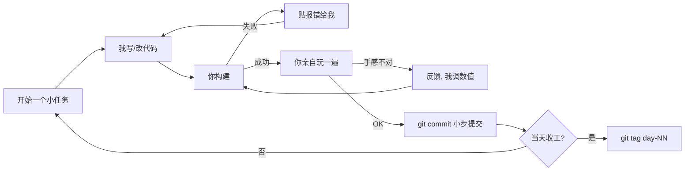
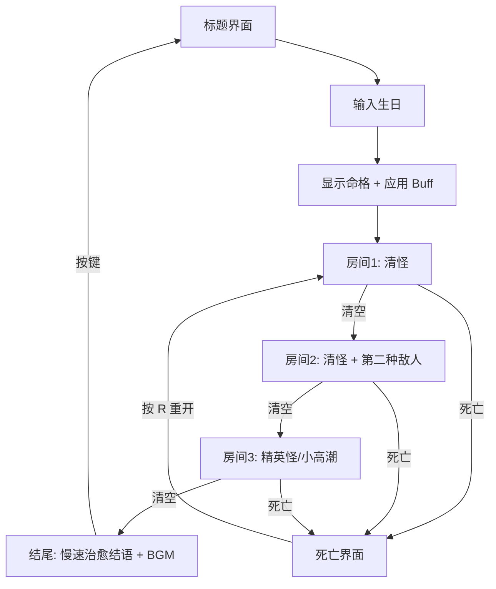
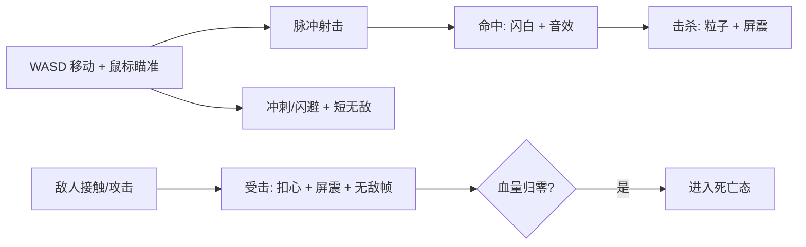

# 15 天冲刺计划 · Demo v0.3「治愈垂直切片」

> **定位**：不是"完成 6 个月计划的前 10%"，而是做一个**从标题到结尾能一条龙玩通、有打击感、有情绪、能打包成 exe 的完整小体验**。
> **心态**：每天出一个**能玩的增量**，绝不一次推太多。宁可少做，不可做崩。
> **关联**：[独立游戏项目计划书](./独立游戏项目计划书.md)（长期愿景，本计划不推翻它，只是把它的"情感内核"压缩到 15 天可落地）

---

## 冲刺进度（滚动更新）

| Day | 主题 | 状态 | 文档 |
|-----|------|------|------|
| 0 | 分支 / 基线 | ✅ 已完成 | — |
| **1** | **闪白 + 屏震 + 手感修订** | **✅ 已完成** | [v0.3-Day01-打击感闪白屏震](./v0.3-Day01-打击感闪白屏震/README.md) |
| **2** | **击杀粒子 + 命中音效** | **✅ 已完成** | [v0.3-Day02-击杀粒子与命中音效](./v0.3-Day02-击杀粒子与命中音效/README.md) |
| 3 | 脉冲手感调优 | ⬜ 待做 | — |
| 4–15 | 见下文逐日计划 | ⬜ 待做 | — |

**当前分支**：`sprint/v0.3` · 建议 tag：`day-02`

---

## 0. 为什么要这样打（先读这段，再看任务）

### 现状诊断（基于代码实测）

你**已经有一个可玩的 MVP**。`level.cpp` 里已实现：

- 关卡状态机（Playing / Victory / Defeat）
- 玩家/敌人从 Marker 生成、子弹系统、相机限制
- `reset_level` 死亡重开、清怪胜利
- `character.cpp` 里的心形血量、无敌帧闪烁、伤害区/死亡区、接触伤害

也就是说，`MVP定义与验收标准.md` 的 M1–M8 **代码里基本齐了**。你没有卡在"做不出来"。

### 真正的三个病根

| 病根 | 表现 | 本计划的对策 |
|------|------|--------------|
| **范围爆炸** | 6 个月蓝图（API、六技能、shader、多房、图鉴、Boss）压在 15 天的心理上 | 砍成"垂直切片"：只做一条完整体验线，其余全部延后 |
| **回退内耗** | `v2 技能&氛围&八字` → `元气骑士房间` → `回到基础版本`，一次推太多推崩 | **工作纪律**：main 永远可跑，每天一个 tag，小步提交 |
| **文档过载 / 出货不足** | 33 份 md、精密排期，但游戏没往前走 | 把方向盘从"规划"打到"每日出可玩增量" |

### 一句话策略

> **保留你的情感内核（生日/八字），砍掉所有高风险大件；用"打击感 + 一条完整体验线"换取正向反馈。**
> 八字做成**本地版**（不调 API，本地映射表 → 一句命格 + 一个能感知的 buff），风险为零，情感还在。

### 你的真实产能（基于 git 时间戳，不是估计）

| 打法 | 时间 | 产出 |
|------|------|------|
| **小步快跑**（7-04 晚 16:54→23:37） | 7 小时 | 血量→无敌帧→子弹命中→场景→敌人AI→死亡重开→胜负占位，**6 个功能全留下** |
| **一次堆大件**（7-06~7-15） | 10 天 | 技能&氛围&八字+房间大改一起上 → `回到基础版本`，**几乎全退掉** |

> **结论**：你不慢，你快得惊人——前提是**小步、每步可跑、跑通即提交**。慢，只发生在一口吃太多的时候。本计划的全部纪律都是为了让你一直待在"7-04 的状态"。

---

## 1. v0.3 目标：一句话定义

> 玩家从**标题界面**进入，**输入生日**得到一句"命格"和一个可感知的属性加成，进入**三间森林房间**依次清怪推进，战斗有**明确打击感**（受击闪白、屏震、击杀粒子、音效），通关后看到一段**慢速浮现的治愈结语**，可重开。全流程 **3–6 分钟**，**0 崩溃**，能**打包成 exe** 发给朋友玩。

### 验收总表（15 天结束时逐条勾选）

| # | 项目 | 验收标准 |
|---|------|----------|
| A1 | 标题界面 | 有游戏名、开始按钮、治愈基调背景；点击进入 |
| A2 | 生日输入 | 输入年月日 → 本地存储 → 显示一句命格 + 应用 buff（移速/血量/暴击其一可感知） |
| A3 | 战斗手感 | 命中敌人有闪白/顿挫；击杀有粒子；受击有屏震；均有音效 |
| A4 | 多房推进 | 3 间房依次：清怪 → 开门/自动切换 → 下一房 |
| A5 | 两种敌人 | 至少 2 种，行为/外观可区分 |
| A6 | 位移技能 | 冲刺/闪避（带短无敌帧），手感顺滑，有音效 |
| A7 | 结尾叙事 | 通关后慢速浮现结语文字，配 BGM，有情绪落点 |
| A8 | 氛围 | 房内雾 overlay + BGM；标题/战斗/结尾 BGM 有区分 |
| A9 | 稳定性 | 连续 3 轮从标题玩到结尾，0 崩溃 |
| A10 | 可分发 | 导出 Windows exe，双击能玩；录一段 60–90 秒演示视频 |

> **底线（若时间告急，必须保住的最小集）**：A3（打击感）+ A4（3 房推进）+ A9（不崩）+ A10（能打包）。这四条做到，就已经是一个"完整的小游戏"了。A2/A6/A7/A8 是加分的灵魂层，从后往前砍。

### 拉伸清单（做得快时，从顶端往下拉，一次只拉一件）

> 规则：**只有当某阶段提前完成、且 main 可跑时**，才从这里拉一件进来。拉进来的东西同样遵守"小步、可跑、即提交"。**永远不要为了拉伸而牺牲主线或稳定性。**

| 优先级 | 拉伸项 | 预估 | 备注 |
|--------|--------|------|------|
| ⭐1 | 第二个主动技能（能量之光治疗光环 / 极地斩近战） | 1–2 天 | 挑一个，别都做 |
| ⭐2 | 房间 3 末尾一个"精英怪/小 Boss"（大血量 + 一种特殊攻击） | 1–2 天 | 给通关一个高潮 |
| ⭐3 | 拾取物系统（回血心 / 临时增益） | 1 天 | 增加战斗决策 |
| ⭐4 | 第三、四种敌人 | 0.5 天/种 | 换数值+贴图+行为其一 |
| ⭐5 | 房间数 3 → 5 | 0.5 天 | 内容量翻倍 |
| ⭐6 | 真 Shader 雾 / 丁达尔光（替换 overlay） | 1–2 天 | 氛围质感升级 |
| ⭐7 | 存档（记录命格 + 最好成绩） | 1 天 | |
| ⭐8 | 对象池（敌人/子弹） | 1 天 | 拉伸把敌人堆多时再做 |

> 建议：**先把主线 A1–A10 全绿，再动拉伸。** 若你产能真如 7-04 那样，主线大概率能在第 10–11 天完成，那后面 3–4 天正好拉 ⭐1、⭐2 两件（第二技能 + 小 Boss），这两件对"好玩"的提升最大。

---

## 2. 分工：你和 AI 各干什么

这是"游戏开发模式"里最常被忽略、却最关键的一件事。我们是一个 **2 人小组**：你是**制作人 + 手感裁判 + 美术/音频采购 + 测试**，我（AI）是**程序 + 架构 + shader**。

| 环节 | 你（人） | 我（AI） |
|------|----------|----------|
| 决策 | 定"好不好玩/够不够治愈"，拍板取舍 | 给 2–3 个方案 + 推荐项 |
| 代码 | 在 Godot 编辑器里连场景节点、按我给的步骤操作 | 写 C++/GDScript、shader、改场景脚本 |
| 构建 | 跑 `scripts/configure-and-build.bat`，把报错贴给我 | 定位并修构建/运行错误 |
| 测试 | 实际玩、按验收清单走测、录屏 | 根据你反馈调数值/修 bug |
| 美术 | 用 AI 绘图或下免费素材，导入 `project/assets/` | 告诉你需要什么规格的图、怎么接 |
| 音频 | 下免费 SFX/BGM（见 §7） | 写播放逻辑、连信号 |
| 版本 | 执行 git 提交/打 tag（见 §3） | 提醒你何时该提交 |

> **关键**：手感和"治愈感"只有你能判断，我判断不了。所以**每个增量做完，你必须亲自玩一遍再往下走**。这也是防止"做崩了才发现"的核心。

---

## 3. 工作纪律：终结"回退内耗"（务必遵守）

你过去的痛，一大半来自"一次推太多 → 崩 → 整体回退"。这套纪律直接治它：

1. **main 永远可跑**。任何时候 checkout main 都能构建+启动。
2. **开冲刺分支**：`git checkout -b sprint/v0.3`，日常在这上面做。
3. **小步提交**：一个能玩的小增量 = 一次 commit。commit 前**先构建、先玩一遍**，跑得起来才提交。
4. **每天打 tag**：当天收工且可运行，`git tag day-01`、`day-02`……。**任何一天崩了，最多回退一天，不会再蒸发一周。**
5. **崩了就降级**：某功能 2 小时内搞不定 → 用降级方案（见每日任务里的"降级"），记为技术债，继续往前。**不要停在一个坑里磨一整天。**
6. **不并行开多个大件**：同一时间只推进一个验收项。



---

## 4. 核心玩法闭环（v0.3 版）



战斗内循环（每一帧的"爽点"来源）：



---

## 5. 15 天逐日计划（含验收标准 + 降级）

> 每格 = 半天到一天。周期按"能玩增量"划分，不按日历硬绑。若你某天时间多，可提前；某天卡住，用降级往前推。
> 图例：🧑=你主导 · 🤖=我主导 · ✅=验收

```mermaid
gantt
    title 15 天冲刺甘特图
    dateFormat  X
    axisFormat  D%d
    section 准备
    环境/纪律/分支        :a0, 0, 1
    section 打击感(灵魂)
    受击闪白+屏震         :a1, 1, 2
    击杀粒子+命中音效      :a2, 2, 2
    脉冲手感调优          :a3, 4, 1
    section 循环骨架
    多房推进框架          :b1, 5, 2
    第二种敌人            :b2, 7, 1
    section 技能+内核
    冲刺/闪避技能         :c1, 8, 2
    生日Buff(本地八字)     :c2, 10, 2
    section 灵魂层
    标题界面             :d1, 11, 1
    结尾叙事+BGM分场景     :d2, 12, 2
    雾overlay氛围         :d3, 13, 1
    section 收尾
    全流程走测+修bug      :e1, 13, 2
    打包exe+录视频        :e2, 14, 1
    缓冲                 :e3, 15, 1
```



---

### Day 0（半天）· 准备与止血

| 任务 | 谁 | 说明 |
|------|----|----|
| 验证当前 demo 能构建能跑 | 🧑🤖 | 跑 `scripts/configure-and-build.bat`，F5 启动，确认能移动/射击/打怪 |
| 建立冲刺分支 | 🧑 | `git checkout -b sprint/v0.3` |
| 打基线 tag | 🧑 | `git tag day-00-baseline` |

✅ **验收**：从 main 干净构建、启动、能玩当前 MVP；分支和基线 tag 就位。
🛟 **降级**：若构建失败——这是**最高优先级**，先把它修好，其它都不做。贴报错给我。

---

### Day 1–3（灵魂层：打击感）— 让"现有的一间房"变好玩

> 这是**投入产出比最高**的三天。不加任何新系统，只让"打怪"这件事变爽。打完这三天你会立刻获得正向反馈，士气回血。

**Day 1 · 受击反馈 + 屏幕震动** — ✅ **已完成**（详见 [v0.3-Day01 文档](./v0.3-Day01-打击感闪白屏震/README.md)）

- ✅ 敌人被命中：青白闪（0.12s），**不震屏**
- ✅ 玩家受击：红橙闪 + 相机屏震（trauma 衰减）+ 无敌闪烁（1.0s）
- ✅ 修复：仅 Player `make_current()`，避免敌人抢走镜头导致震感颠倒
- ✅ 走测通过，已提交 `sprint/v0.3`

~~初版计划~~（已被上述实现替代）：
- ~~敌人被命中时 sprite 闪白 0.05s~~ → 改为青白闪 0.12s，与玩家红闪区分
- ~~玩家受击时相机屏震~~ → 已实现，且仅玩家受击触发

**Day 2 · 击杀粒子 + 命中音效** — ✅ **已完成**（详见 [v0.3-Day02 文档](./v0.3-Day02-击杀粒子与命中音效/README.md)）

- ✅ 击杀：`AnimatedSprite2D` 播 `simpleexplosion00–08`（冲刺降级路径，未上 GPUParticles）
- ✅ 音效：命中 `hit2` / 击杀 `explosion2` / 受击 `hurt2`（Kenney retro，路径见 `path::audio`）
- ✅ 统一入口：`src/util/combat_feedback.*`；接入 projectile / enemy / character
- ✅ 修复无声根因：删除 `project/assets/audio/.gdignore`，Godot 才能导入音频
- ✅ 修复退出崩溃：去掉静态 `Ref` 缓存
- ✅ 编译走测通过

~~初版计划~~（已被上述实现替代）：
- ~~GPUParticles2D 迸发~~ → 序列帧 `AnimatedSprite2D` 一次播放
- ~~另下新音效~~ → 直接用仓库内 `assets/audio/sfx/retro/`

**Day 3 · 脉冲手感调优**
- 🤖 暴露射速、子弹速度、后坐/散射为可调参数
- 🧑 反复试射，调到"射得爽"
- 🧑 打 `git tag day-03`；此时录个 15 秒小视频存档（对比 Day0，感受进步）
- ✅ 射击节奏舒服，命中反馈闭环完整。

---

### Day 4–6（骨架层）— 三房推进

**Day 4–5 · 多房推进框架**
- 🤖 方案：`Level` 支持按序加载 `level1/level2/level3.tscn`，或数据驱动房间列表；清怪后 `on_enemy_died` 全清 → 切下一房
- 🧑 用现有 `level1.tscn` 复制出 2、3 房，摆不同刷怪点/布局
- ✅ 从房1清怪 → 自动进房2 → 清怪 → 房3 → 通关结算。
- 🛟 切场景复杂→"同一房刷 3 波敌人"也算过关（wave 模式），先保闭环。

**Day 6 · 第二种敌人**
- 🤖 新 `Enemy` 变体：改速度/血量/外观，或加一种远程/冲撞行为
- 🧑 复制 `enemy.tscn` 换素材，摆进房2/房3
- ✅ 场上能看到两种明显不同的敌人。
- 🛟 行为难写→只改数值和贴图，做成"快而脆"vs"慢而肉"。

---

### Day 7–9（技能 + 情感内核）

**Day 7–8 · 冲刺/闪避技能**
- 🤖 新增冲刺：按键（如 Shift/空格）向移动方向猛冲一段，冲刺中短无敌帧 + 冷却
- 🧑 下冲刺音效；调冲刺距离/冷却手感
- ✅ 能冲刺躲子弹，手感顺滑，有音效和冷却反馈。
- 🛟 位移物理难调→做成"短距瞬移 + 0.2s 无敌"。

**Day 9 · 生日 Buff（本地版八字，你的情感内核）**
- 🤖 GDScript 做生日输入 UI（年/月/日）；本地存 `user://profile.json`
- 🤖 一张本地映射表 `buff_rules.json`：按生日几个字段 → 命格文案 + buff（移速/血量/暴击等挑 1–2 个）
- 🤖 C++ 侧读取 profile 应用到 Player 属性
- 🧑 写 4–6 条命格文案（呼应"能屈能伸方为丈夫"的治愈基调）
- ✅ 输入生日 → 看到一句命格 → 进游戏能感觉到 buff（比如"出身寒微：移速略低但血量+1"）。
- 🛟 映射复杂→固定 3 种命格随机/按月份取一个，先跑通体验。

> ⚠️ **明确不做**：真实赛博八字 API、HTTP 请求、复杂命理规则。那是 15 天之后的事。

---

### Day 10–13（灵魂层：氛围与叙事）

**Day 10–11 · 标题界面**
- 🤖 GDScript 标题场景：游戏名 + 「开始」+「退出」；开始 → 生日输入 → 关卡
- 🧑 出一张治愈基调的标题背景图（AI 绘图，绿色森林/光影）
- ✅ 启动进标题，点开始能一路进入游戏。

**Day 11–12 · 结尾叙事 + BGM 分场景**
- 🤖 通关后结算场景：一段结语文字**慢速逐字/逐行浮现**（Tween），配 BGM
- 🧑 写结语文案（100–200 字，治愈落点，呼应主人公"直面困境、坚韧回弹"）
- 🧑 下 3 段 BGM：标题（宁静）、战斗（轻推进）、结尾（温暖）
- 🤖 在场景切换处切 BGM
- ✅ 通关看到慢速结语 + 温暖 BGM，有情绪落点。
- 🛟 Tween 难调→文字直接淡入也行，重点是 BGM 到位。

**Day 13 · 雾 overlay 氛围（可选灵魂加分）**
- 🤖 房内加一层半透明雾 `ColorRect`/贴图 overlay + 轻微飘动；整体调色偏绿/暖
- 🧑 判断"够不够治愈、够不够森林"
- ✅ 静止截图能一眼看出"这是一片有氛围的森林"。
- 🛟 时间紧→**直接跳过**，用纯色地面 + 现有素材即可。这是最先被砍的项。

---

### Day 13–15（收尾）

**Day 13–14 · 全流程走测 + 修 bug**
- 🧑 按 §1 验收总表 A1–A9 逐条走，记录所有问题
- 🤖 按优先级修（崩溃 > 卡关 > 手感 > 美观）
- ✅ 连续 3 轮从标题玩到结尾，0 崩溃。

**Day 14 · 打包 exe + 录演示视频**
- 🤖 指导 Godot 导出 Windows 预设
- 🧑 导出 exe，在**另一台/干净目录**双击测试能跑
- 🧑 录 60–90 秒演示视频（标题→生日→战斗爽点→通关结语）
- 🧑 `git tag v0.3`，合并回 main
- ✅ exe 双击能玩；演示视频存档。

**Day 15 · 缓冲**
- 处理前面欠的技术债、补一个你最想加的小细节，或纯粹留白防意外。**不要新开大功能。**

---

## 6. 界面简笔画（ASCII 草图）

### 标题界面
```
┌───────────────────────────────────────┐
│                                        │
│        ~ 葱郁森林 / 光影背景 ~          │
│                                        │
│            《 游戏名待定 》              │
│                                        │
│            ┌──────────────┐            │
│            │   开始旅程    │            │
│            └──────────────┘            │
│            ┌──────────────┐            │
│            │   退出        │            │
│            └──────────────┘            │
│                                        │
│   "出身寒微不是耻辱，能屈能伸方为丈夫"   │
└───────────────────────────────────────┘
```

### 生日输入 → 命格
```
┌───────────────────────────────────────┐
│         请输入你的出生年月日            │
│                                        │
│      [ 1998 ] 年 [ 07 ] 月 [ 15 ] 日   │
│                                        │
│            ┌──────────────┐            │
│            │   测算命格    │            │
│            └──────────────┘            │
│  ─────────────────────────────────────  │
│  命格：孤军奋战                         │
│  「血量越低，你的锋芒越盛」              │
│  加成：血量-1，暴击随血量降低而提升      │
│            ┌──────────────┐            │
│            │   进入森林    │            │
│            └──────────────┘            │
└───────────────────────────────────────┘
```

### 战斗 HUD
```
┌───────────────────────────────────────┐
│ ♥ ♥ ♥ ♡ ♡        房间 1 / 3           │  ← 心形血量 + 房间进度
│                                        │
│              ●(敌)                      │
│         ●(敌)      ✷ 命中闪白           │
│                                        │
│           ▲(玩家) → · · ·  脉冲子弹      │
│                                        │
│  [Shift] 冲刺 ▓▓▓▓░ 冷却                │  ← 技能冷却条
└───────────────────────────────────────┘
```

### 结尾结语（慢速浮现）
```
┌───────────────────────────────────────┐
│                                        │
│         （文字逐行淡入，配暖色 BGM）     │
│                                        │
│      你走出了这片森林。                  │
│      困住你的从来不是黑暗，              │
│      而是忘了自己能发光。                │
│                                        │
│                            —— 待续 —— │
│              [ 按任意键回到标题 ]        │
└───────────────────────────────────────┘
```

---

## 7. 资源清单（免费 / 可商用，省时间）

| 类型 | 来源 | 说明 |
|------|------|------|
| 美术（占位/成品） | [Kenney.nl](https://kenney.nl)（CC0） | 顶视角角色、子弹、图标，免费可商用 |
| 美术（森林/氛围） | AI 绘图（你已有 GPT Image 计划） | 标题背景、地面底图、雾贴图 |
| 现成爆炸/粒子 | **你仓库已有** `project/assets/art/explosions/` | Day 2 直接用，别重造 |
| 音效 SFX | [freesound.org](https://freesound.org)、Kenney Audio | 命中/击杀/受击/冲刺 |
| BGM | [incompetech（Kevin MacLeod）](https://incompetech.com)、[OpenGameArt](https://opengameart.org) | 标注署名即可用；选宁静/温暖向 |

> 素材统一放 `project/assets/`，导入后 Godot 会生成 `.import`，记得一起提交。

---

## 8. 风险与降级速查

| 风险 | 触发条件 | 降级动作 |
|------|----------|----------|
| 构建/运行崩 | 任何时候 | 最高优先级，停一切先修；回退到最近 `day-NN` tag |
| 多房切换搞不定 | Day 5 卡住 | 改"单房刷 3 波敌人"（wave 模式） |
| 冲刺物理难调 | Day 8 卡住 | 改"短距瞬移 + 0.2s 无敌" |
| 八字映射复杂 | Day 9 卡住 | 固定 3 种命格按月份取一个 |
| 氛围/shader 费时 | Day 13 | **直接砍**，纯色 + 现有素材 |
| 整体时间告急 | Day 12 后 | 保底线：打击感 + 3 房 + 不崩 + 能打包（§1 底线集） |

---

## 9. 每日收工自检（贴在显眼处）

- [ ] 今天的增量**亲自玩过**了吗？
- [ ] 构建**能跑**吗？
- [ ] **commit** 了吗？收工**打 tag** 了吗？
- [ ] 有没有陷在一个坑里超过 2 小时？（是→用降级）
- [ ] 我今天是在**做游戏**，还是又在**改文档/改计划**？（后者→停）

---

> 记住：15 天后交付一个**小而完整、能让人玩得开心**的东西，远胜过一个宏大而半成品的框架。
> 你已经越过最难的技术门槛了。剩下的，是**克制**和**坚持每天出货**。我们一步步来。
