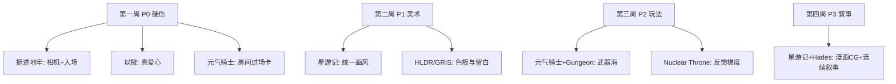
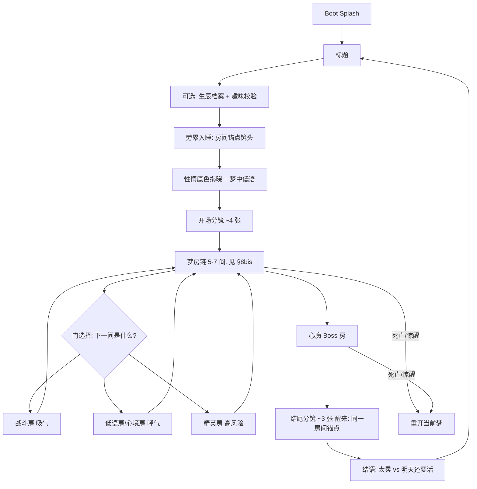

# 冲刺计划 · Demo v0.4「打磨与个性化」

> **定位**：在 v0.3「能玩通、有打击感、能打包」的基础上，解决**一眼 AI、不好玩、没故事感**三大体验断层；把游戏从「逻辑正确的原型」升级为「有作者气质、有叙事弧线、愿意发给朋友的小作品」。
> **心态**：延续 v0.3 纪律——每天一个**能玩的增量**，一次只推一件；宁可少做，不可做崩。
> **前置**：[v0.3 垂直切片](./15天冲刺计划-v0.3垂直切片.md)（A1–A10 主线已完成或收尾中）
> **关联**：[独立游戏项目计划书](./独立游戏项目计划书.md)（长期愿景；本计划不推翻情感内核，只升级表达层）

---

## 冲刺进度（滚动更新）

| 阶段 | 主题 | 状态 | 文档 |
|------|------|------|------|
| **0** | **基线冻结 / 分支** | ⬜ 待开始 | — |
| **P0** | **硬伤速修**（爱心 / 相机 / 敌入 / 过场） | ✅ 已完成 | [v0.4-P0-硬伤速修](./v0.4-P0-硬伤速修/README.md) |
| **P1** | **美术统一**（星游记风 + UI + 启动画面） | ⏸ 整块跳过 | 产能不足；范围收敛，非质量降级 |
| **P2** | **玩法深度**（梦房链 / 武器 / 分波 / Boss / 音频） | ✅ 完成（近战推迟） | [v0.4-P2-玩法深度](./v0.4-P2-玩法深度/README.md) |
| **P3** | **叙事包装**（漫画 CG + 故事连续性） | ✅ 已完成 | [v0.4-P3-叙事包装](./v0.4-P3-叙事包装/README.md) |
| **P4** | **主题扩展框架**（多主题配置表） | ✅ 已完成 | [v0.4-P4-主题框架](./v0.4-P4-主题框架/README.md) |
| **收尾** | **全流程走测 / 打包 / 演示视频** | 🟡 待你确认 B9 + 视频 | [v0.4-收尾](./v0.4-收尾/README.md) |
| **HLD** | **屏幕之旅（8 天）** | 🟡 进行中 | [v0.4-HLD式屏幕之旅-8天结构方案](./v0.4-HLD式屏幕之旅-8天结构方案.md) |

**建议分支**：`sprint/v0.4`（从 v0.3 可运行 tag 拉出）· 建议 tag：`v0.4`

---

## 0. 为什么要 v0.4（先读这段）

### v0.3 做到了什么

v0.3 成功交付了**技术骨架**：

- 标题 → 生日命格 → 三间房清怪 → 结尾结语 → exe 可分发
- 打击感（闪白 / 屏震 / 粒子 / 音效）、冲刺闪避、两种敌人、雾 overlay

你没有卡在「做不出来」。

### v0.3 没解决什么（市场体验官视角）

| 断层 | 玩家感受 | 技术根因（已实测） |
|------|----------|-------------------|
| **表达层占位** | 一眼 AI、没灵魂 | Kenney 占位素材拼贴；背景 tint + 程序化雾，非手绘场景 |
| **反馈演出缺失** | 怪 pop 出来、过场生硬 | 敌人 Marker 瞬间生成；`room_cleared` 直接切场景 |
| **相机语言弱** | 视角怪、发闷 | `Camera2D` 钉死角色中心，无前瞻 / 阻尼 / 战斗拉近 |
| **UI 廉价感** | 爱心形状错 | `heart_hud.cpp` 用 `draw_circle` 画圆点，非心形 |
| **叙事碎片化** | 有文案没故事 | 生日门、三间房、结尾结语**彼此独立**，缺一条可见的故事线 |
| **无开场仪式** | 双击 exe 无期待感 | 无 Boot Splash / 无开场 CG / 标题直入功能菜单 |

### 一句话策略

> **保留 v0.3 的全部玩法骨架与情感内核；用「借鉴矩阵 + 美术统一 + 叙事连续性 + 漫画 CG」换掉所有「占位感」。**
>
> **两条 v0.4 新原则（本次讨论新增）：**
> 1. **叙事自洽 + 克制**：做梦 / 战斗 / 醒来必须是**同一个人的同一段经历**；且 v0.4 **只讲「劳累的一夜、一个梦、一次醒来」**，不铺宏大世界观——详见 §5。
> 2. **表达层不降级**：美术、相机、UI、叙事、CG 这些「决定像不像作品」的东西，**要么做好，要么整块推迟**，绝不合入劣质版本。降级只保留给「不崩 / 能打包」这类稳定性兜底。详见 §3、§11。

---

## 1. v0.4 目标：一句话定义

> 双击 exe 看到**品牌开场** → 标题进入 →（可选）留下生辰档案 → **劳累的一天结束，你入睡（房间锚点镜头）** → **开场漫画分镜**（约 4 张静图）交代入梦 → 梦中走过一条**梦房链（5–6 间，含战斗 / 低语 / 心境房 + 门选择）**，与**暗影心魔**交手，听**内心独白**与**梦中低语**，越深光越亮、影越浓 → 末尾**心魔 Boss** → **结尾漫画分镜**（约 3 张静图）+ 醒来（同一房间锚点）：**也许只是太累了，需要放松**；但明天该做的事还在——区别只是，今晚你多走了一步 → 回标题。全流程 **5–8 分钟**，美术统一为**星游记式赛璐璐**，**0 崩溃**，能打包 exe。
>
> ⚠️ 关键转变：**主线契机 = 日常劳累后的入睡**（非生日，生辰降为彩蛋）；**固定三房 → 梦房链 + 门选择**（见 §8bis）；**「升级」→「找回」**（见 §5.2.6）；全文不再使用「命格」二字。

### 验收总表（v0.4 结束时逐条勾选）

| # | 项目 | 验收标准 |
|---|------|----------|
| B1 ✅ | 硬伤修复 | 心灯血量（心形，暂用多边形）；相机有阻尼 + 鼠标前瞻；敌人有入场预警；房间间有过场卡（见 [v0.4-P0](./v0.4-P0-硬伤速修/README.md)） |
| B2 | 美术统一 | 主角 + 两种敌人 + 各房型背景 + UI 统一到「粗描边赛璐璐」；不再裸用 Kenney 小人 |
| B3 | 开场仪式 | exe 有 Boot Splash；首次进游戏有开场漫画分镜（入梦，约 4 张静图，见 §5.4 说明） |
| B4 | 武器多样性 | 至少 4 种可拾取武器（含远程 + 近战各 ≥1）；切换有音效与 HUD 提示 |
| B5 | 战斗节奏 | **梦房链 5–6 间 + ≥2 房型 + 门选择**（见 §8bis）；战斗房分 ≥2 波；末尾心魔 Boss（特殊攻击 + 高血量） |
| B6 | 叙事自洽 | 劳累入睡 → 梦中战斗（内心独白 + 低语）→ 醒来，是**同一个人的同一段经历**；玩家能说清「为什么做梦、为什么在梦里战斗、醒来意味着什么」（见 §5）；宏大靠**单元剧累积**、首版只保证一晚完整 |
| B7 | 结尾包装 | 结尾漫画分镜（醒来，约 3 张静图）+ 治愈结语；BGM 与标题 / 战斗区分 |
| B8 | 氛围音频 | 标题 / 探索 / 战斗 / Boss / 结尾 BGM 有区分；核心 SFX 按武器类型区分 |
| B9 | 稳定性 | 连续 3 轮从开场 CG 玩到结尾 CG，0 崩溃 |
| B10 | 可分发 | 导出 Windows exe；录 90–120 秒演示视频（含 CG 片段） |

> **底线（时间告急必保）**：B1 + B2（主角 + 一房背景）+ B4（至少 2 种武器）+ B9 + B10。B3/B6/B7 是灵魂层，从后往前砍时**至少保留开场或结尾 CG 其一**。

### 拉伸清单（主线全绿后再拉，一次一件）

| 优先级 | 拉伸项 | 预估 | 备注 |
|--------|--------|------|------|
| ⭐1 | 第二个主动技能（极地斩 / 能量之光，二选一） | 1–2 天 | 与武器系统互补 |
| ⭐2 | 拾取物（回血心 / 临时增益） | 1 天 | 增加战斗决策 |
| ⭐3 | 第三、四种敌人 | 0.5 天/种 | 换贴图 + 行为其一 |
| ⭐4 | 击杀 VFX 多套序列帧 | 0.5 天 | 按敌种或武器切换 |
| ⭐5 | 真 Shader 丁达尔光（替换 overlay 雾） | 1–2 天 | 星游记式逆光 |
| ⭐6 | 房间数 3 → 5 | 0.5 天 | 需同步叙事文案 |
| ⭐7 | 存档（生辰档案 + 最好成绩 + 分镜已读标记） | 1 天 | |
| ⭐8 | 枪口闪光 + 近战挥砍残影 | 0.5–1 天 | 武器手感加分 |
| ⭐9 | 第二个主题「彩虹海」可玩切片 | 2–3 天 | 见 §8 主题表 |
| ⭐10 | 对象池（敌人 / 子弹） | 1 天 | 敌人堆多时再上 |

---

## 2. 分工：你和 AI 各干什么

| 环节 | 你（人） | 我（AI） |
|------|----------|----------|
| 决策 | 定「好不好玩 / 够不够像星游记 / 故事是否打动人」 | 给 2–3 方案 + 推荐项 |
| 代码 | Godot 编辑器连节点、导入素材、走测 | C++ / GDScript / shader / 场景脚本 |
| 构建 | `scripts/configure-and-build.bat` | 修构建 / 运行错误 |
| 测试 | 实际玩、按 B1–B10 勾选、录屏 | 按反馈调数值 / 修 bug |
| 美术 | AI 绘图（§7 提示词）、下免费 SFX/BGM | 规格说明、接入路径、shader 调色 |
| 叙事 | 拍板故事线、润色 CG 旁白 | 写 `story.json` 结构、接 CG 播放器 |
| 版本 | git commit / tag | 提醒何时该提交 |

> **关键**：手感和「有没有作者味」只有你能判断。每个增量做完**必须亲自玩一遍**再往下走。

---

## 3. 工作纪律（继承 v0.3，务必遵守）

1. **main 永远可跑**；日常在 `sprint/v0.4` 开发。
2. **小步提交**：一个能玩增量 = 一次 commit；提交前先构建、先玩。
3. **每天打 tag**：`v0.4-p0-01`、`v0.4-p1-02`……崩了最多回退一天。
4. **卡 2 小时就换招——但不降级交付**：先把任务**拆成更小的一步**试试；仍搞不定，就把**整件事整块推迟**到拉伸 / 下一版，让 main 保持干净。**绝不为了「往前推」而合入一个劣质的爱心 / 相机 / CG**——半成品的表达层比没有更伤作品感（见 §11 对「质量降级」与「范围收敛」的区分）。
5. **不并行开多个大件**：同一时间只推进一个验收项。
6. **借鉴不等于抄袭**：学结构、手感、镜头语言；角色与故事保持原创。

---

## 4. 借鉴矩阵（重点章节）

> 本章是 v0.4 的**设计圣经**。每一款参考游戏都标明：**学什么、不学什么、落到我们哪一项验收**。
> 排序按与当前项目的**相似度 + 可落地性**。

### 4.1 总览对照表

| 参考作品 | 相似度 | 核心借鉴点 | 对应 v0.4 验收 | 明确不学 |
|----------|--------|------------|----------------|----------|
| **《元气骑士》** | ★★★★★ | 房间制、武器海、拾取切换、节奏 | B4 B5 | 弹幕密度、像素风 |
| **《挺进地牢》** | ★★★★★ | 翻滚手感、枪械差异、相机俯角、房间演出 | B1 B4 B5 | 美式荒诞、纯弹幕 |
| **《以撒的结合》** | ★★★★☆ | 清房节奏、爱心血量 UI、道具决策 | B1 B2 | 黑暗恶心、随机迷宫 |
| **《Nuclear Throne》** | ★★★★☆ | 快节奏屏震、击杀反馈、敌人入场压迫感 | B1 B5 | 末世废土、纯爽游 |
| **《Hades》** | ★★★☆☆ | 等距镜头运镜、过场旁白、死亡后叙事推进 | B1 B6 B7 | 3D 伪等距、恋爱支线 |
| **《Hyper Light Drifter》** | ★★★☆☆ | 顶视角氛围、剪影美术、少字多画叙事 | B2 B6 | 无台词、高难度 |
| **《GRIS》** | ★★★☆☆ | 情绪配色、无压叙事、音乐与画面同步 | B6 B8 | 解谜平台、无战斗 |
| **《Death's Door》** | ★★★☆☆ | 俯视角场景构图、干净 UI、房间可读性 | B2 B5 | 魂系难度曲线 |
| **《Tunic》** | ★★★☆☆ | 探索神秘感、手册式叙事（远期图鉴） | B6 ⭐ | 3D、谜题为主 |
| **《Sky 光·遇》** | ★★☆☆☆ | 治愈基调、音乐情绪、「同行」感文案 | B6 B8 | 社交 MMO |
| **《暖雪》** | ★★★☆☆ | 国产 roguelite 统一画风、武器流派 | B2 B4 | 武侠题材 |
| **《星游记》** | ★★★★★（审美） | 赛璐璐、暖金×蓝紫、逆光、热血治愈叙事 | B2 B3 B6 B7 | 直接复刻角色 |

---

### 4.2 分维度深挖：每款游戏借什么

#### A. 玩法与关卡结构

| 来源 | 具体借鉴 | 我们的落地 |
|------|----------|------------|
| **元气骑士** | 每房清怪 → 开门；地面掉落武器；枪 / 刀 / 法杖手感差异 | P2 武器拾取系统；三房差异化布局 |
| **挺进地牢** | 翻滚无敌帧 + 冷却；枪械后坐与散射；房间进门短暂安全区 | 已有冲刺，P2 对齐冷却与音效；P0 敌人入场预警 |
| **以撒** | 心形血量（真爱心）；小房间快节奏；清完才开门 | P0-1 真爱心；B5 分波刷怪 |
| **Nuclear Throne** | 击杀屏震梯度；敌人死亡爆屑；波次间喘息 | 已有 `combat_feedback`，P2 按武器调震级 |
| **Hades** | 房间切换有「地名 + 一句话」；Boss 房前氛围铺垫 | P0-4 房间过场卡；P2 房 3 小 Boss |

#### B. 相机与视角

| 来源 | 具体借鉴 | 我们的落地 |
|------|----------|------------|
| **挺进地牢** | 略俯的 3/4 感（非死盯 90°）；瞄准方向轻微偏移镜头 | P0-2 `camera.cpp` 加 `position_smoothing` + lookahead |
| **Hades** | 战斗时微拉近；大受击时短震 | P0-2 战斗 zoom tween（可选拉伸） |
| **Hyper Light Drifter** | 大场景留白、角色小、环境讲故事 | P1 背景手绘拉大留白；雾作前景层 |

> **视角结论**：保持 2D 俯视角玩法，但镜头要有**阻尼、前瞻、呼吸感**——这是「视角怪」的解药，不需要改成 3D。

#### C. 美术与氛围

| 来源 | 具体借鉴 | 我们的落地 |
|------|----------|------------|
| **星游记** | 粗黑描边、赛璐璐、暖金×蓝紫、丁达尔光、战损绷带 | P1 全套美术圣经（§6） |
| **Hyper Light Drifter** | 有限色板、强剪影、光影讲故事 | 每主题 1 套主色 + 1 高光色 |
| **GRIS** | 情绪 = 配色；章节色调递进 | 三房：雾绿 → 深林 → 金光（见 §5 叙事） |
| **Death's Door** | 房间构图可读、障碍有设计感 | P1 背景替换方块墙 |

#### D. 叙事与情绪

| 来源 | 具体借鉴 | 我们的落地 |
|------|----------|------------|
| **星游记** | 「目标彩虹海」式执念；拉钩约定；热血 + 治愈并存 | §5 主线「走出迷雾，看见自己的光」 |
| **Hades** | 每次回家都有新台词；系统文案服务角色 | 性情底色文案与故事线挂钩，非随机鸡汤 |
| **GRIS** | 少字、多画、音乐先行 | 漫画 CG 为主，战斗内短句为辅 |
| **Sky** | 温柔旁白、不说教 | 结尾结语保持克制，CG 承担情绪高峰 |

#### E. 音频

| 来源 | 具体借鉴 | 我们的落地 |
|------|----------|------------|
| **Hades** | 战斗 / Boss / 安全区 BGM 明确切换 | B8 `MusicDirector` 扩轨 |
| **Nuclear Throne** | 枪声辨识度、击杀 satisfying | 按武器类型分 SFX |
| **GRIS / Sky** | 钢琴 / 弦乐治愈、环境音铺底 | 标题与结尾用 acoustic / ethereal |

---

### 4.3 借鉴优先级（执行顺序）



---

## 5. 叙事重做：从碎片到连续（重点章节）

### 5.1 两个根本矛盾 + 一个规模警示

v0.3 的叙事不是「不够多」，而是**自相矛盾**；同时 v0.4 必须避免**叙事野心过大**——个人项目撑不起「史诗世界观」，烂尾风险极高。

**矛盾一：身份两张皮。**
「输入生日 → 拿加成」说的是**现实里的你**；可进森林战斗的是**另一个故事**。玩家情感无处落脚。

**矛盾二：因果断裂。**
「都知道加成了，为什么还要射击？」——开场、玩法、结尾三段没有因果。

**规模策略：宏大靠「单元剧累积」，不靠「一次性铺开」。**
你可以有宏大野心，但**不要在第一版就把史诗全端上来**（那是个人项目烂尾的头号死因）。正确姿势：
- 每一晚的梦（森林 / 星海 / 神庙…）都是**独立完整的小故事**——哪怕只做出一晚，也是一部完整作品，**随时停手都不烂尾**。
- 每多做一晚，背后那条大线索就**多显露一块**（类比《爱死机》《黑镜》：单集独立，共享宇宙；星游记的宏大也是一集集攒出来的，不是第一集讲完彩虹海）。
- 这条结构给你两头好处：**做不下去 → 每晚都完整**；**想做宏大 → 越做世界观越大**。

> 结论：主线契机改为**日常劳累后入睡**；生日降为**彩蛋**；废除「命格」用语；战斗 = 梦中面对自己；醒来 = 也许只是需要休息，但明天该做的还在；**宏大留给"一晚一晚累积"，首版只保证"一晚完整"**。

### 5.2 v0.4 叙事解法：劳累的一夜，一个梦

统一用**第二人称「你」**（「我做了一个梦，梦里我经历了……醒来我觉得……」），把要素重新定义：

| 要素 | v0.3（割裂） | v0.4（自洽） |
|------|-------------|-------------|
| **主线契机** | 生日夜进森林 | **劳累的一天结束，你入睡**——最普通的日常，无诅咒感 |
| **生辰输入** | 抽 buff 入口 | **可选档案 + 彩蛋**：映射「性情底色」与趣味反馈；**生日当天**触发专属对白（见 5.10） |
| **性情底色**（原 buff，禁用「命格」） | 属性作弊码 | **你惯常的应对方式**：文案说「你一向怎样」，数值弱且措辞生活化 |
| **敌人** | 无意义怪 | **暗影心魔**：怯、倦、疑——白天积压、在梦里被放大 |
| **战斗** | 清怪 | **在梦里推开暗影**；玩家通过移动 / 射击 / 冲刺**主动控梦** |
| **醒来** | 通关结语 | **「也许只是太累了，需要放松」**；但主角世界观不变：明天该做的还要做——**区别是，今晚你多走了一步，愿意为自己改变一点** |

> **一句话主轴（克制版）**：**「太累了，你睡着；梦里光与影撕扯；你推开暗影，光渐亮；醒来——也许只是需要歇一歇，但你知道，明天还可以再试一次。」**

#### 5.2.1 世界观脊椎：森林是梦，光是中心，影随光深

**① 森林 = 梦，不是物理地点。**
不是「生日诅咒进林子」，而是**累到睡着，梦里有片林**。入梦自然；心魔、用光驱暗、闹钟前醒来，全部自洽。

**② 先有画风，再长出叙事**（不变）：从星游记式**逆光、暖金、暗影**提炼「光」为脊椎。

**③ 光与影：光越浓，影越深。**
不是善恶二元，而是**同一枚硬币的两面**——你越想抓住光，旁边的影就越黑。体现在：
- **视觉**：房越亮，敌人剪影越浓、边缘越清晰；
- **叙事**：内心独白不只说「你要发光」，也说「你也害怕」；
- **玩法**：玩家控梦——操作本身就是「我还在主导」。

> 可借鉴经典「光与影」的对位美学（如《银河英雄传说》中光与影的并置——**只借对照关系，不借其宏大剧情**）。v0.4 不引入星际政治线。

**④ 「光」脊椎（精简版）**

| 身份 | 表现 |
|---|---|
| 美术 | 逆光、丁达尔、心灯、吞光暗影 |
| 叙事 | 找回精气神，但不承诺「变成超人」 |
| 玩法 | 攻击 = 光；敌 = 暗影；血 = 心灯；场景由暗渐亮 |

> **世界观一句话（克制版）**：**「累到睡着的那夜，你梦见林子里的光被暗影吞没；你在梦里把它们推开；醒来时，天还没全亮——你只是歇了一觉，但心里轻了一点。」**

#### 5.2.2 为什么要战斗

1. **暗影**：白天没处理完的累、怕、烦，在梦里变大。
2. **不打**：梦会一路黑下去——像情绪一路沉底。
3. **打**：在梦里**不让步**；操作本身就是「我还在控场」——**玩家控梦**。
4. **赢**：光亮一档；醒来时好受一点。**不承诺逆天改命**，只承诺「今晚没垮」。

#### 5.2.3 战斗 × 氛围：呼吸节奏 + 视觉弧线

| 拍子 | 状态 | 处理 |
|---|---|---|
| 吸气 | 房内战斗 | 热血、打击感、快节奏 BGM、屏震 |
| 呼气 | 清房过场 | 场景变亮、影更深、BGM 转暖、**内心独白一句**、留白 |

视觉弧线：`房1 冷绿暗 → 房2 透光 → 房3 暖金（影也最浓）→ 醒来 晨光`。

#### 5.2.4 内心独白 + 梦中低语（新增）

战斗中穿插**短句内心独白**（屏幕边缘淡入，1–2 秒，不挡操作）：

| 时机 | 示例 |
|---|---|
| 进房 | 「又是这种梦……」 |
| 受击 | 「……还没完。」 |
| 清房 | 「原来这里也能亮。」 |
| Boss 前 | 「这个……好像是我。」 |

**梦中低语**：偶发 ENV 式短句（极短、可跳过），暗示「这是你的梦，你在主导」——与**玩家实际操作控梦**同频。文案池按「性情底色」微调措辞，不说数值。

#### 5.2.5 UI 从脊椎长出来

| UI | 呈现 |
|---|---|
| 血量 | 心形**心灯** |
| 性情底色卡 | 粗描边 + 暖金边框，**只展示生活化性情文案** |
| 内心独白 | 半透明底 + 细描边，不抢 HUD |
| 过场卡 | 逆光剪影 + 地名 + 一句 |

#### 5.2.6 「成长」= 找回，不是升级（堵住 roguelite 逻辑漏洞）

「晚上做梦打怪」这个框架有一个**必须绕开的陷阱**：一旦叫「升级 / 刷装备」，就会和「做梦」的语气打架——梦里攒的等级醒来没了会让人觉得"白睡一觉"，留着又会问"梦里的刀怎么带到现实"。

**解法：全程不用「升级」，改用「找回 / 唤醒」。**

| 旧说法（会穿帮） | v0.4 说法（自洽） |
|---|---|
| 升级、变强 | **找回本就属于你的东西**（呼应「你忘了自己会发光」） |
| 刷到新武器 | **唤醒一种心境**（不同武器 = 不同心境的光） |
| 每局重来很奇怪 | **每晚是一个新的梦**——roguelite「每局重置」反而完美自洽 |
| 数值永久成长 | 梦里的力量**梦醒收回心里**；下次做梦可再唤出（局内成长，局外只留"状态变化"） |

> 现实层的成长用**"房间锚点"**体现（见 5.3 / 5.7）：每通一晚，醒来的房间发生一点微小改变（多一盆绿植、桌子收拾干净），成长写在"人的状态"上，而非数字上。

### 5.3 新流程



> 说明：**不再是「三间一样的房」**，而是**类 Hades 的「梦房链 + 门选择」**（详见 §8bis）。梦的飘忽不定 = 你不知道下一扇门后是什么，正好和「门选择」的随机感天然契合。

### 5.4 漫画分镜规格（通俗说明）

> **「格 / 分镜」是什么？** = 漫画的**一张图**。不是视频，是若干张静图按顺序播放（缓慢平移 + 淡入 + 字幕），像翻绘本。v0.4：**入梦约 4 张，醒来约 3 张**。

| 项目 | 规格 |
|------|------|
| **形式** | 2D 静图 + Ken Burns + 字幕；**不做 AI 视频** |
| **画风** | §6 星游记赛璐璐 |
| **技术** | `story.json`：`panels[]` → `image` + `duration` + `caption` |

### 5.5 开场分镜草案（劳累入睡 → 入梦）

> 目标：20 秒内明白——**今天很累，我睡着了，梦开始了。**

| 张序 | 画面 | 旁白（示例） |
|----|------|--------------|
| 1 | 加班 / 通勤后回到房间，外套未脱，灯未全开 | 「今天也就这样吧。」 |
| 2 | 倒床 / 沙发，手机滑落，屏幕还亮着 | 「闭上眼，脑子却还在转。」 |
| 3 | 金雾从闭着的眼缝漫入（**入梦**） | 「然后，你做了一个梦——」 |
| 4 | 梦中俯视角 UI 淡入，低语一句 | 「……光呢？还在吗？」 |

### 5.6 情绪三幕的过场短句 + 独白

> 梦房链虽有 5–7 间，但情绪只分**三幕**（前段 / 中段 / Boss 前）。短句挂在"进入某一幕的第一间"和"Boss 前"，不是每间都塞字。

| 幕 | 地名（该幕基调） | 幕首过场一句 | 独白（示例） |
|----|------|----------|------------------|
| 前段（冷绿暗） | **雾缘** | 「梦里的雾，比白天还重。」 | 「先站稳。还能站。」 |
| 中段（透光） | **深心** | 「越往里，影越深。」 | 「光越亮……影也越黑。」 |
| Boss 前（暖金） | **光扉** | 「最后一道影，像你自己。」 | 「……行。那就面对。」 |

### 5.7 结尾分镜草案（醒来 · 不宏大）

| 张序 | 画面 | 旁白（示例） |
|----|------|--------------|
| 1 | 闹钟 / 晨光切进窗，你从床上坐起 | 「梦醒了。」 |
| 2 | 同一房间，比睡前略整齐一点（微小改变） | 「也许只是太累了，需要放松。」 |
| 3 | 穿衣 / 推门的背影 | 「但该做的事，还在。——不过今天，你可以多改变一点。」 |

> **「房间锚点」= CG 连续性的支点**：入梦的房间和醒来的房间是**同一个空间、同一机位**（床 / 窗 / 桌）。每晚从这里入睡、回到这里醒来，反复出现同一锚点镜头（参考《你的名字》反复出现的场景）——既做出**仪式感**，又让"多晚累积"时的连续性自然成立；现实层的成长也画在这个房间的细微变化上（见 5.2.6）。

### 5.8 性情底色（修订 `buff_rules.json`，禁用「命格」）

- 界面 / 文案**不出现「命格」**；改用 **「性情底色」** 或 **「你惯常的样子」**。
- 增加 `story_hook`：生活化短句，不说数值。
- 数值保留**弱影响** + 弱化措辞（已定，见 §13）。

| id（内部） | 展示名 | story_hook 示例 |
|------------|--------|-----------------|
| humble_roots | 出身寒微 | 「你习惯走慢一步——但每一步都踩得很稳。」 |
| lone_blade | 孤军奋战 | 「一个人扛惯了。今晚也是。」 |
| toward_light | 向光而行 | 「你总往亮处走。哪怕亮处很远。」 |

### 5.9 叙事验收（B6）

- [ ] 玩家能说清：因为**累**而做梦，不是因为**生日诅咒**
- [ ] 玩家能说清：梦里在打**自己的暗影**，醒来是**歇一歇 + 明天继续**
- [ ] 全程**无「命格」字样**；性情只作人设，不作玄学
- [ ] 至少 **3 处内心独白**在走测中被注意到
- [ ] 故事体量 = **一夜一梦**，无「下集预告式」宏大伏笔

### 5.10 生辰档案：彩蛋与趣味校验（非主线）

生辰**不驱动故事**，只用于：性情映射 seed、档案存储、**彩蛋**。

| 规则 | 反馈（示例，可再润色） |
|------|------------------------|
| 年龄 **< 8 岁** | 「你还小呢，先好好长大。这夜的故事，长大后再做也不迟。」 |
| 年龄 **> 120 岁** | 「一百二十载？你是来梦里查档案的，还是来逗我的？」 |
| **生日 = 今天** | 专属低语 + 可选特殊 BG tint（彩蛋，非必做） |
| 非法日期 | 「这日子……日历上找不到哦。」 |

实现：`birthday_gate.gd` 校验 + 友好提示；主线**允许跳过**生辰，用默认性情底色进入。

---

## 6. 美术方向：星游记风格圣经

> 参考素材：`cankao/` 文件夹（13 张《星游记》截图）

### 6.1 风格关键词

| 维度 | 描述 |
|------|------|
| **线条** | 粗黑描边、干净、港漫 + 日漫混血 |
| **上色** | 赛璐璐硬边阴影，非渐变糊脸 |
| **色彩** | 暖金 × 深蓝紫强对比；高饱和但不脏 |
| **光** | 丁达尔光、逆光、光晕、径向速度线（战斗） |
| **人物** | 少年热血、东方服饰元素（盘扣、束腰）、战损绷带 |
| **场景** | 奇幻 + 科幻 + 东方混搭；云海、星空、神庙浮雕 |
| **机械** | 圆润复古、民族纹饰，非冷硬工业风 |

> **核心母题 = 光**（见 §5.2.1 脊椎）：所有场景围绕「逆光 + 暖金 vs 暗影」构图；**关卡视觉弧线**为「冷暗 → 暖金黎明」，每清一间房整体亮一档，把「找回光」画出来。敌人 = 吞光的暗影（强剪影 + 边缘幽光），玩家攻击 = 光。

### 6.2 与玩法的结合（顶视角资产）

| 资产 | 规格建议 |
|------|----------|
| 主角 | 顶视角或 3/4 俯视角；待机 / 移动 / 受击 3 态起 |
| 敌人 | 强剪影 + 描边，两态可区分 |
| 背景 | 每房 1 张 2000×1500 手绘底图 + 可选前景雾层 |
| UI | 粗描边按钮、暖金边框、心形贴图（满/空） |
| 武器图标 | 枪 / 刀 / 剑 / 锤 各 1 图标 + 地面掉落图 |

### 6.3 AI 绘图通用前缀（复制用）

```
2D anime cel-shaded illustration, bold clean black ink outlines, hard cel shading,
vibrant saturated colors, Chinese shonen adventure anime style (inspired by Rainbow Sea / 星游记),
dramatic rim lighting and god rays, warm gold and deep blue-purple color palette,
painterly background, high contrast, game asset, transparent background
```

顶视角追加：`top-down view, orthographic, sprite sheet friendly`

---

## 7. 音频采购提示词

### 7.1 BGM 搜索标签

| 场景 | 英文搜索词 |
|------|------------|
| 标题 / 治愈 | `ethereal ambient`, `peaceful acoustic guitar`, `dreamy piano` |
| 森林探索 | `mystical forest`, `celtic exploration`, `gentle adventure` |
| 战斗 | `energetic orchestral battle`, `hybrid action combat`, `chiptune action` |
| Boss | `epic boss battle`, `intense hybrid trailer` |
| 结尾 | `emotional piano`, `hopeful strings`, `bittersweet uplifting` |
| 星海主题（远期） | `cosmic ambient`, `celestial dreamy synth` |

来源：Pixabay、Uppbeat、OpenGameArt、incompetech、freesound.org

### 7.2 SFX 搜索标签

```
sword swing whoosh / sword slash hit / metal impact
gun shot retro / pistol shot / rifle burst
hammer heavy impact / heavy thud
dash whoosh / enemy hurt / explosion
UI click soft / pickup chime / door open stone
```

---

## 8. 武器拾取系统（P2 设计摘要）

### 8.1 武器列表（首版至少 4 种）

| 类型 | 武器 | 手感关键词 | 借鉴 |
|------|------|------------|------|
| 远程 | 脉冲枪（默认） | 中射速、中伤害、现有手感 | 已有 |
| 远程 | 手枪 | 快、准、单发 | Gungeon |
| 远程 | 霰弹 | 近距、多弹丸、散射 | Gungeon / 元气骑士 |
| 近战 | 刀 | 快、短、连击 | 元气骑士 |
| 近战 | 剑 | 中速、突刺范围 | — |
| 近战 | 大锤 | 慢、大范围、强击退 + 屏震 | Nuclear Throne |

### 8.2 技术要点

- 数据驱动：`weapon_rules.json`（伤害 / 攻速 / 射程 / 音效 / 反馈强度）
- 近战 = 扇形 / 矩形 `Area2D` 短时 hitbox，非子弹
- 拾取：`WeaponPickup` 掉落后可更换，旧武器留地面
- 反馈：大锤 hitstop + 大震；刀快音轻

---

## 8bis. 关卡与房间结构（梦房链，重做「三间房」）

> 本节回应「三间一样的房 + 我的叙事不搭」——**把固定三房，换成借鉴 Hades / 元气骑士 / 以撒 的「梦房链 + 门选择」。**

### 8bis.1 为什么三房要改

| 旧「三间房」的问题 | 后果 |
|---|---|
| 三间结构雷同、只换 tint | 单调、"一眼看完" |
| 线性无选择 | 没有 roguelite 的"每局不同"，不耐玩 |
| 与"梦"的飘忽气质不符 | 梦应该是"不知道下一扇门后是什么" |

> **关键契合点**：梦本就该**捉摸不定**——「门选择 + 随机房型」不是为玩法硬加的，而是**梦境最自然的表达**。玩法和叙事在这里第一次真正合一。

### 8bis.2 新模型：一晚 = 一条「梦房链」

**一晚梦 = 5–7 间小梦房（chamber）串成一条链，末尾一个心魔 Boss。**

借鉴来源与落地：

| 借鉴 | 学什么 | 我们的落地 |
|------|--------|------------|
| **Hades** | 一间一间打；**每间结束选下一扇门**（门上预告奖励/房型） | 梦房链核心；门 = 梦的岔路 |
| **元气骑士 / 以撒** | 清怪才开门；小房快节奏；宝箱房/商店房穿插 | 房型多样化；"心境房"给 reward |
| **Hyper Light Drifter** | 少量探索、藏一个秘密角落 | 偶发"隐藏梦房"（拉伸） |
| **Nuclear Throne** | 波次间喘息、节奏起伏 | 战斗房内分波（承接 B5） |

### 8bis.3 房型（呼吸节奏落到房间上）

| 房型 | 节奏 | 内容 | 出现频率 |
|------|------|------|----------|
| **战斗房**（吸气） | 紧 | 分波清怪；主玩法 | 每晚 3–4 间 |
| **低语房**（呼气） | 松 | 无战斗；纯氛围 + 内心独白 + 梦中低语 | 每晚 1 间 |
| **心境房**（呼气 / 决策） | 松 | **找回一件武器 / 心灯碎片**（不叫"升级"，见 5.2.6）；二选一 | 每晚 1–2 间 |
| **精英房**（深吸气） | 高压 | 高风险高回报；可跳过 | 每晚 0–1 间 |
| **Boss 房**（顶点） | 高潮 | 心魔 Boss = "最深的自己" | 每晚 1 间 |

> 门选择 = 在"下一间是战斗 / 喘息 / 拿东西 / 冒险"里做**取舍**——这正是 roguelite 的决策乐趣，也让"呼吸节奏"由玩家自己掌控。

### 8bis.4 v0.4 首版做多少（务实收敛）

**不做完整 roguelite 地图**（分支地图/商店/诅咒等留到未来）。首版只做**一条精简梦房链**：

- **长度**：5–6 间（战斗×3 + 心境×1 + 低语×1 + Boss×1）。
- **门选择**：末尾二选一（Hades 式预告），先做**两选项**即可，不做复杂地图。
- **随机**：房间从**预制房池**里抽（手搓 6–8 个房，随机取序），不做全程序化生成——**保证质量不降级**（呼应 §11）。
- **视觉三幕**：链条按进度走"冷绿→透光→暖金"（承接 5.2.3 / 5.6）。

### 8bis.5 与验收 / 阶段的挂钩

- 影响 **B5 战斗节奏**：从"每房 ≥2 波"升级为"**梦房链 + ≥2 房型 + 门选择 + Boss**"。
- 归入 **P2 玩法深度**：新增任务 P2-6「梦房链框架 + 门选择 + 房型」。
- 降级边界（范围收敛，不劣化）：若链条系统超时 → **先做"预制房顺序链（无门选择）"**，门选择推迟到拉伸；但**房型多样化必须保留**（这是治好"三房雷同"的关键）。

---

## 9. 主题扩展框架（P4，为未来铺路）

> 统一美术语言（§6），换主题只改配置表。

| 主题 ID | 名称 | 主色 | 敌人母题 | 叙事调性 | 解锁条件 |
|---------|------|------|----------|----------|----------|
| `forest` | 迷雾森林 | 暖绿 + 金光 | 林间幽灵 | 治愈 / 出发 | 默认 |
| `rainbow_sea` | 彩虹海 | 深蓝紫 + 星点 | 水母光体 | 浩瀚 / 执念 | 通关森林 |
| `golden_temple` | 黄金神庙 | 暖金 + 浮雕 | 石像守卫 | 试炼 / 神圣 | 拉伸 |
| `cloud_port` | 云海空港 | 灰蓝 + 暖橙云 | 飞行机械 | 冒险 / 离别 | 拉伸 |
| `frost` | 极地 | 冷白 + 青蓝 | 冰兽 | 坚忍 | 拉伸 |
| `neon_city` | 霓虹都市 | 紫红 + 黑 | 机械单位 | 迷失 / 觉醒 | 拉伸 |

配置字段：`theme.json` → `palette` / `bg` / `enemy_sprites` / `bgm` / `temperament_flavor` / `room_names`

> 每个主题 = **独立的一晚梦境**（单元剧），共享光/影脊椎与画风。
> **宏大靠累积**（见 §5.1）：每晚独立完整、随时停手不烂尾；但每多做一晚，背后那条大线索多显露一块（共享宇宙式，而非第一版就铺开）。「解锁条件」列即这条累积线的显性化。

---

## 10. 分阶段任务（执行顺序）

### 阶段 0 · 基线（半天）

| 任务 | 谁 | 说明 |
|------|----|------|
| 确认 v0.3 tag 可构建可跑 | 🧑🤖 | 全流程走测一遍 |
| `git checkout -b sprint/v0.4` | 🧑 | |
| `git tag v0.4-baseline` | 🧑 | |

✅ **验收**：v0.3 全流程 0 崩溃；分支就位。

---

### 阶段 P0 · 硬伤速修（1–2 天） ✅ 已完成

> 📄 **实现与走测记录**：[v0.4-P0-硬伤速修](./v0.4-P0-硬伤速修/README.md)（含[源码与函数说明](./v0.4-P0-硬伤速修/源码与函数说明.md)）

| # | 任务 | 借鉴 | 状态 | 备注 |
|---|------|------|------|------|
| P0-1 | 心灯血量替换 `draw_circle` | 以撒 | ✅ | 首版用**心形多边形 + 暖金填充**（心灯语义）跑通；真贴图留待 P1-4 |
| P0-2 | 相机阻尼 + 鼠标前瞻 | Gungeon / Hades | ✅ | `position_smoothing` + 朝鼠标前瞻 lerp，与屏震合并到 `set_offset()` |
| P0-3 | 敌人入场预警圈 0.4s → 淡入 | Nuclear Throne | ✅ | 入队预警圈（圆+描边环）→ 到时生成并 `alpha` 淡入；已消除瞬间 pop |
| P0-4 | 房间过场：黑屏淡入淡出 + 地名卡 | Hades / 元气骑士 | ✅ | 清房发 `room_advance_requested` → `room_transition.gd` 淡入+地名卡+情绪短句→淡出 |

**走测追加修复**：① 界面/叙事中文乱码（`String::utf8()`）；② 鼠标移出画面小人仍跟随（`activate` 联动输入）；③ 攻击准星缺失（恢复为暖金「光」准星）。

✅ **验收**：B1 全绿；玩起来「不再一眼原型」。

---

### 阶段 P1 · 美术统一（3–5 天）

| # | 任务 | 谁主导 |
|---|------|--------|
| P1-1 | 主角贴图（3 态） | 🧑 出图 🤖 接入 |
| P1-2 | 两种敌人贴图 | 🧑 🤖 |
| P1-3 | 各房型背景（战斗/低语/心境）+ 房间锚点（床/窗）+ 标题 + 结尾背景 | 🧑 🤖 |
| P1-4 | UI 重绘（按钮 / 心 / 冷却条） | 🧑 🤖 |
| P1-5 | Boot Splash + 标题入场动画 | 🤖 🧑 验收 |

✅ **验收**：B2 + 开场仪式感初步（无 CG 也可用动画顶着）。

---

### 阶段 P2 · 玩法深度（4–6 天）

> 📄 **实现与走测记录**：[v0.4-P2-玩法深度](./v0.4-P2-玩法深度/README.md)（含[源码与函数说明](./v0.4-P2-玩法深度/源码与函数说明.md)）
>
> **范围决策**：P1 复杂美术整合整块跳过；先做玩法。P2-6 首版**无门选择**（预制顺序链），房型多样化已落地。

| # | 任务 | 借鉴 | 状态 |
|---|------|------|------|
| P2-6 | **梦房链框架 + 房型**（战斗/低语/心境/Boss；预制房池，见 §8bis；门选择拉伸） | Hades / 元气骑士 / 以撒 | ✅ 框架已合入 |
| P2-3 | 分波刷怪（战斗房 ≥2 波） | 以撒 / Nuclear Throne | ✅ Marker `W2` + 波间喘息 |
| P2-1 | `weapon_rules.json` + 拾取切换（"找回/唤醒"语气，见 5.2.6） | 元气骑士 / Gungeon | ✅ 三远程；心境房选择 |
| P2-2 | 近战 hitbox 模块 | — | ⬜ 推迟 |
| P2-4 | 心魔 Boss（梦房链末尾） | Hades 房末高潮 | ✅ |
| P2-5 | BGM / SFX 按场景与武器分轨 | Hades | ✅ |

✅ **验收**：B4 B5 B8（整阶段；P2-6 单项见上文档）。

---

### 阶段 P3 · 叙事包装（2–3 天） ✅ 已完成

> 📄 **实现与走测记录**：[v0.4-P3-叙事包装](./v0.4-P3-叙事包装/README.md)（含[源码与函数说明](./v0.4-P3-叙事包装/源码与函数说明.md)）

| # | 任务 | 说明 | 状态 |
|---|------|------|------|
| P3-1 | `story.json` + 分镜播放器（Ken Burns） | 复用 ending 淡入思路；点击翻页 | ✅ |
| P3-2 | 入梦分镜 ~4 张 + 字幕 | 资产已有；生日确认后接入 | ✅ |
| P3-3 | 醒来分镜 ~3 张 | Victory → ED → 锚点日 → 结语 | ✅ |
| P3-4 | `buff_rules.json`：`story_hook` + UI 禁用「命格」 | 改称「性情底色」 | ✅ |
| P3-5 | 过场卡 + **内心独白**（`monologue.json`） | 幕首 / 受击 / 清房 / Boss 前 | ✅ |
| P3-6 | 生辰趣味校验（&lt;8 / &gt;120 / 生日当天彩蛋） | 可跳过入梦 | ✅ |

✅ **验收**：B3 B6 B7（Boot Splash 仍属跳过的 P1，本阶段不补）。

---

### 阶段 P4 · 主题框架（2 天，可拉伸） ✅ 已完成

> 📄 **实现与走测记录**：[v0.4-P4-主题框架](./v0.4-P4-主题框架/README.md)（含[源码与函数说明](./v0.4-P4-主题框架/源码与函数说明.md)）

| # | 任务 | 状态 |
|---|------|------|
| P4-1 | `theme.json` 数据结构 | ✅ |
| P4-2 | 森林主题接入；彩虹海仅做标题预览（有图换底 / 无图显示预告字） | ✅ |

✅ **验收**：换主题不改代码，只改 JSON + 素材路径。

---

### 收尾 · 走测 / 打包 / 视频（1–2 天） 🟡 进行中

> 📄 **清单与分镜**：[v0.4-收尾](./v0.4-收尾/README.md)

- 按 B1–B10 勾选（见收尾文档实绩表）
- `scripts/build-release.bat` + `export-windows.bat` → `project/build_win/LinJianHuiXiang.exe`
- 录 90–120s 演示（含 CG）——分镜见收尾文档
- `git tag v0.4`（你确认后再打）

---

## 11. 风险与应对（区分「范围收敛」与「质量降级」）

> **核心原则**：v0.4 是「打磨版」，**表达层的质量降级被禁止**——它正是我们要消灭的「AI 感」来源。
> - ❌ **质量降级（禁止）**：把美术 / 相机 / UI / CG / 叙事做成「能看就行」的劣质版并合入。半成品的表达层比没有更伤作品感。
> - ✅ **范围收敛（允许）**：某个**整块功能**做不完，就**整块推迟**到拉伸 / 下一版；已做的部分保持精致、main 保持干净。
> - ✅ **稳定性兜底（保留）**：只有「不崩 / 能打包」这类底线，允许用最省事的方式先保证。

| 风险 | 触发条件 | 应对（收敛范围，不劣化质量） |
|------|----------|------|
| 美术产能不足 | P1 超时 | **减少数量，不降低单张质量**：先把「主角 + 房 1」做到位，其余房间**整块推迟**（宁可只有一房是成品，不要三房都半成品） |
| 近战 hitbox 难调 | P2 卡 2h | 首版**只做远程武器**（脉冲枪 + 手枪 + 霰弹），近战整块推迟；已做的远程手感必须打磨到位 |
| CG 图出不来 | P3 超时 | **减少格数，不降低单格质量**：开场 / 结尾各保底 2 格精品；宁缺毋滥，不用糊图凑数 |
| 叙事文案定不下来 | 你犹豫 | 先用 §5.5–5.7 草案跑通**结构与情绪**，文字后续在 `story.json` 迭代（这是内容迭代，非质量降级） |
| 整体时间告急 | 最后 2 天 | 按 §1 底线**整块砍**非底线项（保留 B1 + B2 主角 + B4 两武器 + B9 + B10），被砍项干净移除、不留半成品 |

---

## 12. 每日收工自检

- [ ] 今天的增量**亲自玩过**了吗？
- [ ] 构建**能跑**吗？
- [ ] **commit** 了吗？收工**打 tag** 了吗？
- [ ] 有没有陷在一个坑里超过 2 小时？（是 → 拆更小一步，或整块推迟；**不要合入劣质版本**）
- [ ] 今天是在**做游戏**，还是又在**改文档/改计划**？（后者 → 停）
- [ ] 新改动有没有离**星游记统一画风**更近一点？

---

## 13. 决策台账（已定 / 待定）

### 已定（本轮讨论敲定）

| # | 事项 | 结论 |
|---|------|------|
| 1 | 叙事模型（§5） | ✅ **梦境 / 心象**：**劳累入睡 → 一梦 → 醒来**；第二人称「你」；敌人 = 心魔 |
| 2 | 主线 vs 生日 | ✅ **主线 = 日常劳累后入睡**；**生日 = 彩蛋**（§5.10 趣味校验 + 当天专属低语） |
| 3 | 用语 | ✅ **全文禁用「命格」**；改用 **「性情底色」** / **「你惯常的样子」** |
| 4 | 叙事体量 | ✅ **宏大靠单元剧累积**（本轮更新）：每晚独立完整、随时停手不烂尾；每多一晚，背后大线索多显露一块（共享宇宙式，非首版铺开） |
| 4b | 关卡结构 | ✅ **固定三房 → 梦房链 + 门选择**（§8bis）：借鉴 Hades/元气骑士/以撒；房型=战斗/低语/心境/精英/Boss；首版 5–6 间、预制房池随机取序 |
| 4c | 成长语气 | ✅ **「升级」→「找回/唤醒」**（§5.2.6）：每晚一个新梦，roguelite 每局重置自洽；现实成长写在"房间锚点"细微变化上 |
| 4d | CG 连续性 | ✅ **房间锚点镜头**：入梦/醒来同一空间同一机位，反复出现做仪式感与跨晚连续性 |
| 5 | 基调 | ✅ **热血治愈 + 呼吸节奏**；战斗 × 氛围交替 |
| 6 | 统一脊椎 | ✅ **光与影**（光越浓，影越深）；攻击 = 光 / 敌 = 暗影 / 血 = 心灯 |
| 7 | 内心独白 | ✅ 战斗中穿插短句独白 + **梦中低语**（玩家控梦） |
| 8 | 表达层不降级（§11） | ✅ 认可 |
| 9 | 武器首版 | ✅ 4 种：脉冲枪 + 手枪 + 刀 + 大锤 |
| 10 | 执行顺序 | ✅ P0 → P1 → P2 → P3 |
| 11 | 性情数值 | ✅ **弱数值** + 弱化生活化措辞 |
| 12 | 漫画分镜 | ✅ 入梦 **约 4 张静图** + 醒来 **约 3 张静图**（见 §5.4 通俗说明） |
| 13 | **画风定稿（头号闸门）** | ✅ **2026-07-21 定稿**：以 `gpt_gemini/concept/style_bible_board_v1.png` 为准（引擎锁：`project/assets/art/concept/style_bible_board_v1_LOCKED.png`）。蓝金主角 / 紫影 / 心灯 / 金边深蓝 UI / 冷绿·暖金·深蓝紫色板 |

### 待定

| # | 事项 | 说明 |
|---|------|------|
| 14 | **游戏名** | 画风已定，可起名（暂定《林间回响》仅作 working title） |
| 15 | 生辰趣味文案 | §5.10 示例句可再润色；实现于 `birthday_gate.gd` |
| 16 | 内心独白系统 | P3 或 P2 末：触发点 + `monologue.json` 文案池 |

---

> **记住**：v0.3 证明你能把游戏做出来；v0.4 证明你能把游戏**做得像一部作品**。
> 作品可以有宏大野心，但**先把"一夜一梦"做完整**——宏大是一晚一晚攒出来的，不是第一版铺出来的。
> **下一步：画风已定 → 从 P0-1 真爱心 / 心灯动手**（素材已在 `project/assets/art/ui/heart/`）。
