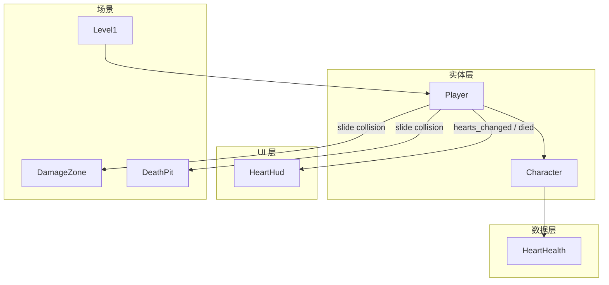

# P0-B01 心形血量系统 — 实现文档

> **任务**：P0-B01 心形血量系统（见 [P0-战斗与角色](../任务/P0-战斗与角色.md)）  
> **完成时间**：2026-07  
> **详细说明**：[源码与函数说明.md](./源码与函数说明.md)

---

## 概述

本次实现为 Demo v0.1 引入**离散心形血量**（默认 5 颗心），替代传统血条：

- 受击扣 1 心，心为 0 时发出 `died` 信号
- 左上角 HUD 用圆点绘制当前血量（不依赖 Emoji 字体）
- 关卡内 **DamageZone**（绿）扣 1 心，**DeathPit**（红）立即清空

---

## 涉及文件一览

| 类型 | 路径 | 说明 |
|------|------|------|
| 新建 | `src/entity/character/health.hpp` | 纯数据结构，心形血量运算 |
| 新建 | `src/ui/heart_hud.hpp` | HUD 控件类声明 |
| 新建 | `src/ui/heart_hud.cpp` | HUD 绘制与信号绑定 |
| 修改 | `src/entity/character/character.hpp` | 角色血量 API、信号、成员 |
| 修改 | `src/entity/character/character.cpp` | 扣血、重置、信号发射 |
| 修改 | `src/entity/character/player.hpp` | 伤害区碰撞检测声明 |
| 修改 | `src/entity/character/player.cpp` | 伤害区逻辑、默认 5 心 |
| 修改 | `src/core/constants.hpp` | 信号名、节点名常量 |
| 修改 | `src/api/extension_interface.cpp` | 注册 `HeartHud` 类 |
| 修改 | `project/scenes/characters/player.tscn` | `collision_mask = 56` |
| 修改 | `project/scenes/ui/main_dialog.tscn` | `HudCanvasLayer` + `HeartHud` |

---

## 架构关系



---

## 信号与常量

| 名称 | 定义位置 | 用途 |
|------|----------|------|
| `hearts_changed` | `constants.hpp` → `event::hearts_changed` | 参数 `(current, max)`，血量变化时广播 |
| `died` | `constants.hpp` → `event::died` | 心为 0 时广播（供 P0-B05 死亡重开） |
| `HeartHud` | `constants.hpp` → `name::ui::heart_hud` | HUD 节点唯一名（预留） |

---

## 场景节点结构（HUD 相关）

```
MainSubViewport
├── MainCanvasLayer          # 关卡与游戏世界
│   └── Level1
│       └── Player
└── HudCanvasLayer (layer=10) # 固定于视口，不受相机影响
    └── HeartHud
```

---

## 已知设计决策

1. **延迟绑定**：`HeartHud` 在 `_ready` 中 `call_deferred("connect_to_player")`，避免早于 `Level::_ready` 创建 Player。
2. **`find_child(..., owned=false)`**：Level 由 C++ 动态挂载，不能用 `owned=true` 查找。
3. **圆点绘制**：默认字体不支持 ❤️ Emoji，改用 `Control::_draw()` 画圆点。
4. **接触去重**：`m_active_zone_colliders` 仅在**首次进入**伤害区时扣心（无敌帧留给 P0-B02）。

---

## 验收对照

| 验收项 | 状态 |
|--------|------|
| 3 或 5 颗心 | ✅ 默认 5 |
| 受击扣 1 心 | ✅ DamageZone |
| UI 同步 | ✅ HeartHud |
| 心为 0 触发死亡信号 | ✅ `died` |

---

## 后续任务衔接

| 任务 | 与本模块关系 |
|------|----------------|
| P0-B02 无敌帧 | 在 `take_damage` 或 `handle_zone_contact` 增加冷却 |
| P0-B05 死亡重开 | 监听 `died` 信号 |
| P0-B04 敌人接触伤害 | 敌人调用 `Player::take_damage(1)` |
