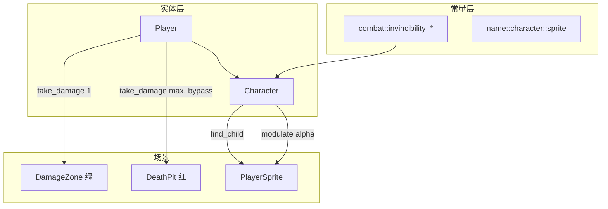

# P0-B02 受击无敌帧 — 实现文档

> **任务**：P0-B02 受击无敌帧（见 [P0-战斗与角色](../任务/P0-战斗与角色.md)）  
> **依赖**：P0-B01 心形血量系统  
> **完成时间**：2026-07  
> **详细说明**：[源码与函数说明.md](./源码与函数说明.md)

---

## 概述

本次在 P0-B01 扣心逻辑之上，为 `Character` 增加**受击后短暂无敌**与**精灵闪烁反馈**：

- 受击成功后进入 **0.75s** 无敌（任务要求 0.5–1s 范围内）
- 无敌期间再次调用 `take_damage` 不扣心
- 对 `PlayerSprite` 做透明度闪烁（0.35 ↔ 1.0，间隔 0.08s）
- **DeathPit**（红）即死伤害绕过无敌；**DamageZone**（绿）受无敌保护

---

## 涉及文件一览

| 类型 | 路径 | 说明 |
|------|------|------|
| 修改 | `src/entity/character/character.hpp` | 无敌 API、`_process`、精灵与计时成员 |
| 修改 | `src/entity/character/character.cpp` | 无敌逻辑、闪烁、扣血流程变更 |
| 修改 | `src/entity/character/player.cpp` | DeathPit 传入 `bypass_invincibility` |
| 修改 | `src/core/constants.hpp` | 精灵节点名、无敌帧数值常量 |

> 未新建 cpp/hpp；逻辑集中在 `Character` 基类，便于 P0-B04 敌人接触伤害复用 `take_damage(1)`。

---

## 架构关系

---

## 常量一览

| 名称 | 定义位置 | 值 | 用途 |
|------|----------|-----|------|
| `name::character::sprite` | `constants.hpp` | `"PlayerSprite"` | `_ready` 中查找闪烁目标 |
| `combat::invincibility_duration` | `constants.hpp` | `0.75` | 无敌持续时间（秒） |
| `combat::invincibility_blink_interval` | `constants.hpp` | `0.08` | 闪烁切换间隔（秒） |
| `combat::invincibility_blink_alpha` | `constants.hpp` | `0.35` | 闪烁「暗」相透明度 |

---

## 与 P0-B01 的协作

| P0-B01 机制 | P0-B02 如何衔接 |
|-------------|-----------------|
| `m_active_zone_colliders` 首次进入扣血 | 同区站立不重复扣；**离开再进入**时由无敌帧拦截 |
| `take_damage(1)` | 成功扣血后自动 `start_invincibility()` |
| `take_damage(max)` 即死 | 改为 `take_damage(max, true)`，**不触发无敌** |
| `reset_hearts()` | 同时 `end_invincibility()`，清除闪烁状态 |

---

## 已知设计决策

1. **无敌集中在 `take_damage`**：伤害区、未来敌人 AI 均走同一入口，无需各处单独判无敌。
2. **`bypass_invincibility` 仅 C++ 默认参数**：不暴露给 Godot 脚本；即死区在 `player.cpp` 内硬编码。
3. **按需 `_process`**：默认 `set_process(false)`，仅无敌期间启用，减少空转。
4. **闪烁目标为子节点 `PlayerSprite`**：不 modulate 整个 `Player`（避免影响 `PointLight2D` 等兄弟节点）。
5. **`m_sprite` 无 assert**：敌人子类场景可能无同名精灵；找不到时仅跳过视觉，逻辑无敌仍生效。

---

## 验收对照

| 验收项 | 状态 |
|--------|------|
| 受击后 0.5–1s 无敌 | ✅ 0.75s |
| 闪烁反馈 | ✅ Sprite modulate |
| 无敌期间不重复扣心 | ✅ `take_damage` 拦截 |
| 降级：无闪烁仅逻辑无敌 | ✅ `m_sprite == nullptr` 时仍有无敌 |

---

## 后续任务衔接

| 任务 | 与本模块关系 |
|------|----------------|
| P0-B04 敌人接触伤害 | 敌人调用 `player->take_damage(1)`，自动享受无敌 |
| P0-B05 死亡重开 | 死亡时 `end_invincibility()` 已清理状态 |
| 视觉增强（可选） | 可改为 `visible` 开关或全节点 modulate |
