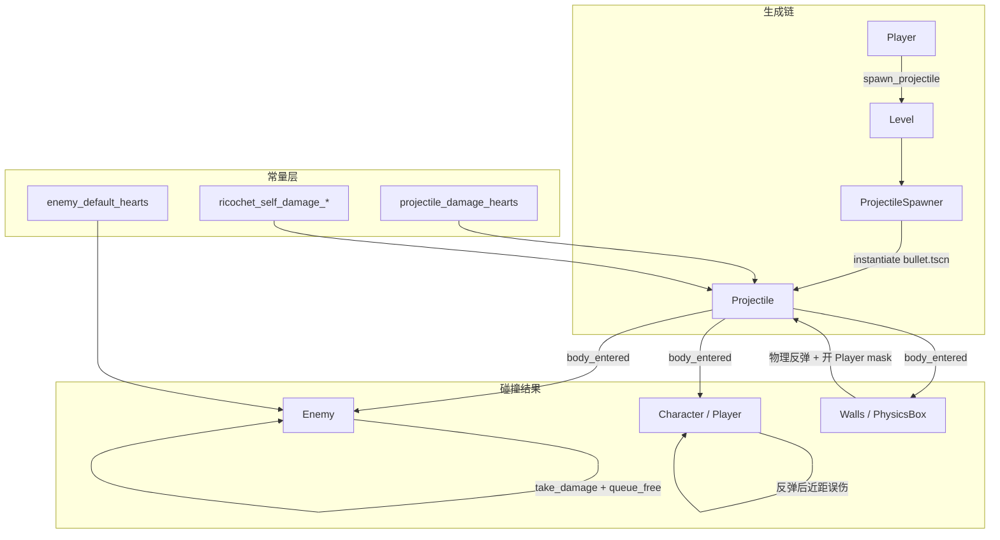

# P0-B03 脉冲攻击打磨 — 实现文档

> **任务**：P0-B03 脉冲攻击打磨（见 [P0-MVP最小闭环开发任务](../任务/P0-MVP最小闭环开发任务.md)）  
> **依赖**：P0-B01 心形血量、P0-B02 受击无敌帧  
> **完成时间**：2026-07  
> **详细说明**：[源码与函数说明.md](./源码与函数说明.md)

---

## 概述

本次实现 MVP **M2 脉冲攻击**，在既有 `Projectile` 发射链路上补齐：

- 子弹命中 **敌人** 扣心并销毁（不穿透多段伤害）
- 子弹命中 **墙体 / PhysicsBox** 时 **物理反弹**（不销毁）
- **首发**子弹不打玩家；**反弹后**且玩家距反弹点足够近时，可 **误伤自己**（狂暴自伤设定）
- 关卡内放置 **TestEnemy** 供 B03 手动验收；敌人归零时 `queue_free`

---

## 涉及文件一览

| 类型 | 路径 | 说明 |
|------|------|------|
| 修改 | `src/core/constants.hpp` | 脉冲伤害、敌人默认心数、反弹误伤半径 |
| 修改 | `src/entity/projectile/projectile.hpp` | 碰撞回调、反弹/命中状态成员 |
| 修改 | `src/entity/projectile/projectile.cpp` | 伤害逻辑、物理材质、反弹误伤 |
| 修改 | `src/entity/character/enemy.hpp` | `_ready`、`on_died` 声明 |
| 修改 | `src/entity/character/enemy.cpp` | 默认心数、死亡移除 |
| 修改 | `src/entity/character/character.cpp` | `CharacterController` 改为可选（场景内静止敌人） |
| 修改 | `src/entity/level.hpp` | 移除 PhysicsBox 调试信号槽 |
| 修改 | `src/entity/level.cpp` | 简化子弹生成；伤害下沉至 `Projectile` |
| 修改 | `project/scenes/projectiles/bullet.tscn` | 碰撞 mask = 74 |
| 修改 | `project/scenes/characters/enemy.tscn` | `collision_layer = NPCs(2)` |
| 修改 | `project/scenes/levels/level1.tscn` | 实例化 `TestEnemy` |

> 未新建 cpp/hpp；`ProjectileSpawner` 仍负责预加载与射速限制，命中逻辑集中在 `Projectile`。

---

## 架构关系

---

## 常量一览

| 名称 | 定义位置 | 值 | 用途 |
|------|----------|-----|------|
| `combat::projectile_damage_hearts` | `constants.hpp` | `1` | 脉冲命中敌人扣心数 |
| `combat::enemy_default_hearts` | `constants.hpp` | `3` | 敌人默认心数（B04 前测试用） |
| `combat::ricochet_self_damage_radius` | `constants.hpp` | `120.0f` | 反弹点起算，玩家在此半径内可被误伤（px） |
| `combat::ricochet_self_damage_hearts` | `constants.hpp` | `1` | 反弹误伤扣心数 |

---

## 碰撞矩阵（B03 相关）

| 主体 | layer | mask（初始） | B03 行为 |
|------|-------|-------------|----------|
| Projectile | `Projectiles (4)` | `74` = NPCs + Walls + PhysicsObjects | 首发不含 Player |
| Enemy | `NPCs (2)` | `Walls (8)` | 可被子弹命中 |
| Player | `Player (1)` | `56` | 首发不被子弹检测；反弹后子弹 mask 动态加入 Player |

**mask 74 分解**：`2 + 8 + 64` = 敌人 + 围墙 + 紫色 PhysicsBox。

---

## 与 P0-B01 / B02 的协作

| 机制 | B03 如何衔接 |
|------|----------------|
| `Enemy::take_damage(1)` | 走 `Character` 扣心；敌人无控制器时仍可受伤 |
| `Player` 误伤 `take_damage(1)` | 尊重 B02 无敌帧，不会连扣 |
| `died` 信号 | 敌人 `on_died` → `queue_free`；玩家死亡逻辑留给 B05 |
| `HeartHud` | 仅绑定玩家；敌人扣心仅 Console 反馈（降级） |

---

## 已知设计决策

1. **伤害逻辑在 `Projectile::on_body_entered`**：Level 只负责生成与定位，不再连接调试用的 `body_entered`。
2. **墙体不 `queue_free`**：反弹由 `PhysicsMaterial`（`bounce=0.85`）在 `_ready` 中设置；避免在 tscn 内嵌 `PhysicsMaterial2D` 导致场景加载失败。
3. **首发 mask 不含 Player**：直射永不伤己；首次碰墙/箱后 `set_collision_mask` 加入 Player 层。
4. **误伤距离以反弹点为准**：玩家距 `m_bounce_point` ≤ 120px 才扣心，体现「贴墙狂暴射击」风险。
5. **`CharacterController` 可选**：`level1.tscn` 内静态 `TestEnemy` 无 AI 控制器，不再 `runtime_assert` 崩溃。
6. **反弹材质在 C++ 设置**：`bullet.tscn` 保持 `load_steps=3` 简单格式，经编译验证可稳定 `instantiate()`。

---

## 验收对照

| 验收项 | 状态 |
|--------|------|
| 按键射击稳定发射 | ✅ |
| 子弹命中敌人扣心 | ✅ Console `pulse hit` |
| 敌人心为 0 消失 | ✅ `enemy defeated` + `queue_free` |
| 子弹打墙/箱反弹 | ✅ 物理反弹，不穿透 PhysicsBox |
| 贴墙射击可误伤自己 | ✅ `ricochet self-hit` |
| 远离墙体反弹不伤己 | ✅ 超半径忽略 |
| 直射不穿自伤 | ✅ 未反弹时忽略 Player |
| 编译运行正常 | ✅ 用户已验证 |

---

## 后续任务衔接

| 任务 | 与本模块关系 |
|------|----------------|
| P0-L01 单关卡 | `TestEnemy` 临时放置，后续改为刷点生成 |
| P0-B04 敌人 AI | 复用 `Enemy` 心数与 `take_damage`；接触伤害打玩家 |
| P0-B06 碰撞层整理 | 对照本文碰撞矩阵做全场景回归 |
| 视觉增强（可选） | 命中特效、敌人闪烁（需敌人场景 `PlayerSprite` 或扩展查找逻辑） |
