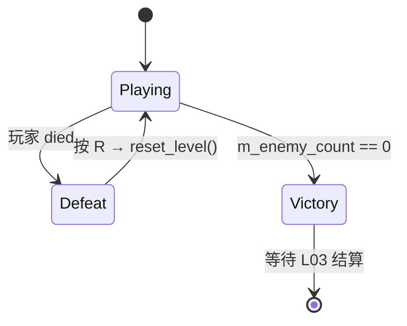

# P0-B05 + P0-L02 死亡重开与关卡状态机 — 实现文档

> **任务**：P0-B05 死亡与重开 + P0-L02 关卡流程状态机（合并迭代）  
> **关联**：[P0-MVP最小闭环开发任务](../任务/P0-MVP最小闭环开发任务.md)  
> **依赖**：P0-B01 心形血量、P0-B04 敌人 AI、P0-L01 单关卡  
> **完成时间**：2026-07  
> **详细说明**：[源码与函数说明.md](./源码与函数说明.md)

---

## 概述

本次实现 MVP **M5 玩家死亡重开** 与 **M7 胜负判定（状态机部分）**：

- `Level` 持有 `Playing / Victory / Defeat` 三态，互斥切换
- 玩家 `died` → `Defeat`；全部敌人阵亡 → `Victory`
- 终局时锁定 `PlayerController` 输入（移动 / 瞄准 / 射击）
- 失败态按 **R** 调用 `Level::reset_level()` 复位心数、敌人与状态
- 发出 `level_state_changed` 信号，供 P0-L03 结算 UI 监听

---

## 涉及文件一览

| 类型 | 路径 | 说明 |
|------|------|------|
| 修改 | `src/entity/level.hpp/cpp` | 状态机、敌人计数、重开、信号 |
| 修改 | `src/entity/controller/character_controller.hpp/cpp` | `set_input_enabled` 输入门控 |
| 修改 | `src/core/constants.hpp` | `level_state_changed` 事件名 |
| 修改 | `src/util/input.hpp` | `restart` 输入动作名 |
| 修改 | `project/project.godot` | `restart` 映射到 R 键 |

---

## 状态机

| 状态 | 玩家输入 | 游戏逻辑 |
|------|----------|----------|
| `Playing` | 启用 | 正常 `_process`、射击、位置日志 |
| `Defeat` | 禁用 | 监听 R 重开；Console 提示 |
| `Victory` | 禁用 | 等待 L03 展示结算文案 |

---

## 关键 API

| 符号 | 说明 |
|------|------|
| `enum class LevelState` | `Playing`, `Victory`, `Defeat` |
| `Level::transition_to_state()` | 仅从 `Playing` 切出，锁定输入并发信号 |
| `Level::reset_level()` | 清弹 / 清敌、复位心数与出生点、重刷敌人 |
| `CharacterController::set_input_enabled()` | 门控 `_process` 内全部输入处理 |

---

## 验收对照

| 验收项 | 状态 |
|--------|------|
| 心为 0 后不能移动 / 射击 | ✅ |
| 失败态按 R 可重开，状态复位 | ✅ |
| 消灭全部敌人进入胜利态 | ✅ |
| 胜负互斥，不会双终局 | ✅ |
| 编译通过 | ✅ |

---

## 后续任务衔接

| 任务 | 关系 |
|------|------|
| P0-L03 | 监听 `level_state_changed`，展示胜利 / 失败文案；胜利态可增加「继续 / 重开」 |
| P0-L07 | 死亡轮 + 胜利轮走测 |
