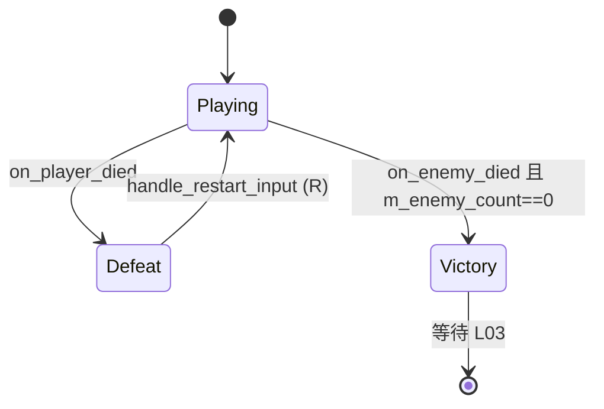

# P0-B05 + P0-L02 源码与函数说明

本文档逐文件说明本次 **P0-B05 死亡重开** 与 **P0-L02 关卡状态机** 涉及的 **头文件职责**、**cpp 文件含义**，以及 **每个函数/成员** 的作用。文末附 **头文件注释对照表**，便于在 IDE 外查阅。

> 概要文档见 [README.md](./README.md) · 依赖 [P0-B04 源码与函数说明](../P0-B04-敌人基础AI/源码与函数说明.md)（敌人 `died`、刷怪）· [P0-B01 实现文档](../P0-B01-心形血量系统/README.md)（`died` / `reset_hearts`）

---

## 1. `src/core/constants.hpp`（本次增量）

**文件含义**：全局字符串、碰撞层枚举与战斗数值常量。本次在 `event` 命名空间增加关卡状态变化信号名，供 `Level` 向 L03 结算 UI 广播。

### 命名空间 `event`（增量）

| 常量 | 值 | 说明 |
|------|-----|------|
| `level_state_changed` | `"level_state_changed"` | `Level` 进入 `Victory` / `Defeat` 时发射；参数为 `int`（`LevelState` 枚举底层值） |

```cpp
/** Level 状态切换时发射（P0-L02）；参数为 LevelState 的 int 值。 */
constexpr inline auto level_state_changed{ "level_state_changed" };
```

### 枚举 `LevelState`（定义于 `level.hpp`，信号传参对照）

| 枚举值 | 底层 `int` | 含义 |
|--------|------------|------|
| `LevelState::Playing` | `0` | 正常游玩 |
| `LevelState::Victory` | `1` | 全部敌人阵亡 |
| `LevelState::Defeat` | `2` | 玩家心数为 0 |

---

## 2. `src/util/input.hpp`（本次增量）

**文件含义**：输入动作名字符串常量，与 `project.godot` 的 `[input]` 段一一对应。

### 命名空间 `input::action`（增量）

| 常量 | 值 | 说明 |
|------|-----|------|
| `restart` | `"restart"` | 失败态重开本关；`Level::handle_restart_input` 检测 `is_action_just_pressed` |

```cpp
/** 失败态重开本关（P0-B05），映射物理键 R。 */
constexpr inline auto restart{ "restart" };
```

---

## 3. `project/project.godot`（本次增量）

**文件含义**：Godot 项目配置。本次在 `[input]` 段注册 `restart` 动作。

| 动作名 | 绑定 | 说明 |
|--------|------|------|
| `restart` | `physical_keycode = 82`（R 键） | 仅在 `LevelState::Defeat` 时由 `Level` 处理 |

---

## 4. `src/entity/level.hpp`

**文件含义**：单关卡根节点声明。在 B04 刷怪基础上，新增 **三态状态机**、**存活敌人计数**、**失败重开** 与 **`level_state_changed` 信号**。是 L02 与 B05 的核心落点。

### 枚举：`enum class LevelState`

| 枚举值 | 说明 |
|--------|------|
| `Playing` | 默认态；允许玩家输入、射击、位置调试输出 |
| `Victory` | 全部敌人阵亡；锁定输入，等待 L03 结算 |
| `Defeat` | 玩家死亡；锁定输入，监听 R 重开 |

### 类：`class Level`

#### 公开接口

| 函数 / 成员 | 说明 |
|-------------|------|
| `Level()` | 构造：设置唯一名 `Level1`，`activate(true)` |
| `~Level()` | 默认析构 |
| `_ready()` | 初始化玩家、刷怪、连接 `died` / 射击 / 位置信号 |
| `_draw()` | **B05+L02**：仅在 `Playing` 且关卡激活时绘制瞄准圆点 |
| `_process(delta_time)` | 光标显隐；**Defeat** 时检测 R 重开 |
| `activate(active)` | 设置 `m_active`（关卡是否处于「游玩焦点」） |
| `active()` | 查询 `m_active` |
| `get_state()` | 返回当前 `m_state` |

#### 保护接口（信号槽 + 绑定）

| 函数 | 说明 |
|------|------|
| `_bind_methods()` | 注册槽函数与 `level_state_changed` 信号 |
| `on_player_spawn_projectile(obj)` | 玩家射击；**Playing** 外忽略 |
| `on_character_position_changed(node, location)` | 控制器位置日志；**Playing** 外忽略 |
| `on_player_died()` | 玩家 `died` 槽 → `transition_to_state(Defeat)` |
| `on_enemy_died()` | 敌人 `died` 槽 → 递减计数，归零则 `Victory` |

#### 私有接口

| 函数 | 说明 |
|------|------|
| `spawn_player_at_marker()` | 将 `m_player` 移到 `SpawnPoint` 标记位置 |
| `spawn_enemies_from_markers()` | 扫描 `EnemySpawn*` 刷怪；**递增 `m_enemy_count`** 并连接 `on_enemy_died` |
| `clear_enemies()` | 逆序遍历子节点，`queue_free` 所有 `Enemy` |
| `clear_projectiles()` | 逆序遍历子节点，`queue_free` 所有 `Projectile` |
| `set_player_input_enabled(enabled)` | 转发到 `PlayerController::set_input_enabled` |
| `transition_to_state(new_state)` | 仅从 `Playing` 切到 `Victory`/`Defeat`；锁输入、发信号、Console 提示 |
| `reset_level()` | 清弹清敌、复位状态与心数、重刷敌人、恢复输入 |
| `handle_restart_input()` | `Defeat` + `restart` 刚按下 → `reset_level()` |

#### 成员变量

| 成员 | 类型 | 说明 |
|------|------|------|
| `m_active` | `std::atomic<bool>` | 关卡是否激活（光标与绘制门控） |
| `m_state` | `LevelState` | 当前关卡流程状态，默认 `Playing` |
| `m_enemy_count` | `int` | 本关存活敌人计数；刷怪时递增，敌人 `died` 时递减 |
| `m_background` | `godot::Node*` | 背景节点引用（预留，本次未改逻辑） |
| `m_projectile_spawner` | `ProjectileSpawner*` | 子弹生成器 |
| `m_player` | `Player*` | 本关玩家实例 |
| `m_physics_box` | `godot::RigidBody2D*` | 调试物理盒引用（既有） |

#### 前向声明

| 类型 | 说明 |
|------|------|
| `godot::RigidBody2D` | `m_physics_box` 类型，避免头文件 include 过重 |
| `Player` | `m_player` 与部分槽函数相关 |

---

## 5. `src/entity/level.cpp`

**文件含义**：`Level` 全部方法实现。包含匿名辅助函数 `state_label`、状态切换、重开复位，以及对 B04 既有逻辑的 **Playing 门控** 补丁。

### 匿名命名空间

| 函数 | 说明 |
|------|------|
| `state_label(state)` | 将 `LevelState` 转为 `"Playing"` / `"Victory"` / `"Defeat"` 字符串，供 Console 彩色输出 |

### 函数说明

| 函数 | 说明 |
|------|------|
| `Level::Level()` | `set_unique_name(Level1)` + `activate(true)` |
| `Level::_ready()` | 见下方 **初始化步骤表** |
| `Level::get_state()` | 返回 `m_state` |
| `Level::spawn_player_at_marker()` | `find_child(SpawnPoint)` → `set_global_position` |
| `Level::spawn_enemies_from_markers()` | 见下方 **刷怪步骤表**（相对 B04 增加计数与 `died` 连接） |
| `Level::clear_enemies()` | 子节点逆序扫描，`cast_to<Enemy>` 则 `queue_free` |
| `Level::clear_projectiles()` | 子节点逆序扫描，`cast_to<Projectile>` 则 `queue_free` |
| `Level::set_player_input_enabled(enabled)` | `gdcast<PlayerController>` → `set_input_enabled` |
| `Level::transition_to_state(new_state)` | 见下方 **状态切换表** |
| `Level::reset_level()` | 见下方 **重开步骤表** |
| `Level::handle_restart_input()` | 非 `Defeat` 直接返回；`is_action_just_pressed(restart)` → `reset_level()` |
| `Level::_process(delta_time)` | 编辑器跳过；光标显隐；**仅 Defeat** 调用 `handle_restart_input`；`queue_redraw` |
| `Level::_draw()` | `active() && m_state == Playing` 时画鼠标瞄准圆 |
| `Level::activate(active)` | 写 `m_active` |
| `Level::active()` | 读 `m_active` |
| `Level::_bind_methods()` | 绑定四个槽 + `level_state_changed(int)` |
| `Level::on_player_spawn_projectile(obj)` | 非 `Playing` 返回；否则 spawner 生成子弹并 `add_child` |
| `Level::on_character_position_changed(node, location)` | 非 `Playing` 返回；否则 Console 打印坐标 |
| `Level::on_player_died()` | `transition_to_state(Defeat)` |
| `Level::on_enemy_died()` | 非 `Playing` 返回；`--m_enemy_count`；`<= 0` 则 `Victory` |

**`_ready` 初始化步骤**

| 步骤 | 代码行为 |
|------|----------|
| 1 | 查找 `PhysicsBox` → `m_physics_box` |
| 2 | 实例化 `Player` + `PlayerController` |
| 3 | `add_child(m_player)` → `spawn_player_at_marker()` |
| 4 | `add_child(m_projectile_spawner)` → `spawn_enemies_from_markers()` |
| 5 | **`connect Player::died → on_player_died`** |
| 6 | 连接 `position_changed`、`spawn_projectile`（既有调试/射击） |

**`spawn_enemies_from_markers` 相对 B04 的增量**

| 步骤 | 代码行为 |
|------|----------|
| 1–7 | 与 B04 相同：扫描 `EnemySpawn*`、实例化、`EnemyController`、`add_child` |
| 8 | **`connect Enemy::died → on_enemy_died`** |
| 9 | **`++m_enemy_count`** |

**`transition_to_state` 逻辑**

| 条件 | 行为 |
|------|------|
| `m_state != Playing` | 直接返回（胜负互斥，防止双终局） |
| `new_state == Playing` | 直接返回（终局不可经此函数回到 Playing） |
| 否则 | 写 `m_state` → `set_player_input_enabled(false)` → `emit level_state_changed` → Console 输出状态；`Defeat` 额外提示按 R |

**`reset_level` 重开步骤**

| 步骤 | 代码行为 |
|------|----------|
| 1 | `clear_projectiles()` |
| 2 | `clear_enemies()` |
| 3 | `m_state = Playing`，`m_enemy_count = 0` |
| 4 | `m_player->reset_hearts()` + `spawn_player_at_marker()` |
| 5 | `set_player_input_enabled(true)` |
| 6 | `spawn_enemies_from_markers()`（重新计数、重新连接 `died`） |
| 7 | Console 输出 `level reset` |

> **include 增量**：`#include "entity/projectile/projectile.hpp"`（`clear_projectiles` 类型判断）

---

## 6. `src/entity/controller/character_controller.hpp`

**文件含义**：角色输入控制器基类。本次新增 **输入总开关** `m_input_enabled`，供 `Level` 在终局时统一锁定玩家（及未来其他角色的）移动 / 旋转 / 动作处理。

### 类：`class CharacterController`

#### 公开接口（本次增量）

| 函数 | 说明 |
|------|------|
| `set_input_enabled(enabled)` | 设置 `m_input_enabled`；`false` 时 `_process` 不再调用三个 `process_*_input` |
| `input_enabled()` | 查询当前是否允许处理输入 |

#### 保护成员（本次增量）

| 成员 | 说明 |
|------|------|
| `m_input_enabled` | 默认 `true`；`Level::set_player_input_enabled` 在终局设为 `false` |

#### 既有接口（B05+L02 上下文）

| 函数 / 成员 | B05+L02 用途 |
|-------------|----------------|
| `_process(delta_time)` | 在 `m_input_enabled == false` 时提前返回，**玩家无法移动/瞄准/射击** |
| `process_movement_input` | `PlayerController` 实现；被门控 |
| `process_rotation_input` | 同上 |
| `process_action_input` | 同上（含 `shoot`） |
| `m_input_mode` | `PlayerController` 仍为 `MouseAndKeyboard`；与门控正交 |
| `m_rotation_angle` | 门控后不再更新 |
| `m_elapsed_time` | 门控后不再累加，不再发射 `position_changed` |

> **设计说明**：门控放在基类 `_process` 入口，而非仅在 `PlayerController` 内判断，便于 `EnemyController` 未来也可被关卡冻结（当前 B05 只锁玩家）。

---

## 7. `src/entity/controller/character_controller.cpp`

**文件含义**：`CharacterController` 实现。本次在 `_process` 最前增加 `m_input_enabled` 检查，并实现开关 getter/setter。

### 函数说明

| 函数 | 说明 |
|------|------|
| `set_input_enabled(enabled)` | `m_input_enabled = enabled` |
| `input_enabled()` | 返回 `m_input_enabled` |
| `_process(delta_time)` | 编辑器返回 → **`!m_input_enabled` 返回** → 调用三个 `process_*_input` → 每秒 `position_changed` |
| `process_action_input(...)` | 基类占位，派生类须覆盖 |
| `process_movement_input(...)` | 基类占位 |
| `process_rotation_input(...)` | 基类占位 |
| `_bind_methods()` | 注册 `character_move` / `rotate` / `shoot` / `position_changed` 信号（无变更） |

---

## 8. 关联文件（只读，B05+L02 依赖链）

以下文件 **本次未修改**，但状态机依赖其行为。

### `src/entity/character/character.hpp` / `character.cpp`

| 符号 | B05+L02 用途 |
|------|----------------|
| `take_damage(...)` | 心数为 0 时 `emit_signal(event::died)` |
| `reset_hearts()` | `reset_level` 恢复玩家心数与无敌状态 |
| `is_alive()` | 死亡后角色仍存在场景中，靠输入门控禁止操作 |

### `src/entity/character/enemy.cpp`

| 符号 | B05+L02 用途 |
|------|----------------|
| `Enemy::_ready` | 自身 `died → on_died`（`queue_free`） |
| `Enemy::on_died` | 在 `Level::on_enemy_died` **之后或之前** 均安全；`queue_free` 延迟到帧末 |

### `src/entity/controller/player_controller.hpp` / `.cpp`

| 符号 | B05+L02 用途 |
|------|----------------|
| 全部 `process_*_input` | 继承基类 `_process` 调度；被 `m_input_enabled` 门控，**无需改 PlayerController 源码** |

### `src/main.cpp` / `main.hpp`

| 符号 | 说明 |
|------|------|
| `Main` 构造 | 实例化 `Level` 并挂到 `CanvasLayer`；重开采用 **`Level::reset_level`** 而非 `reload_current_scene`（与 GDExtension 架构一致） |

---

## 9. 运行时调用链

### 玩家死亡 → 失败态

```
Player::take_damage (hearts → 0)
  → Character::emit_signal(died)
  → Level::on_player_died
    → transition_to_state(Defeat)
      → m_state = Defeat
      → PlayerController::set_input_enabled(false)
      → emit level_state_changed(2)
      → Console: level state Defeat + press R
```

### 最后一名敌人死亡 → 胜利态

```
Enemy::take_damage (hearts → 0)
  → emit died
  → Level::on_enemy_died        // 与 Enemy::on_died 同为 died 的连接槽
    → --m_enemy_count
    → m_enemy_count <= 0
      → transition_to_state(Victory)
        → set_input_enabled(false)
        → emit level_state_changed(1)
```

### 失败态按 R 重开

```
Level::_process (m_state == Defeat)
  → handle_restart_input
    → Input::is_action_just_pressed("restart")
    → reset_level
      → clear_projectiles / clear_enemies
      → m_state = Playing, m_enemy_count = 0
      → Player::reset_hearts + spawn_player_at_marker
      → set_input_enabled(true)
      → spawn_enemies_from_markers
```

### Playing 门控（射击与调试）

```
非 Playing 状态下:
  on_player_spawn_projectile  → 直接 return（无法射击）
  on_character_position_changed → 直接 return（无位置日志）
  _draw 瞄准圆点               → 不绘制
```

---

## 10. 状态机一览



| 当前状态 | 可转入 | 触发条件 | 玩家输入 |
|----------|--------|----------|----------|
| `Playing` | `Defeat` | 玩家 `died` | 启用 |
| `Playing` | `Victory` | `m_enemy_count` 归零 | 启用 |
| `Defeat` | `Playing` | 按 R → `reset_level` | 禁用 |
| `Victory` | — | L03 未实现重开出口 | 禁用 |

---

## 11. 信号一览

| 信号 | 注册类 | 参数 | 发射时机 | 监听方（当前） |
|------|--------|------|----------|----------------|
| `died` | `Character` | 无 | 心数为 0 | `Level::on_player_died`（玩家）；`Level::on_enemy_died`（每个敌人） |
| `level_state_changed` | `Level` | `int`（`LevelState`） | `transition_to_state` | **预留 L03** `MainDialog` 等 |
| `spawn_projectile` | `Player` | `Node*` | 射击 | `Level::on_player_spawn_projectile`（Playing 门控） |
| `position_changed` | `CharacterController` | `Object*`, `Vector2` | 每秒 | `Level::on_character_position_changed`（Playing 门控） |

---

## 12. 头文件注释对照表

以下为各头文件中 **P0-B05 + P0-L02 相关** 关键声明的文档化注释（建议阅读源码时对照；与本文档一一对应）。若源码中尚未写入块注释，可按此表补全。

### `constants.hpp`

```cpp
/** Level 状态切换时发射（P0-L02）；参数为 LevelState 的 int 值。 */
constexpr inline auto level_state_changed{ "level_state_changed" };
```

### `input.hpp`

```cpp
/** 失败态重开本关（P0-B05），映射物理键 R。 */
constexpr inline auto restart{ "restart" };
```

### `level.hpp`

```cpp
/** 关卡流程状态（P0-L02）。 */
enum class LevelState {
    Playing,  /**< 正常游玩 */
    Victory,  /**< 全部敌人阵亡 */
    Defeat    /**< 玩家死亡 */
};

/**
 * 单关卡根节点：玩家/敌人/子弹生命周期与流程状态机（P0-L02 + P0-B05）。
 * Victory/Defeat 时锁定玩家输入；Defeat 下按 R 调用 reset_level。
 */
class Level : public godot::Node2D;

/** 构造：唯一名 Level1，默认 activate(true)。 */
Level();

/** 实例化玩家与敌人，连接 died / 射击 / 位置信号。 */
virtual void _ready() override;

/** 仅 Playing 且 active 时绘制瞄准辅助圆。 */
void _draw() override;

/** 光标显隐；Defeat 时检测 restart 输入。 */
void _process(double delta_time) override;

/** 设置关卡是否为当前游玩焦点（光标行为）。 */
void activate(bool active = true);

/** 查询关卡是否激活。 */
[[nodiscard]] bool active() const;

/** 返回当前关卡流程状态。 */
[[nodiscard]] LevelState get_state() const;

/** 玩家射击槽：非 Playing 时忽略。 */
[[signal_slot]] void on_player_spawn_projectile(godot::Node* obj);

/** 控制器位置调试槽：非 Playing 时忽略。 */
[[signal_slot]] void on_character_position_changed(const godot::Object* const obj,
                                                   godot::Vector2 location) const;

/** 玩家 died 槽 → transition_to_state(Defeat)。 */
[[signal_slot]] void on_player_died();

/** 敌人 died 槽 → 递减 m_enemy_count，归零则 Victory。 */
[[signal_slot]] void on_enemy_died();

/** 将玩家移到 SpawnPoint 标记。 */
void spawn_player_at_marker();

/**
 * 扫描 EnemySpawn* 刷怪，递增 m_enemy_count，
 * 并为每个敌人连接 died → on_enemy_died（P0-B04 基础 + L02 计数）。
 */
void spawn_enemies_from_markers();

/** 移除关卡下所有 Enemy 子节点（重开前清理）。 */
void clear_enemies();

/** 移除关卡下所有 Projectile 子节点（重开前清理）。 */
void clear_projectiles();

/** 转发到 PlayerController::set_input_enabled。 */
void set_player_input_enabled(bool enabled);

/**
 * 从 Playing 切换到 Victory 或 Defeat。
 * 互斥：已在终局则忽略；不可切回 Playing。
 */
void transition_to_state(LevelState new_state);

/**
 * 重开本关：清弹清敌、复位状态与心数、重刷敌人、恢复输入（P0-B05）。
 */
void reset_level();

/** Defeat 下检测 restart 动作并调用 reset_level。 */
void handle_restart_input();

/** 当前关卡流程状态，默认 Playing。 */
LevelState m_state{ LevelState::Playing };

/** 存活敌人数量；刷怪 ++，敌人 died --。 */
int m_enemy_count{ 0 };
```

### `character_controller.hpp`

```cpp
/**
 * 设置是否处理输入（P0-B05）。
 * false 时 _process 跳过 movement / rotation / action，用于终局锁操作。
 */
void set_input_enabled(bool enabled);

/** 查询输入是否启用。 */
[[nodiscard]] bool input_enabled() const;

/** 输入总开关，默认 true。 */
bool m_input_enabled{ true };
```

### `character_controller.cpp`（实现侧注释建议）

```cpp
/** 写 m_input_enabled。 */
void CharacterController::set_input_enabled(const bool enabled);

/** 读 m_input_enabled。 */
bool CharacterController::input_enabled() const;

/**
 * 每帧输入调度。
 * 编辑器或 !m_input_enabled 时提前返回；
 * 否则调用三个 process_*_input 并周期性发射 position_changed。
 */
void CharacterController::_process(double delta_time);
```

### `level.cpp`（实现侧注释建议）

```cpp
/** LevelState → 调试用英文字符串。 */
constexpr const char* state_label(const LevelState state);
```

---

## 13. 调参与扩展建议

| 需求 | 修改位置 |
|------|----------|
| 胜利也允许 R 重开 | `handle_restart_input` 增加 `Victory` 分支，或 L03 提供按钮 |
| 自动重开（3 秒） | `Level::_process` 在 `Defeat` 累加计时器后 `reset_level` |
| 冻结敌人 AI | `Victory`/`Defeat` 时对 `EnemyController` 调用 `set_input_enabled(false)` |
| 结算文案 | L03：监听 `level_state_changed`，按 `int` 参数展示不同文本 |
| 重开不清子弹 | `reset_level` 去掉 `clear_projectiles` |
| 多关卡切换 | 用 `change_scene` 替换 `reset_level`，或 `Main` 层管理 Level 实例 |

---

## 14. 与前后任务的协作

| 任务 | B05+L02 如何衔接 |
|------|------------------|
| P0-B01 心形血 | `died` 信号驱动 `Defeat`；`reset_hearts` 驱动重开复位 |
| P0-B02 无敌帧 | 重开时 `reset_hearts` → `end_invincibility`，视觉与计时清零 |
| P0-B04 敌人 AI | `spawn_enemies_from_markers` 刷怪；每个敌人 `died` 递减 `m_enemy_count` |
| P0-L01 刷点 | `SpawnPoint` / `EnemySpawn*` 在 `reset_level` 时复用 |
| P0-L03 结算 | 监听 `level_state_changed(int)`；`0=Playing, 1=Victory, 2=Defeat` |
| P0-L07 走测 | 死亡轮（阵亡 → R 重开）与胜利轮（清敌 → Victory） |

---

## 15. 验收时建议关注的代码路径

| 走测步骤 | 对应函数 |
|----------|----------|
| 扣光心后无法移动/射击 | `transition_to_state(Defeat)` → `set_input_enabled(false)` → `CharacterController::_process` 提前返回 |
| Console 出现 `press R to restart` | `transition_to_state` 内 `Defeat` 分支 |
| 按 R 后心数满、敌人重生 | `reset_level` 全流程 |
| 清敌后 Victory、无法射击 | `on_enemy_died` → `transition_to_state(Victory)` |
| 阵亡与清敌同帧只出一种结局 | `transition_to_state` 首行 `m_state != Playing` 守卫 |
