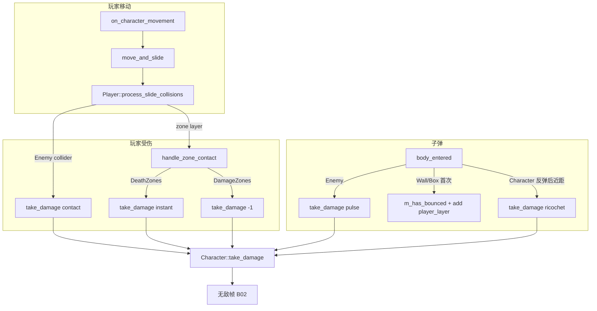

# P0-B06 源码与函数说明

本文档逐文件说明本次 **P0-B06 伤害与碰撞层整理**（及同期 **P0-L07 MVP 验收收口**）涉及的 **头文件职责**、**cpp 文件含义**，以及 **每个函数/成员** 的作用。文末附 **头文件注释对照表** 与 **碰撞伤害调用链**，便于在 IDE 外查阅。

> 概要文档见 [README.md](./README.md) · 走测记录见 [P0-L07-MVP联调与走测](../P0-L07-MVP联调与走测/README.md)  
> 依赖 [P0-B03 源码与函数说明](../P0-B03-脉冲攻击打磨/源码与函数说明.md)（脉冲反弹）· [P0-B04 源码与函数说明](../P0-B04-敌人基础AI/源码与函数说明.md)（敌人接触）

---

## 0. 本次修改范围一览

| 类型 | 路径 | B06 变更 |
|------|------|----------|
| 修改 | `src/core/constants.hpp` | 新增 `collision` 命名空间与矩阵块注释 |
| 修改 | `src/entity/projectile/projectile.cpp` | 反弹后 mask 改用 `collision::player_layer` |
| 修改 | `project/scenes/characters/player.tscn` | 显式 `collision_layer = 1` |
| 核对 | `project/scenes/characters/enemy.tscn` | layer 2, mask 9（无改动） |
| 核对 | `project/scenes/projectiles/bullet.tscn` | layer 4, mask 74（无改动） |
| 核对 | `project/scenes/levels/level1.tscn` | 围墙/调试区 layer（无改动） |
| 新建 | `doc/P0-B06-伤害与碰撞层整理/*` | 实现文档与本文档 |
| 新建 | `doc/P0-L07-MVP联调与走测/README.md` | v0.1 走测记录 |
| 更新 | `doc/任务/P0-MVP最小闭环开发任务.md` | B06/L07 状态与清单勾选 |

**只读关联**（B06 验收依赖，本次未改代码）：`player.cpp`、`character.cpp`、`enemy.cpp` 中的伤害与碰撞检测逻辑。

---

## 1. `src/core/constants.hpp`

**文件含义**：全局命名常量、事件名、碰撞层枚举与战斗数值。B06 在 `LayerID` 之后新增 `collision` 命名空间，将场景中的 `collision_layer` / `collision_mask` 数值与 C++ 枚举对齐，并内嵌碰撞矩阵文档。

### 枚举 `LayerID`（只读，B06 矩阵基准）

| 枚举值 | 位值（十进制） | `project.godot` 层名 | B06 用途 |
|--------|----------------|----------------------|----------|
| `Player` | `1` | `player` | 玩家 Body layer |
| `NPCs` | `2` | `npcs` | 敌人 Body layer |
| `Projectiles` | `4` | `projectiles` | 子弹 RigidBody layer |
| `Walls` | `8` | `walls` | 关卡围墙 StaticBody |
| `DamageZones` | `16` | `damage_zones` | 调试伤害区 |
| `DeathZones` | `32` | `death_zones` | 调试即死区 |
| `PhysicsObjects` | `64` | `physics_objects` | 调试 PhysicsBox（B03 反弹） |
| `Layer08` … `Layer16` | `128` … | 未命名预留 | 后续技能/陷阱扩展 |

### 命名空间 `collision`（B06 新增）

块注释（位于命名空间上方）为 **碰撞矩阵权威说明**，与下表常量一一对应：

```cpp
/**
 * Physics collision matrix (P0-B06).
 * Layer names are registered in project.godot [layer_names].
 * ...
 */
namespace collision { ... }
```

| 常量 | 值 | 计算式 | 对应场景 |
|------|-----|--------|----------|
| `player_layer` | `1` | `LayerID::Player` | `player.tscn` collision_layer |
| `enemy_layer` | `2` | `LayerID::NPCs` | `enemy.tscn` collision_layer |
| `projectile_layer` | `4` | `LayerID::Projectiles` | `bullet.tscn` collision_layer |
| `walls_layer` | `8` | `LayerID::Walls` | `level1` 四面墙 collision_layer |
| `player_mask` | `58` | Walls + DamageZones + DeathZones + NPCs | `player.tscn` collision_mask |
| `enemy_mask` | `9` | Walls + Player | `enemy.tscn` collision_mask |
| `projectile_mask` | `10` | Walls + NPCs | 子弹基础 mask（文档基准值） |
| `projectile_mask_ricochet` | `74` | `projectile_mask \| PhysicsObjects` | `bullet.tscn` collision_mask |

**`projectile_mask_ricochet` 行内注释**（源码中唯一带 `/** */` 的 collision 常量）：

```cpp
/** B03 ricochet off DebugZones/PhysicsBox — used in bullet.tscn. */
constexpr inline uint32_t projectile_mask_ricochet{ ... };
```

### 命名空间 `combat`（只读，伤害数值）

B06 不修改数值，但伤害路径依赖下列常量：

| 常量 | 值 | 伤害场景 |
|------|-----|----------|
| `projectile_damage_hearts` | `1` | 脉冲命中敌人 |
| `enemy_contact_damage_hearts` | `1` | 敌人 Body 接触玩家 |
| `ricochet_self_damage_radius` | `120.0f` | 反弹后自伤距离判定 |
| `ricochet_self_damage_hearts` | `1` | 反弹自伤扣心 |

---

## 2. `src/entity/projectile/projectile.hpp`

**文件含义**：脉冲子弹 `RigidBody2D` 子类声明。负责 TTL、射程、物理反弹与 `body_entered` 伤害分发。碰撞层在 `bullet.tscn` 配置；反弹后运行时扩展 mask 的逻辑在 `on_body_entered`。

### 类：`class Projectile : public godot::RigidBody2D`

#### 生命周期

| 函数 | 说明 |
|------|------|
| `Projectile()` | 默认构造 |
| `~Projectile()` | 默认析构 |
| `_ready()` | 设置物理材质、初速度、连接 `body_entered` → `on_body_entered` |
| `_process(delta_time)` | 编辑器外递减 TTL；超距或超时 `queue_free` |

#### 属性访问器（Godot 导出属性）

| 函数 | 说明 |
|------|------|
| `get_movement_speed()` / `set_movement_speed()` | 移动速度（预留，当前发射用 `m_velocity`） |
| `get_time_to_live()` / `set_time_to_live()` | 存活秒数，默认 `2.5` |
| `get_acceleration()` / `set_acceleration()` | 加速度（预留） |
| `get_max_travel_dist()` / `set_max_travel_dist()` | 最大飞行距离；setter 内部存平方值 |
| `get_velocity()` / `set_velocity()` | 发射冲量大小，默认 `1500` |

#### 碰撞与伤害

| 函数 | 说明 |
|------|------|
| `on_body_entered(body)` | **核心**：`body_entered` 信号槽；按碰撞体类型分支处理伤害/反弹 |

#### 保护成员

| 成员 | 类型 | 说明 |
|------|------|------|
| `m_start_pos` | `Vector2` | 出生全局坐标，用于射程判定 |
| `m_bounce_point` | `Vector2` | 首次碰墙/PhysicsBox 的反弹点，用于自伤距离 |
| `m_hit` | `bool` | 已造成伤害并待销毁，防重复处理 |
| `m_has_bounced` | `bool` | 是否已发生过至少一次墙/箱反弹 |
| `m_velocity` | `double` | 发射冲量（px） |
| `m_movement_speed` | `double` | 属性预留 |
| `m_acceleration` | `double` | 属性预留 |
| `m_time_to_live` | `double` | TTL 秒 |
| `m_max_travel_dist` | `double` | 最大距离**平方**（与 getter 开方对称） |

#### `_bind_methods`

向 Godot 注册上述 property getter/setter 及 `on_body_entered`，供场景与信号绑定。

---

## 3. `src/entity/projectile/projectile.cpp`

**文件含义**：`Projectile` 全部实现。B06 唯一代码变更：`on_body_entered` 墙反弹分支中，追加 Player mask 时改用 `collision::player_layer` 替代 `static_cast<uint32_t>(LayerID::Player)`，语义不变，与 `constants.hpp` 单一数据源对齐。

### 函数说明

#### `Projectile::_ready()`

| 步骤 | 行为 |
|------|------|
| 1 | 创建 `PhysicsMaterial`：`bounce=0.85`，`friction=0.2` |
| 2 | 记录 `m_start_pos` |
| 3 | 沿 transform X 轴 `apply_impulse(forward * m_velocity)` |
| 4 | 连接 `body_entered` → `on_body_entered` |

#### `Projectile::on_body_entered(body)` ⭐ B06 相关

入口守卫：`m_hit` 或 `body == nullptr` 则返回。

**分支 1 — 命中敌人（`Enemy`）**

| 条件 | 行为 |
|------|------|
| `cast_to<Enemy>(body)` 成功 | `take_damage(projectile_damage_hearts)`；Console 输出；`m_hit=true`；`queue_free` |

依赖：`bullet.tscn` mask 含 `NPCs(2)`，敌人在 `NPCs` layer。

**分支 2 — 命中角色（`Character`，含 Player）**

| 条件 | 行为 |
|------|------|
| `!m_has_bounced` | 直接返回（**首发不打玩家**） |
| 距 `m_bounce_point` > `ricochet_self_damage_radius` | 返回（仅近距自伤） |
| 否则 | `take_damage(ricochet_self_damage_hearts)`；销毁子弹 |

依赖：反弹后 mask 已含 `Player`，且 `m_has_bounced` 为真。

**分支 3 — 命中物理体（墙 / PhysicsBox）** ⭐ B06 修改点

| 条件 | 行为 |
|------|------|
| `layer & Walls` 或 `layer & PhysicsObjects` | 若 `!m_has_bounced`：设 `m_has_bounced=true`，记录 `m_bounce_point`，**`set_collision_mask(mask \| collision::player_layer)`** |

> **B06 变更**：第 86 行由 `LayerID::Player` 改为 `collision::player_layer`，值仍为 `1`。

**分支 4 — 其他**

无操作；子弹继续物理模拟（反弹由引擎处理）。

#### `Projectile::_process(delta_time)`

| 条件 | 行为 |
|------|------|
| `engine::editor_active()` | 直接返回 |
| `m_time_to_live <= 0` | `queue_free` |
| 飞行距离² ≥ `m_max_travel_dist` | `queue_free` |

#### Property getter/setter

标准读写 `m_*` 成员；`set_max_travel_dist` 将传入距离平方后存储。

---

## 4. `src/entity/character/player.hpp`

**文件含义**：玩家角色声明，继承 `Character`。B06 相关：覆盖 `process_slide_collisions` 处理 **敌人接触** 与 **伤害区/即死区**；碰撞 mask 在 `player.tscn` 配置为 `collision::player_mask`（58）。

### 类：`class Player : public Character`

| 函数 | 访问 | 说明 |
|------|------|------|
| `Player()` | public | 设唯一名 `Player`，最大心数 5 |
| `_ready()` | public | 调用 `Character::_ready()`，发射初始 `hearts_changed` |
| `process_slide_collisions()` | protected override | 每帧 `move_and_slide` 后检测碰撞体 |
| `handle_zone_contact(body)` | private | 按 `collision_layer` 判断 Damage/Death zone |
| `_bind_methods()` | protected | 空（无额外 Godot 绑定） |

| 成员 | 说明 |
|------|------|
| `m_active_zone_colliders` | 本帧已处理的 zone 实例 ID，避免同帧重复扣心 |

---

## 5. `src/entity/character/player.cpp`

**文件含义**：玩家碰撞伤害实现。依赖 `player.tscn`：`collision_layer=1`，`collision_mask=58`（含 NPCs、Walls、DamageZones、DeathZones）。

### 函数说明

#### `Player::Player()`

- `scene::node::set_unique_name(this, name::character::player)`
- `m_health.set_max(5)`

#### `Player::_ready()`

- `Character::_ready()` → 挂载控制器、开火点等
- `emit_hearts_changed()` 同步 HUD

#### `Player::process_slide_collisions()` ⭐ 碰撞伤害主路径

每帧由 `Character::on_character_movement` → `move_and_slide()` 之后调用。

| 步骤 | 行为 |
|------|------|
| 1 | 遍历 `get_slide_collision_count()` |
| 2 | 取 `collider`，记录 `instance_id` 到 `touching` |
| 3 | 若 `collider` 为 `Enemy` | `take_damage(enemy_contact_damage_hearts)`；Console 日志 |
| 4 | 否则若该 id 不在 `m_active_zone_colliders` | `handle_zone_contact(PhysicsBody2D*)` |
| 5 | `m_active_zone_colliders = touching` | 下帧对比，zone 仅「新进入」时扣心 |

**与 B06 关系**：玩家 mask 含 `NPCs(2)` 才会与敌人产生 slide collision；含 `DamageZones/DeathZones` 才能滑入调试区。

#### `Player::handle_zone_contact(body)` ⭐ 区域伤害

| 步骤 | 行为 |
|------|------|
| 1 | `body == nullptr` 或 `!is_alive()` → 返回 |
| 2 | 读 `body->get_collision_layer()` |
| 3 | `layer & DeathZones` | `take_damage(max_hearts, bypass=true)` 即死 |
| 4 | `layer & DamageZones` | `take_damage(1)` |

**与 B06 关系**：不依赖 zone 的 mask（zone mask 为 0）；由玩家主动 mask 检测 zone layer。

#### `Player::_bind_methods()`

空实现。

---

## 6. `src/entity/character/character.hpp` / `character.cpp`（只读关联）

**文件含义**：角色基类。提供移动、`take_damage`、无敌帧与空的默认 `process_slide_collisions`。

### B06 相关公开接口

| 函数 | 说明 |
|------|------|
| `take_damage(hearts, bypass_invincibility)` | 扣心；存活时开无敌；心为 0 发 `died` |
| `is_alive()` / `is_invincible()` | 伤害分支守卫 |
| `process_slide_collisions()` | 虚函数；`Player` 覆盖，`Enemy` 用基类空实现 |

### `Character::on_character_movement`（碰撞触发点）

```
translate → set_velocity → move_and_slide() → process_slide_collisions()
```

玩家与敌人每帧移动后都会调用；仅 `Player` 在子类中实现接触伤害。

### `Character::take_damage` 流程

| 条件 | 返回 |
|------|------|
| 已死亡 | `false` |
| 无敌且未 bypass | `false` |
| `apply_damage` 无实际扣心 | `false` |
| 成功 | `emit_hearts_changed`；存活则 `start_invincibility`；死亡则 `emit died`；`true` |

---

## 7. `src/entity/character/enemy.hpp` / `enemy.cpp`（只读关联）

**文件含义**：敌人角色。碰撞配置在 `enemy.tscn`：`collision_layer=2`（NPCs），`collision_mask=9`（Walls+Player）。无 cpp 层碰撞逻辑；被脉冲命中与接触玩家的检测分别在 `Projectile` 与 `Player` 侧。

| 函数 | 说明 |
|------|------|
| `Enemy()` | 默认心数 `enemy_default_hearts`，速度 `enemy_movement_speed` |
| `_ready()` | 基类初始化 + 绑定 `died` → `on_died` |
| `on_died()` | Console 日志 + `queue_free` |

---

## 8. 场景文件碰撞配置

### `project/scenes/characters/player.tscn`（B06 修改）

```ini
collision_layer = 1    # collision::player_layer
collision_mask = 58    # collision::player_mask
```

### `project/scenes/characters/enemy.tscn`（核对）

```ini
collision_layer = 2    # collision::enemy_layer
collision_mask = 9     # collision::enemy_mask
```

### `project/scenes/projectiles/bullet.tscn`（核对）

```ini
collision_layer = 4    # collision::projectile_layer
collision_mask = 74    # collision::projectile_mask_ricochet
contact_monitor = true
max_contacts_reported = 1
```

### `project/scenes/levels/level1.tscn`（核对）

| 节点 | collision_layer | 说明 |
|------|-----------------|------|
| `Boundaries/Wall*` | `8` | Walls |
| `DebugZones/DeathPit` | `32` | DeathZones |
| `DebugZones/DamageZone` | `16` | DamageZones |
| `DebugZones/PhysicsBox` | `64` | PhysicsObjects |

### `project/project.godot` `[layer_names]`

层序号与 `LayerID` 位序一致（layer_1 = bit0 = Player，以此类推）。

---

## 9. 碰撞 × 伤害调用链



---

## 10. 头文件注释对照表（建议）

以下为 B06 碰撞相关 API 的推荐文档注释，便于日后补全到头文件。

### `constants.hpp`

```cpp
/**
 * Physics collision layer bitmasks (P0-B06).
 * Values must match project/scenes/*.tscn and project.godot [layer_names].
 * See collision matrix comment above namespace collision.
 */
namespace collision { ... }

/** B03 ricochet off DebugZones/PhysicsBox — used in bullet.tscn. */
constexpr inline uint32_t projectile_mask_ricochet{ ... };
```

### `projectile.hpp`

```cpp
/**
 * Pulse projectile (RigidBody2D). Collision layers configured in bullet.tscn.
 * on_body_entered: hit Enemy → damage; hit Wall/Box → ricochet + optional self-damage.
 */
class Projectile : public godot::RigidBody2D { ... };

/** body_entered handler: enemy hit, ricochet self-damage, wall bounce mask extension (B06). */
[[signal_slot]] void on_body_entered(godot::Node* body);
```

### `player.hpp`

```cpp
/**
 * Player character. collision_layer/mask in player.tscn (see collision::player_*).
 */
class Player : public Character { ... };

/**
 * After move_and_slide: enemy contact damage + zone enter damage.
 * Requires player mask to include NPCs, DamageZones, DeathZones (P0-B06).
 */
void process_slide_collisions() override;

/** Applies damage from StaticBody on DamageZones or DeathZones layer. */
void handle_zone_contact(godot::PhysicsBody2D* body);
```

### `character.hpp`

```cpp
/**
 * Hook after move_and_slide for slide-based contact damage.
 * Default empty; Player overrides for enemy/zone detection (B04/B06).
 */
virtual void process_slide_collisions();

/**
 * @param bypass_invincibility true for death zones (instant kill).
 * @return true if hearts were actually lost.
 */
bool take_damage(int hearts = 1, bool bypass_invincibility = false);
```

---

## 11. P0-L07 同期文档变更（无 cpp 修改）

| 文件 | 内容 |
|------|------|
| `doc/P0-L07-MVP联调与走测/README.md` | 走测步骤、M1–M8 映射、演示清单勾选 |
| `doc/任务/P0-MVP最小闭环开发任务.md` | B06/L07 状态 ✅；子任务与清单更新 |

L07 不引入新函数；验收结论为 **Demo v0.1 最小 MVP 达成**。

---

## 12. 调参与扩展建议

| 需求 | 修改位置 |
|------|----------|
| 统一改玩家碰撞 mask | `collision::player_mask` + `player.tscn` |
| 子弹不打 PhysicsBox | `bullet.tscn` mask 改为 `collision::projectile_mask`（10） |
| 关闭反弹自伤 | `projectile.cpp` 删除分支 2 或不再追加 `player_layer` |
| 新陷阱层 | `LayerID` 新枚举位 → `project.godot` 注册 → 更新 `collision` 矩阵注释 |
| 敌方弹幕 | 新 layer 或复用 `Projectiles`；mask 仅 Player + Walls |

---

## 13. 与前后任务的协作

| 任务 | B06 如何衔接 |
|------|----------------|
| P0-B03 脉冲 | `Projectile::on_body_entered`、子弹 mask 74、`projectile_mask_ricochet` |
| P0-B04 敌人 AI | 玩家/敌人 mask 9/58；`Player::process_slide_collisions` 接触扣心 |
| P0-B02 无敌帧 | 所有 `take_damage` 路径尊重 `is_invincible`（即死区 bypass 除外） |
| P0-L01 关卡 | `level1.tscn` 围墙与 DebugZones layer |
| P0-L07 验收 | 碰撞回归后勾选 MVP 清单；v0.1 出口 |
| P0-L04/L06 v0.2 | 不改碰撞矩阵即可叠加视差/美术 |
