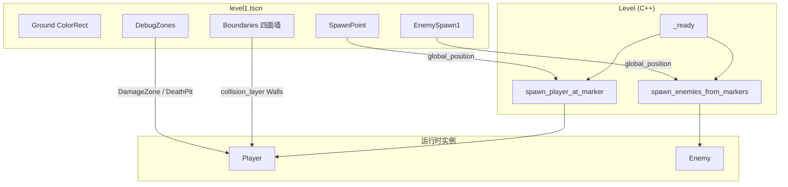

# P0-L01 单关卡场景搭建 — 实现文档

> **任务**：P0-L01 单关卡场景搭建（见 [P0-MVP最小闭环开发任务](../任务/P0-MVP最小闭环开发任务.md)）  
> **依赖**：无（可与 P0-B03 收尾并行）  
> **完成时间**：2026-07  
> **详细说明**：[源码与函数说明.md](./源码与函数说明.md)

---

## 概述

本次实现 MVP **M6 单张关卡**，将原先分散的测试块重组为一张可玩的矩形森林区域：

- **2000×1500 px** 活动区（`ColorRect` 地面 + 四面 `StaticBody2D` 围墙）
- **`SpawnPoint`** 标记玩家出生点，`Level::_ready` 读取位置而非硬编码
- **`EnemySpawn*`** 标记敌人刷点，`Level::spawn_enemies_from_markers` 预留 B04 刷怪接口
- **`DebugZones`** 保留 `DamageZone` / `DeathPit` / `PhysicsBox` 调试区（缩小并移至左下角）

---

## 涉及文件一览

| 类型 | 路径 | 说明 |
|------|------|------|
| 修改 | `src/core/constants.hpp` | 关卡节点名、尺寸常量、`path::scene::Enemy` |
| 修改 | `src/entity/level.hpp` | 新增 `spawn_player_at_marker`、`spawn_enemies_from_markers` |
| 修改 | `src/entity/level.cpp` | `_ready` 调用刷点逻辑；敌人从 Marker 实例化 |
| 重写 | `project/scenes/levels/level1.tscn` | 矩形场地、围墙、出生点、刷点、调试区 |

> 未新建 cpp/hpp；场景搭建以 `level1.tscn` 为主，流程逻辑集中在 `Level`。

---

## 架构关系



---

## 常量一览

| 名称 | 定义位置 | 值 | 用途 |
|------|----------|-----|------|
| `name::level::spawn_point` | `constants.hpp` | `"SpawnPoint"` | 玩家出生 `Marker2D` 节点名 |
| `name::level::enemy_spawn_prefix` | `constants.hpp` | `"EnemySpawn"` | 敌人刷点前缀，匹配 `EnemySpawn1` 等 |
| `name::level::enemy_spawn1` | `constants.hpp` | `"EnemySpawn1"` | 首个刷点节点名（文档/场景约定） |
| `name::level::boundaries` | `constants.hpp` | `"Boundaries"` | 围墙父节点名 |
| `name::level::ground` | `constants.hpp` | `"Ground"` | 地面 `ColorRect` 节点名 |
| `name::level::debug_zones` | `constants.hpp` | `"DebugZones"` | 调试区父节点名 |
| `level::playable_width` | `constants.hpp` | `2000.0f` | 活动区宽度（px） |
| `level::playable_height` | `constants.hpp` | `1500.0f` | 活动区高度（px） |
| `level::wall_thickness` | `constants.hpp` | `40.0f` | 围墙碰撞体厚度（px） |
| `path::scene::Enemy` | `constants.hpp` | `res://scenes/characters/enemy.tscn` | 刷怪预加载路径 |

---

## 场景节点结构

```
Level1 (Level)
├── Ground                    # ColorRect 2000×1500，森林绿
├── DirectionalLight2D          # 场景光照（保留）
├── Boundaries
│   ├── WallTop                 # StaticBody2D, layer=Walls(8)
│   ├── WallBottom
│   ├── WallLeft
│   └── WallRight
├── SpawnPoint                  # Marker2D，默认 (0, 0)
├── EnemySpawn1                 # Marker2D，默认 (0, 300)
└── DebugZones                  # 位置 (-750, 500)
    ├── DeathPit                # layer=DeathZones(32)
    ├── DamageZone              # layer=DamageZones(16)
    └── PhysicsBox              # layer=PhysicsObjects(64)
```

### 围墙几何（与常量对应）

| 墙 | 中心位置 | 碰撞形状 | 说明 |
|----|----------|----------|------|
| Top | `(0, -770)` | 2040×40 横条 | 内缘 y = -750 |
| Bottom | `(0, 770)` | 2040×40 横条 | 内缘 y = 750 |
| Left | `(-1020, 0)` | 40×1540 竖条 | 内缘 x = -1000 |
| Right | `(1020, 0)` | 40×1540 竖条 | 内缘 x = 1000 |

活动区内缘：x ∈ [-1000, 1000]，y ∈ [-750, 750]。

---

## 碰撞关系（L01 相关）

| 主体 | layer | mask | L01 行为 |
|------|-------|------|----------|
| 围墙 | `Walls (8)` | `0` | 静态阻挡，玩家 `slide` 碰撞 |
| Player | `Player (1)` | `56` | 含 Walls(8)+DamageZones(16)+DeathZones(32) |
| Enemy | `NPCs (2)` | `8` | 仅检测墙体，可被子弹命中（B03） |

---

## 与 P0-B03 的协作

| 机制 | L01 如何衔接 |
|------|----------------|
| 脉冲射击测试 | `EnemySpawn1` 运行时生成敌人，替代场景内硬编码 `TestEnemy` |
| `PhysicsBox` 反弹 | 保留于 `DebugZones`，子弹仍可测试反弹逻辑 |
| `DamageZone` / `DeathPit` | 保留于左下角，玩家可走过去验证 B01/B02 扣心 |

---

## 已知设计决策

1. **降级美术**：地面用 `ColorRect` 纯色块，围墙无贴图仅碰撞体；视差与占位美术推迟到 P0-L04/L06。
2. **刷点命名约定**：敌人刷点以 `EnemySpawn` 为前缀，便于后续增加 `EnemySpawn2` 等而无需改代码。
3. **仅扫描 Level 直接子节点**：`spawn_enemies_from_markers` 遍历 `get_child_count()`，刷点须挂在 `Level1` 根下。
4. **出生点在 `add_child` 之后设置**：先 `add_child(m_player)` 再 `set_global_position`，保证坐标系正确。
5. **`find_child` 改为递归**：`physics_box` 位于 `DebugZones` 子树，`_ready` 使用 `find_child(..., true, false)`。

---

## 验收对照

| 验收项 | 状态 |
|--------|------|
| 玩家每次进入出现在 `SpawnPoint` | ✅ |
| WASD 全图移动，无法穿出边界 | ✅ 用户已验证 |
| 至少 1 个敌人刷点，运行时生成敌人 | ✅ `EnemySpawn1` |
| 调试区扣心/即死/反弹仍可用 | ✅ `DebugZones` |
| 编译运行正常 | ✅ 用户已验证 |

---

## 后续任务衔接

| 任务 | 与本模块关系 |
|------|----------------|
| P0-B04 敌人 AI | 在 `spawn_enemies_from_markers` 中为敌人挂载 `EnemyController` |
| P0-B05 + L02 | 监听玩家 `died`、统计存活敌人数，状态机切换 |
| P0-B06 碰撞层整理 | 玩家 mask 需加入 `NPCs` 以支持接触伤害 |
| P0-L04 视差背景 | 在 `Ground` 之上叠加 `ParallaxBackground` |
| P0-L07 MVP 走测 | 以本关卡为完整闭环主场景 |
