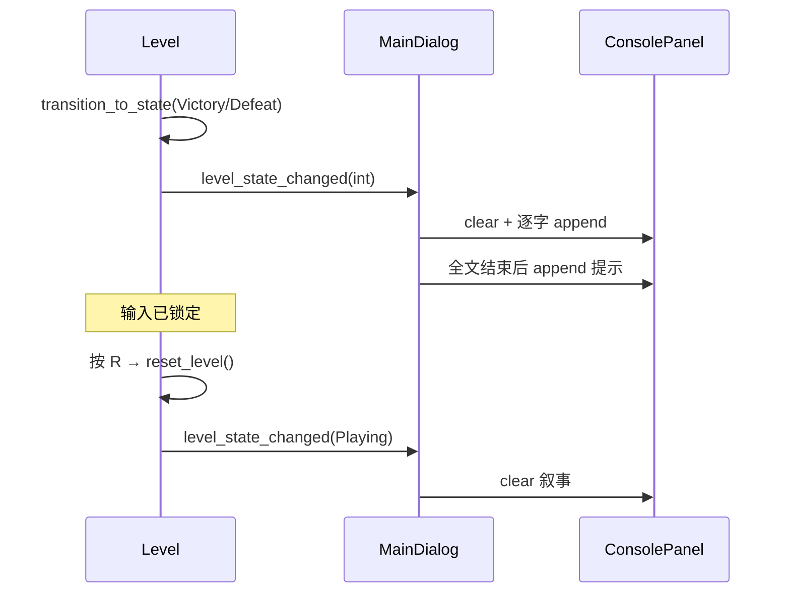

# P0-L03 结算与叙事占位 — 实现文档

> **任务**：P0-L03 结算与叙事占位  
> **关联**：[P0-MVP最小闭环开发任务](../任务/P0-MVP最小闭环开发任务.md)  
> **依赖**：P0-B05 + P0-L02 关卡状态机  
> **完成时间**：2026-07  
> **详细说明**：[源码与函数说明.md](./源码与函数说明.md)（逐函数、逐文件、问题修复、CG 扩展路线）

---

## 概述

本次实现 MVP **M7 胜负闭环（文字反馈部分）**：

- 胜利 / 失败时，`MainDialog` 监听 `level_state_changed`，在 Console 面板逐字浮现治愈向占位文案
- 每行之间留有停顿，全文结束后显示「按 R 重新开始」提示
- 终局期间玩家输入仍由 L02 锁定；`Victory` 与 `Defeat` 均支持按 **R** 重开
- 重开时发出 `Playing` 状态信号，清空叙事并复位关卡

联调阶段修复了两处阻塞问题：**MSVC `godot::String = {}` 编译错误** 与 **`notification: 17` 刷屏导致叙事不可见**（详见 [源码与函数说明 §7](./源码与函数说明.md#7-联调问题与修复记录)）。

---

## 涉及文件一览

| 类型 | 路径 | 说明 |
|------|------|------|
| 修改 | `src/core/constants.hpp` | `narrative` 文案与节奏常量 |
| 修改 | `src/ui/main_dialog.hpp/cpp` | 信号监听、逐字叙事、提示 |
| 修改 | `src/entity/level.cpp` | 胜利态 R 重开、`reset_level` 发 `Playing` 信号 |

---

## 文案与节奏

| 常量 | 用途 |
|------|------|
| `narrative::victory_text` | 胜利叙事（3 句） |
| `narrative::defeat_text` | 失败叙事（3 句） |
| `narrative::victory_hint` / `defeat_hint` | 文末操作提示 |
| `char_reveal_interval` | 单字间隔（0.055s） |
| `line_pause_interval` | 行间停顿（1.4s） |

---

## 信号协作

| `level_state_changed` 值 | 含义 | MainDialog 行为 |
|--------------------------|------|-----------------|
| `0` | `Playing` | 停止叙事、清空面板 |
| `1` | `Victory` | 播放 `victory_text` + 提示 |
| `2` | `Defeat` | 播放 `defeat_text` + 提示 |

---

## 验收对照

| 验收项 | 状态 |
|--------|------|
| 通关与死亡看到不同文案 | ✅ |
| 文案逐字浮现、行间有停顿 | ✅ |
| 终局禁止游戏输入 | ✅（L02 已有） |
| 文末有 R 重开提示 | ✅ |
| 不阻塞 B05 重开（Victory/Defeat 均可 R） | ✅ |
| 编译通过 | ✅ |
| 无 `notification: 17` 刷屏 | ✅ |

---

## 后续扩展（非 v0.1）

胜利结算可升级为 **动画 CG + 逐字文案 + BGM**，`level_state_changed` 作为唯一触发入口即可，无需改动 L02 状态机。推荐在 `MainDialog` 根层增加 `SettlementOverlay`（`CanvasLayer` + `AnimationPlayer` + `AudioStreamPlayer`）。

完整架构、时间轴示例与迁移表见 [源码与函数说明 §9](./源码与函数说明.md#9-后续扩展动画-cg--文字--音乐)。

---

## 后续任务衔接

| 任务 | 关系 |
|------|------|
| P0-B06 | 碰撞层整理，不影响叙事 |
| P0-L07 | 死亡轮 / 胜利轮走测，勾选 M7 文字反馈 |
| P1 氛围 | CG + 音乐结算演出 |
