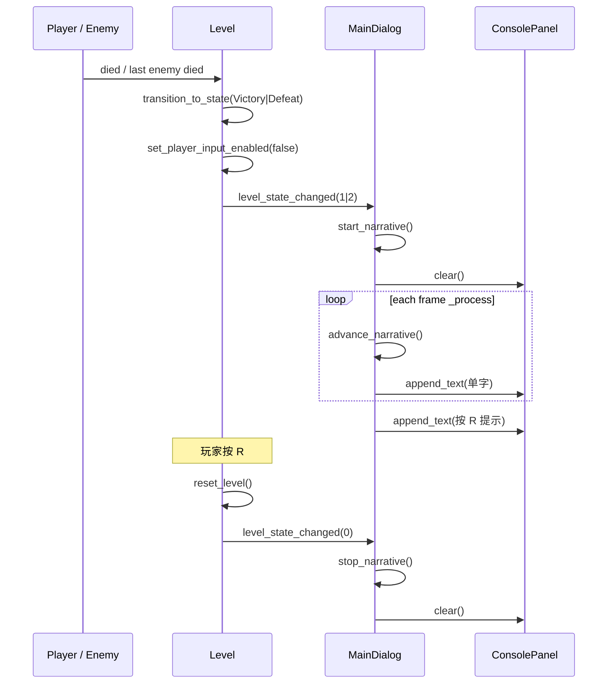

# P0-L03 源码与函数说明

本文档逐文件说明本次 P0-L03 涉及的 **头文件职责**、**cpp 文件含义**，以及 **每个函数/成员** 的作用。文末附 **头文件注释对照表**、**联调问题与修复记录**，以及 **后续动画 CG + 音乐扩展路线**。

> 概要文档见 [README.md](./README.md) · 依赖 [P0-B05+L02 源码与函数说明](../P0-B05+L02-死亡重开与关卡状态机/源码与函数说明.md)（`level_state_changed` 信号）· 任务定义见 [P0-MVP最小闭环开发任务](../任务/P0-MVP最小闭环开发任务.md)

---

## 1. `src/core/constants.hpp`（本次增量）

**文件含义**：全局字符串、碰撞层枚举、战斗数值与事件名常量。本次新增 `narrative` 命名空间，集中存放结算占位文案与逐字浮现节奏参数。

### 命名空间 `narrative`

| 符号 | 值 / 内容 | 说明 |
|------|-----------|------|
| `char_reveal_interval` | `0.055` | 相邻两个 Unicode 字符显现的最短间隔（秒） |
| `line_pause_interval` | `1.4` | 一行播完后、下一行开始前的停顿（秒） |
| `victory_text` | 3 句中文，`\n` 分行 | 胜利治愈向占位叙事 |
| `defeat_text` | 3 句中文，`\n` 分行 | 失败治愈向占位叙事 |
| `victory_hint` | `"按 R 可重新开始本关"` | 胜利全文结束后的操作提示 |
| `defeat_hint` | `"按 R 重新开始"` | 失败全文结束后的操作提示 |

```cpp
namespace narrative
{
    /** Seconds between revealed characters (P0-L03). */
    constexpr inline double char_reveal_interval{ 0.055 };
    /** Pause after each line before the next (P0-L03). */
    constexpr inline double line_pause_interval{ 1.4 };

    constexpr inline auto victory_text{ ... };
    constexpr inline auto defeat_text{ ... };
    constexpr inline auto victory_hint{ "按 R 可重新开始本关" };
    constexpr inline auto defeat_hint{ "按 R 重新开始" };
}
```

### 命名空间 `event`（只读，L03 依赖）

| 常量 | 说明 |
|------|------|
| `level_state_changed` | `"level_state_changed"`；`Level` 状态切换时发射，`int` 参数为 `LevelState` 枚举值 |

### 命名空间 `name::dialog`（只读，L03 依赖）

| 常量 | 说明 |
|------|------|
| `console` | `"ConsolePanel"`；`main_dialog.tscn` 底部 `RichTextLabel` 的 `unique_name` |

---

## 2. `src/ui/main_dialog.hpp`

**文件含义**：主界面面板类声明。在原有「游戏视口 + Console 调试区」布局基础上，新增 **结算叙事状态机**：监听关卡终局信号，在 `ConsolePanel` 上按 Unicode 字符逐字浮现文案，并在文末追加 RichText 操作提示。

继承自 `godot::Panel`，由 `main_dialog.tscn` 根节点挂载，在 `extension_interface.cpp` 中注册为 GDExtension 类。

### 类：`class MainDialog`

#### 公开接口

| 函数 | 说明 |
|------|------|
| `MainDialog()` | 默认构造 |
| `~MainDialog()` | 默认析构 |
| `_ready()` | 节点就绪：绑定 Console 上下文、查找 `Level1` 与 `ConsolePanel`，延迟连接关卡信号 |
| `_process(double delta_time)` | 每帧：若叙事进行中则推进逐字计时 |
| `_notification(int notification)` | 处理预删除、鼠标进出等通知；**不再**向 Console 打印调试通知 |
| `connect_to_level()` | 查找 `Level` 并连接 `level_state_changed` → `on_level_state_changed` |
| `_bind_methods()` | 向 Godot 注册 `connect_to_level`、`on_level_state_changed` 供信号与 `call_deferred` 使用 |

#### 保护接口（叙事与信号）

| 函数 | 说明 |
|------|------|
| `on_level_state_changed(int state)` | **信号槽**；`LevelState` 整型值驱动开始/停止叙事 |
| `start_narrative(std::string_view full_text, std::string_view hint)` | 解析文案、清空面板、启动逐字状态机 |
| `stop_narrative()` | 重置全部叙事计时与缓冲，清空 `ConsolePanel` |
| `advance_narrative(double delta_time)` | 推进字符间隔计时与行间停顿 |
| `reveal_next_character()` | 向 `ConsolePanel` 追加下一个 Unicode 字符 |
| `begin_line_pause()` | 当前行结束后进入行间等待；末行则转 `finish_narrative` |
| `finish_narrative()` | 叙事结束：追加淡绿色 RichText 操作提示 |

#### 私有成员

| 成员 | 类型 | 说明 |
|------|------|------|
| `m_level` | `Level*` | 关卡引用，用于信号连接与鼠标激活 |
| `m_console_label` | `godot::RichTextLabel*` | 底部叙事输出控件（`ConsolePanel`） |
| `m_narrative_active` | `bool` | 是否正在播放叙事 |
| `m_narrative_text` | `godot::String` | 当前全文（Godot 字符串，按码点索引） |
| `m_hint_text` | `godot::String` | 文末提示文本 |
| `m_line_lengths` | `std::vector<int>` | 每行字符数（不含 `\n`） |
| `m_line_start_index` | `int` | 当前行在 `m_narrative_text` 中的起始码点索引 |
| `m_line_index` | `int` | 当前行号（0-based） |
| `m_char_index` | `int` | 当前行内已显现字符数 |
| `m_reveal_timer` | `double` | 累积帧时间，用于字符间隔 |
| `m_line_pause_timer` | `double` | 行间停顿倒计时 |
| `m_line_pause` | `bool` | 是否处于行间等待 |

---

## 3. `src/ui/main_dialog.cpp`

**文件含义**：`MainDialog` 实现。负责 Console 绑定、关卡信号监听、逐字叙事状态机，以及鼠标悬停时激活/停用关卡输入焦点。

叙事文本通过 `m_console_label->append_text()` **直接写入** `RichTextLabel`， deliberately **不走** `console::get()->print()`，避免 spdlog 回调附带 `[时间戳] =>` 调试前缀污染正文。

### 匿名命名空间 `build_line_lengths`

| 函数 | 说明 |
|------|------|
| `build_line_lengths(const godot::String& text)` | 扫描全文，按 `\n` 拆成多行，返回每行 **Unicode 字符数**（使用 `text.length()` 码点计数，适配中文） |

### `MainDialog::_ready`

1. 编辑器模式下直接返回。
2. 取得 `console` 单例，从场景树查找 `ConsolePanel`、`Level1`。
3. `game_console->set_context(m_console_label)` 将调试日志输出重定向到底部面板。
4. `call_deferred("connect_to_level")`：等 `Main` 构造完成、`Level` 挂入 `MainCanvasLayer` 后再连信号。

### `MainDialog::connect_to_level`

1. 若 `_ready` 时 `m_level` 为空，**再次** `find_child("Level1")` 并 `gdcast`（兼容 `Main` 构造时序）。
2. 仍为空则静默返回（叙事永不触发——联调时需检查）。
3. 连接 `Level::level_state_changed` → `on_level_state_changed`。

### `MainDialog::_process`

- 仅当 `m_narrative_active == true` 时调用 `advance_narrative(delta_time)`。
- 重写 `_process` 后 Godot 会为该节点启用处理，并每帧发送 `NOTIFICATION_PROCESS`（见 §7 问题排查）。

### `MainDialog::_notification`

| `notification` 分支 | 行为 |
|---------------------|------|
| `NOTIFICATION_PREDELETE` / `NOTIFICATION_UNPARENTED` | 清除 Console 上下文并 `stop_logging` |
| `NOTIFICATION_MOUSE_ENTER` | `m_level->activate(true)`，关卡获得输入焦点 |
| `NOTIFICATION_MOUSE_EXIT` | `m_level->activate(false)`，显示系统光标 |

**L03 修复**：已删除原先在 `switch` 之后的无条件 `console->print("notification: {}", notification)`。该调试代码会把 **每一帧** 的 `NOTIFICATION_PROCESS`（值为 `17`）写入 Console，导致叙事被刷屏淹没（详见 §7）。

### `MainDialog::on_level_state_changed`

| `state`（`LevelState`） | 行为 |
|-------------------------|------|
| `0` `Playing` | `stop_narrative()`，清空面板（重开时） |
| `1` `Victory` | `start_narrative(victory_text, victory_hint)` |
| `2` `Defeat` | `start_narrative(defeat_text, defeat_hint)` |

### `MainDialog::start_narrative`

1. 无 `m_console_label` 则返回。
2. 调用 `stop_narrative()` 清理上一次状态。
3. 将 `std::string_view` 转为 `godot::String`，`build_line_lengths` 拆行。
4. 重置行/字索引与计时器；`m_narrative_active = !m_line_lengths.empty()`。
5. `m_console_label->clear()` 清空面板后开始显现。

### `MainDialog::stop_narrative`

- 关闭 `m_narrative_active`，清空 `godot::String` 时使用 `godot::String{}`（**不可**写 `= {}`，MSVC 会 C2593；**不可** `.clear()`，Godot String 无此方法）。
- 清空 `m_line_lengths` 与全部计时器，并 `clear()` 面板。

### `MainDialog::advance_narrative`

**行间停顿分支**（`m_line_pause == true`）：

1. `m_line_pause_timer -= delta_time`，未归零则返回。
2. `++m_line_index`，重置 `m_char_index`。
3. 若已无下一行 → `finish_narrative()`。
4. 更新 `m_line_start_index`（上一行长度 + 1 跳过 `\n`），`append_text("\n")`。

**逐字分支**：

- 累积 `m_reveal_timer`，每满 `char_reveal_interval` 调用一次 `reveal_next_character()`。

### `MainDialog::reveal_next_character`

1. 取当前行长度 `m_line_lengths[m_line_index]`。
2. `absolute_index = m_line_start_index + m_char_index`。
3. `m_narrative_text.substr(absolute_index, 1)` 取 **一个 Unicode 码点** 追加到面板。
4. 行末调用 `begin_line_pause()`。

### `MainDialog::begin_line_pause`

- 若已是最后一行 → `finish_narrative()`。
- 否则 `m_line_pause = true`，`m_line_pause_timer = line_pause_interval`。

### `MainDialog::finish_narrative`

- `m_narrative_active = false`。
- 追加 RichText：`"\n\n[color=#b6d4ca]" + m_hint_text + "[/color]"`（淡绿色提示）。

---

## 4. `src/entity/level.cpp`（本次增量）

**文件含义**：单关卡根节点。L03 在 B05+L02 状态机基础上做三处衔接：终局发信号供叙事 UI 监听、胜利态允许 R 重开、重开时发 `Playing` 信号清空叙事。

### `Level::transition_to_state`（变更）

| 步骤 | 说明 |
|------|------|
| 守卫 | 仅从 `Playing` 切出；目标不可为 `Playing` |
| 锁定输入 | `set_player_input_enabled(false)` |
| 发信号 | `emit_signal(level_state_changed, int(new_state))` |
| **删除** | 原 `Defeat` 分支内 `press R to restart` 的 Console 调试输出，改由 L03 叙事文末提示承担 |

### `Level::reset_level`（变更）

在敌人重刷、心数复位、输入重新启用之后，新增：

```cpp
this->emit_signal(event::level_state_changed, static_cast<int>(m_state));
```

使 `MainDialog` 收到 `Playing(0)` 并 `stop_narrative()`。

### `Level::handle_restart_input`（变更）

```cpp
if (m_state != LevelState::Defeat && m_state != LevelState::Victory)
    return;
```

胜利态与失败态均可按 **R** 调用 `reset_level()`，与 L03 文末提示一致。

### `Level::_process`（变更）

```cpp
if (m_state == LevelState::Defeat || m_state == LevelState::Victory)
    this->handle_restart_input();
```

原仅 `Defeat` 监听 R，现扩展至 `Victory`。

---

## 5. 头文件注释对照表（建议在 IDE 中同步）

以下为建议在源码头文件中保持或补全的注释（当前 `constants.hpp` 已有 `narrative` 注释；`main_dialog.hpp` 可在后续迭代中按此表补充）：

| 位置 | 建议注释 |
|------|----------|
| `constants.hpp` `narrative::char_reveal_interval` | `/** Seconds between revealed characters (P0-L03). */` |
| `constants.hpp` `narrative::line_pause_interval` | `/** Pause after each line before the next (P0-L03). */` |
| `main_dialog.hpp` `on_level_state_changed` | `/** Signal slot: Victory/Defeat starts narrative, Playing clears it. */` |
| `main_dialog.hpp` `start_narrative` | `/** Parse lines and begin typewriter reveal on ConsolePanel. */` |
| `main_dialog.hpp` `stop_narrative` | `/** Reset timers and clear ConsolePanel (on restart or Playing). */` |
| `main_dialog.hpp` `advance_narrative` | `/** Per-frame: char interval and line pause timing. */` |
| `main_dialog.hpp` `reveal_next_character` | `/** Append one Unicode codepoint via godot::String::substr. */` |
| `main_dialog.hpp` `m_narrative_active` | `/** True while typewriter sequence is running. */` |
| `main_dialog.hpp` `m_line_lengths` | `/** Per-line character counts (excluding newline). */` |

---

## 6. 端到端调用链



---

## 7. 联调问题与修复记录

### 7.1 MSVC C2593：`godot::String = {}` 不明确

**现象**：`configure-and-build.bat` 编译 `main_dialog.cpp` 失败：

```
error C2593: “operator =”不明确
尝试匹配参数列表“(godot::String, initializer list)”
```

**位置**：`stop_narrative()` 内 `m_narrative_text = {}`、`m_hint_text = {}`。

**原因**：MSVC 将 `{}` 解析为 initializer list，与 `godot::String` 多个 `operator=` 重载产生歧义。

**修复**：

```cpp
m_narrative_text = godot::String{};
m_hint_text = godot::String{};
```

**注意**：`godot::String` **没有** `clear()` 成员，不可用 `.clear()` 替代。

---

### 7.2 Console 刷屏 `notification: 17`，叙事不可见

**现象**：编译通过后，终局时 Console 每秒约 60 条：

```
3412 [ 55.99s] => notification: 17
3413 [ 56.01s] => notification: 17
...
```

看不到胜利/失败文案；输入锁定与 R 重开正常。

**原因**：

1. Godot 中 `Node::NOTIFICATION_PROCESS` 的枚举值为 **17**。
2. `MainDialog` 重写了 `_process()`，Godot 因此每帧向 `_notification` 发送 `NOTIFICATION_PROCESS`。
3. 原实现在 `switch` 之后 **无条件**执行：

   ```cpp
   if (auto* c = console::get())
       c->print("notification: {}", notification);
   ```

4. `console::print` 经 spdlog 回调写入同一 `ConsolePanel`，且 `scroll_following = true`，新日志不断把叙事顶出视野，造成「叙事从未显示」的错觉。

**修复**：删除上述无条件调试输出；保留 `switch` 内与 Console 生命周期、鼠标激活相关的必要逻辑。

**验证**：终局后 Console 仅显示治愈文案逐字浮现与文末提示，无 `notification: 17` 刷屏。

---

### 7.3 信号未连接（`m_level == nullptr`）

**现象**：无编译错误，但叙事永不触发。

**缓解**：`connect_to_level()` 在 deferred 阶段 **再次** `find_child("Level1")`，避免 `_ready` 早于 `Main` 将 `Level` 挂入 `MainCanvasLayer` 的时序问题。

---

## 8. 手动走测清单

| 步骤 | 预期 |
|------|------|
| 故意阵亡 | 失败文案 3 句逐字出现，行间约 1.4s 停顿，文末「按 R 重新开始」 |
| 清敌胜利 | 胜利文案不同，文末「按 R 可重新开始本关」 |
| 终局操作 | 无法移动/射击 |
| 叙事期间按 R | 可重开（不阻塞 B05） |
| 重开后 | Console 清空，心数/敌人/状态复位 |
| Console | 无 `notification: 17` 刷屏 |

---

## 9. 后续扩展：动画 CG + 文字 + 音乐

> 本节记录 P0-L03 验收后讨论的技术路线，**非 v0.1 范围**；建议在 P0-L07 走测完成、P1 氛围阶段落地。

### 9.1 可行性结论

**完全可行**。当前 `level_state_changed` 已是结算演出的唯一入口；L03 的 Console 逐字仅为 **MVP 占位**，正式版可将 `on_level_state_changed(Victory)` 从「Console 打字」升级为「全屏演出序列」，无需改动战斗或 L02 状态机。

与 [独立游戏项目计划书](../独立游戏项目计划书.md) 中「慢速叙事」「治愈节奏」及 [技术架构说明](../技术架构说明.md) 中「叙事 UI 偏 GDScript」的分工一致：

| 层级 | 职责 |
|------|------|
| C++ `Level` | 状态判定、发信号、锁定输入 |
| C++ `MainDialog`（或薄封装） | 收到信号 → 调用演出入口 |
| 场景 / GDScript / `AnimationPlayer` | CG 时间轴、文字、音乐淡入淡出 |

### 9.2 推荐场景结构

不宜把全屏 CG 放在 `MainSubViewport` 内（会与游戏相机缩放绑定）。建议在 `main_dialog.tscn` **根层**增加：

```text
MainDialog
├── TopVerticalLayout（现有：SubViewport 游戏区 + Console）
└── SettlementOverlay（新建 CanvasLayer, layer=20, 默认 hidden）
    ├── ColorRect              # 半透明压暗
    ├── CgPlayer               # AnimatedSprite2D / VideoStreamPlayer
    ├── NarrativeLabel         # RichTextLabel，承接 L03 逐字逻辑
    ├── AudioStreamPlayer      # 胜利 BGM / 环境音
    └── AnimationPlayer        # 统筹时间轴
```

### 9.3 演出方案对比

| 方案 | 适用 | 优点 | 缺点 |
|------|------|------|------|
| **A. 序列帧 + AnimationPlayer** | 《凯尔经的秘密》风手绘 | 风格统一、包体可控、易与 2D 玩法共存 | 需拆帧与对轴 |
| **B. VideoStreamPlayer** | 预渲染过场 | 表现力最强 | 包体大、迭代慢 |
| **C. 静帧 + Shader（Ken Burns / 丁达尔）** | 快速氛围 | 成本最低 | 动感较弱 |

**推荐路径**：A 为主，C 为降级；B 留给 P2 关键节点。

### 9.4 文字 + CG + 音乐时间轴示例

| 时间 | 画面 | 文字 | 音乐 |
|------|------|------|------|
| 0–2s | 压暗 + CG 淡入 | 无 | BGM 淡入 |
| 2–8s | CG 慢播 / 镜头推移 | 第 1 句逐字（复用 `advance_narrative`） | 主旋律 |
| 8–14s | 同 CG 或切帧 | 第 2–3 句 | 保持 |
| 14s+ | 定格或呼吸循环 | 「按 R」提示 | 保持或渐弱 |

实现：`AnimationPlayer` 的 method track 调用 `reveal_line(n)` / `show_hint()`；或将现有 `advance_narrative` 抽为独立 `NarrativePlayer` 节点，CG 与音乐由同一时间轴驱动。

### 9.5 与现有 L03 代码的迁移

| 保留 | 替换 / 扩展 |
|------|-------------|
| `level_state_changed` 信号 | 不动 |
| `on_level_state_changed` 分支 | `Victory` → `play_victory_sequence()` |
| `advance_narrative` 等逐字逻辑 | 从 `ConsolePanel` 迁到 `SettlementOverlay/NarrativeLabel` |
| `stop_narrative` | 扩展为 `stop_settlement()`：隐藏 Overlay、停止 BGM |
| Console 逐字输出 | 保留给调试，或仅 `Defeat` 继续使用 |
| `Playing` 信号 | 继续用于清空演出 |

### 9.6 音频注意点

`MainSubViewport` 已设置 `audio_listener_enable_2d = true`。结算 BGM 的 `AudioStreamPlayer` 建议放在 `MainDialog` 根层或 `SettlementOverlay`，避免只在 SubViewport 内导致听感异常。

### 9.7 降级策略（与 MVP 守则一致）

1. 无 CG 资源 → 仅文字 + 音乐（当前 L03 行为）
2. 无音乐 → CG + 文字
3. 资源未加载 → `ResourceLoader.load_threaded`，先文字后 CG

### 9.8 建议排期

| 阶段 | 内容 |
|------|------|
| P0-L07 后 | 闭环走测稳定 |
| P1 氛围 | `SettlementOverlay.tscn` 骨架 + 胜利时间轴占位 |
| P1–P2 | AI 出图 → 序列帧；配乐淡入；失败态可维持纯文字 |

---

## 10. 与前后任务协作

| 任务 | L03 如何衔接 |
|------|----------------|
| P0-B05+L02 | 提供 `level_state_changed`、`Victory`/`Defeat` 输入锁定 |
| P0-B06 | 碰撞层整理，不影响叙事 |
| P0-L07 | 死亡轮 / 胜利轮走测，勾选 M7「通关/死亡有文字反馈」 |
| P1 氛围 | §9 CG + 音乐扩展 |
