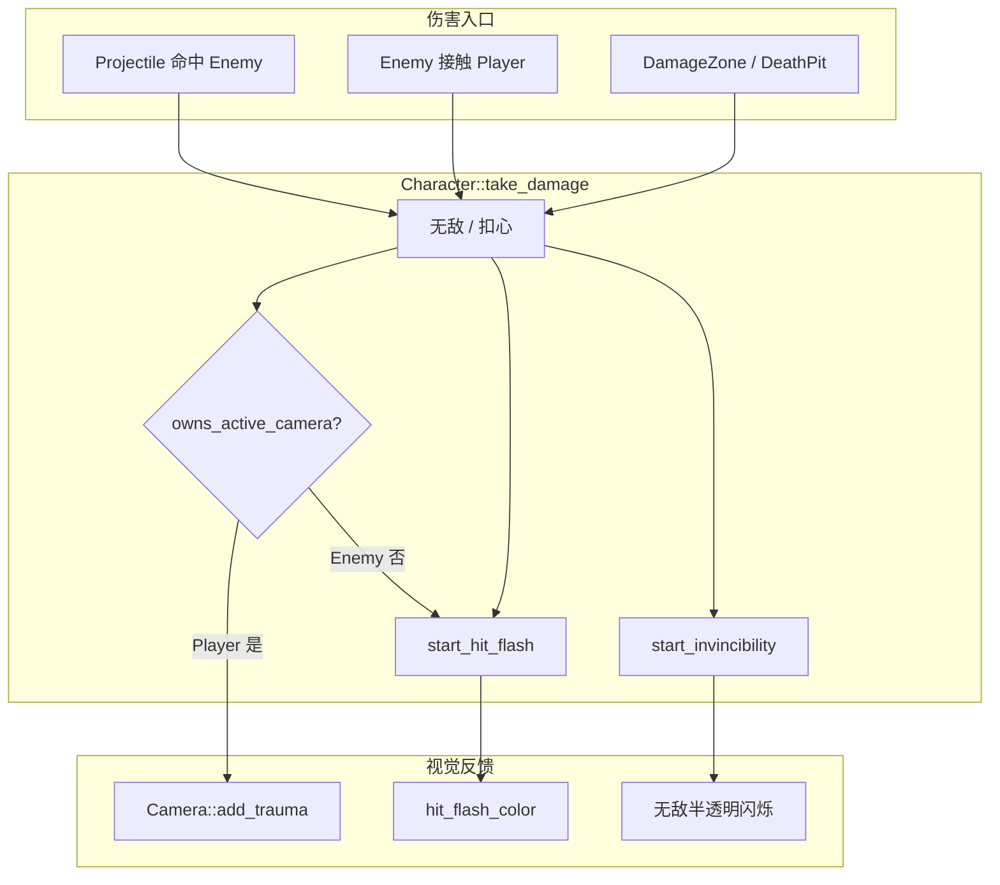

# v0.3 Day01 打击感 — 闪白 / 屏震 / 手感修订

> **冲刺任务**：[15天冲刺计划-v0.3垂直切片](../15天冲刺计划-v0.3垂直切片.md) · Day 1  
> **分支**：`sprint/v0.3`（已测试并提交）  
> **依赖**：P0-B02 受击无敌帧、P0-B03 脉冲命中  
> **详细说明**：[源码与函数说明.md](./源码与函数说明.md)

---

## 概述

本次在 v0.3 冲刺 **Day 1** 完成「打击感」第一版，并在走测后根据手感反馈做了**修订**：

| 反馈类型 | 行为 |
|----------|------|
| **子弹打中敌人** | 精灵 **青白闪**（约 0.12s），**不震屏** |
| **玩家被敌人/伤害区击中** | 精灵 **红橙闪** + **屏震** + 无敌帧半透明闪烁 |
| **镜头** | 仅 **Player** 激活 `Camera2D::make_current()`，敌人不再抢走当前相机 |

同时微调了 P0-B02 无敌帧参数（时长 1.0s、闪烁更明显），便于玩家感知「刚受过伤、暂时安全」。

---

## 走测发现的问题与修复

### 问题 1：打敌人有震、碰玩家没震（逻辑反了）

**原因**：`Character::_ready()` 中每个角色（含敌人）都调用 `m_camera->make_current()`。关卡按 Marker 顺序刷怪，**最后生成的敌人相机会成为 current**。  
`take_damage` 里对 `m_camera->add_trauma()` 的调用落在「受伤者自己的相机」上，因此：

- 打敌人 → 震的是**敌人相机**（且往往是 current）→ 屏幕有震感  
- 玩家挨打 → 震的是**玩家相机**（已不是 current）→ 几乎无感  

**修复**：引入 `owns_active_camera()` 虚函数，仅 `Player` 返回 `true` 并 `make_current()`；屏震仅在 `owns_active_camera()` 为真时触发。

### 问题 2：玩家与敌人闪色相同

**原因**：初版统一用 `hit_flash_brightness` 做白闪，无法区分「我打中了」与「我受伤了」。

**修复**：`hit_flash_color()` 虚函数 — `Character` 默认青白，`Player` 覆盖为红橙。

### 问题 3：无敌帧「感觉短」

**原因**：受击闪仅 0.07s，结束后立刻进入较弱的半透明闪烁，主观上像反馈已经结束。

**修复**：受击闪延长至 0.12s；无敌 0.75s → 1.0s；闪烁间隔 0.1s、暗相 alpha 0.25，更易辨认。

---

## 涉及文件一览

| 类型 | 路径 | 说明 |
|------|------|------|
| 修改 | `src/core/constants.hpp` | 闪色、屏震、无敌帧调参常量 |
| 修改 | `src/entity/camera.hpp` | `add_trauma`、trauma 衰减与 offset 抖动 |
| 修改 | `src/entity/camera.cpp` | 屏震 `_process` 实现 |
| 修改 | `src/entity/character/character.hpp` | `owns_active_camera`、`hit_flash_color`、受击闪成员 |
| 修改 | `src/entity/character/character.cpp` | 相机归属、扣血反馈、闪色与视觉更新 |
| 修改 | `src/entity/character/player.hpp` | 覆盖 `owns_active_camera`、`hit_flash_color` |
| 修改 | `src/entity/character/player.cpp` | 玩家红橙闪实现 |

> 未新建场景；未改 `level.cpp` / `projectile.cpp` 命中逻辑（仍走 `enemy->take_damage()`）。

---

## 架构关系

---

## 常量一览（当前生效值）

| 名称 | 值 | 用途 |
|------|-----|------|
| `hit_flash_duration` | `0.12` | 受击瞬间高亮时长（秒） |
| `enemy_hit_flash_r/g/b` | `4.0 / 5.0 / 5.5` | 敌人被打：青白闪 |
| `player_hit_flash_r/g/b` | `5.0 / 1.4 / 1.1` | 玩家被打：红橙闪 |
| `hit_shake_trauma` | `0.7` | 玩家受击时累加的 trauma |
| `camera_shake_max_offset` | `22.0` | 屏震最大像素偏移 |
| `camera_shake_decay` | `2.0` | trauma 每秒衰减 |
| `invincibility_duration` | `1.0` | 无敌时长（秒，自 P0-B02 修订） |
| `invincibility_blink_interval` | `0.1` | 无敌闪烁间隔 |
| `invincibility_blink_alpha` | `0.25` | 无敌「暗」相透明度 |

调参建议见 [源码与函数说明.md § 调参指南](./源码与函数说明.md#8-调参指南)。

---

## 验收对照（Day 1）

| 验收项 | 状态 |
|--------|------|
| 射击敌人有可见闪色反馈 | ✅ 青白闪 |
| 射击敌人不震屏 | ✅ |
| 玩家受击有屏震 | ✅ |
| 玩家受击与敌人受击闪色可区分 | ✅ 红橙 vs 青白 |
| 镜头始终跟随玩家 | ✅ 仅 Player `make_current` |
| 无敌帧仍有半透明闪烁 | ✅ 1.0s |
| 构建通过、F5 可玩、已提交 git | ✅ |

**Day 2**（已完成）：见 [v0.3-Day02 击杀粒子与命中音效](../v0.3-Day02-击杀粒子与命中音效/README.md)。

---

## 与历史任务的关系

| 模块 | 关系 |
|------|------|
| P0-B02 无敌帧 | 复用 `start_invincibility` / 闪烁逻辑；仅调参，未改入口语义 |
| P0-B03 脉冲 | 命中仍调用 `enemy->take_damage()`，自动触发敌人青白闪 |
| P0-B04 接触伤害 | `player->take_damage(1)` 触发红闪 + 屏震 + 无敌 |
| v0.3 Day02 | ✅ 已完成：命中/死亡处挂粒子与 `AudioStreamPlayer`，见 [Day02 文档](../v0.3-Day02-击杀粒子与命中音效/README.md) |

---

## Git 与分支

| 项 | 说明 |
|----|------|
| 工作分支 | `sprint/v0.3` |
| 建议 tag | `day-01`（Day 1 打击感验收通过后） |
| 提交粒度 | 建议 commit 信息含 `feat(day1):` 或 `fix(day1):` 前缀，便于与 Day 2+ 区分 |
