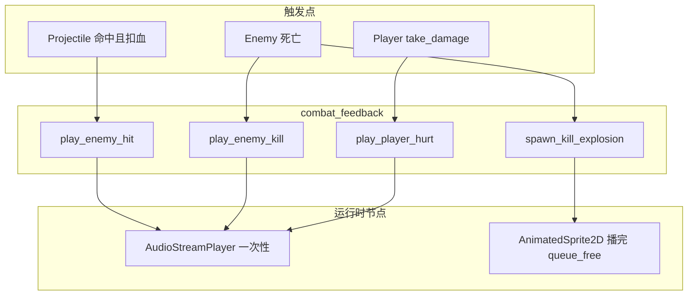

# v0.3 Day02 打击感 — 击杀粒子 + 命中/受击音效

> **冲刺任务**：[15天冲刺计划-v0.3垂直切片](../15天冲刺计划-v0.3垂直切片.md) · Day 2  
> **分支**：`sprint/v0.3`（已编译走测通过）  
> **依赖**：Day 1 闪白/屏震；敌人死亡入口；Kenney 爆炸序列帧 + retro 音效  
> **详细说明**：[源码与函数说明.md](./源码与函数说明.md)

---

## 概述

本次在 v0.3 冲刺 **Day 2** 完成「打击感」第二层反馈：

| 事件 | 视觉 | 音频 |
|------|------|------|
| **脉冲命中敌人（扣血）** | Day 1 青白闪（已有） | `hit2.ogg` |
| **敌人死亡** | `simpleexplosion00–08` 序列帧迸发 | `explosion2.ogg` |
| **玩家受击** | Day 1 红橙闪 + 屏震（已有） | `hurt2.ogg` |

实现上走冲刺计划的 **降级路径**：用 `AnimatedSprite2D` 播一次爆炸序列帧，而非 `GPUParticles2D`。音效用一次性 `AudioStreamPlayer`（播完 `queue_free`）。

---

## 走测发现的问题与修复

### 问题 1：完全没有声音（根因：`.gdignore`）

**现象**：磁盘上能手动播放 `.ogg`，Godot FileSystem 里看不到 `assets/audio`，运行时也无声。

**原因**：模板在 `project/assets/audio/` 下放了空的 **`.gdignore`**。Godot 会**跳过整个目录**（不扫描、不导入、不出现在资源树），`ResourceLoader::exists("res://assets/audio/...")` 恒为 `false`，加载静默失败。

**修复**：删除 `project/assets/audio/.gdignore`，重新打开/重载项目，让 Godot 导入 `.ogg`。

> **教训**：以后「要用的」资源目录不要留 `.gdignore`；暂时不用的大包（如部分 Kenney 子目录）可以继续用 `.gdignore` 减轻编辑器负担。资源统一从 `project/assets/art` 与 `project/assets/audio` 取用。

### 问题 2：退出游戏崩溃（读访问违规）

**现象**：关闭窗口时在 GDExtension 析构路径崩溃。

**原因**：`combat_feedback` 内用 `static Ref<AudioStream>` / `static Ref<SpriteFrames>` 缓存，引擎关闭顺序下静态 Ref 析构不安全。

**修复**：去掉静态缓存，每次按需 `ResourceLoader::load`（音效体量小，可接受）。

### 问题 3：排查过程中的临时写法（已整理回干净版）

排查「无声」时曾尝试：挂根窗口、`call_deferred("play")`、音量拉到 50 dB 等。确认根因是 `.gdignore` 后，已收成：

- 音量 `0 dB`
- 挂到关卡节点（`scene_parent`）
- 直接 `play()`，非 2D 衰减播放器

---

## 涉及文件一览

| 类型 | 路径 | 说明 |
|------|------|------|
| **新增** | `src/util/combat_feedback.hpp` | 命中/击杀/受击 SFX + 击杀爆炸 API |
| **新增** | `src/util/combat_feedback.cpp` | 加载资源、一次性播放、序列帧迸发 |
| 修改 | `src/core/constants.hpp` | `path::audio`、`path::vfx`、爆炸/音量常量 |
| 修改 | `src/entity/projectile/projectile.cpp` | 命中扣血后 `play_enemy_hit` |
| 修改 | `src/entity/character/enemy.cpp` | 死亡时爆炸 + `play_enemy_kill` |
| 修改 | `src/entity/character/character.cpp` | 玩家受击后 `play_player_hurt` |
| 删除 | `project/assets/audio/.gdignore` | 让 Godot 导入音频资源 |

**资源路径（均在仓库内，Kenney / 现成包）：**

| 用途 | `res://` 路径 |
|------|----------------|
| 命中 | `assets/audio/sfx/retro/hit2.ogg` |
| 击杀 | `assets/audio/sfx/retro/explosion2.ogg` |
| 受击 | `assets/audio/sfx/retro/hurt2.ogg` |
| 爆炸帧 | `assets/art/explosions/simple/simpleexplosion00.png` … `08.png` |

---

## 架构关系

---

## 常量一览（当前生效值）

| 名称 | 值 | 用途 |
|------|-----|------|
| `kill_explosion_frame_count` | `9` | 序列帧张数（00–08） |
| `kill_explosion_fps` | `18.0` | 爆炸动画帧率 |
| `kill_explosion_scale` | `1.35` | 爆炸精灵缩放 |
| `kill_explosion_z_index` | `12` | 盖在角色之上 |
| `sfx_enemy_hit_volume_db` | `0.0` | 命中音量 |
| `sfx_enemy_kill_volume_db` | `0.0` | 击杀音量 |
| `sfx_player_hurt_volume_db` | `0.0` | 受击音量 |

调参见 [源码与函数说明.md § 调参指南](./源码与函数说明.md#6-调参指南)。

---

## 验收对照（Day 2）

| 验收项 | 状态 |
|--------|------|
| 击杀有可见爆炸/迸发 | ✅ `AnimatedSprite2D` 序列帧 |
| 命中敌人有音效 | ✅ `hit2.ogg` |
| 击杀有音效 | ✅ `explosion2.ogg` |
| 玩家受击有音效 | ✅ `hurt2.ogg` |
| Godot 能看到并导入 `assets/audio` | ✅ 已删 `.gdignore` |
| 退出游戏不崩溃 | ✅ 无静态 Ref 缓存 |
| 构建通过、F5 可玩 | ✅ |

**Day 3 待做**：脉冲射速/弹速等手感参数暴露与调优。

---

## 后续优化（未做，已记入冲刺拉伸清单）

Day 2 基线保留 **单套** `AnimatedSprite2D` 序列帧（`simple/`）。以下两项不挡主线，主线有余力时再拉：

| 优先级 | 优化项 | 预估 | 说明 |
|--------|--------|------|------|
| ⭐5（冲刺表） | **多套爆炸序列帧** | ~0.5 天 | **推荐优先**。仓库已有 `sonic` / `ground` / `regular` / `pixel` / `particle` 等；击杀时随机或按敌人类型切换。扩展 `spawn_kill_explosion` / `path::vfx` 即可，调用点几乎不动 |
| ⭐6（冲刺表） | **GPUParticles2D** | 0.5–1 天 | 可选。工程量中等、调参成本高于序列帧；项目尚无粒子先例。更稳做法：编辑器调好 `.tscn`，C++ 只 `instantiate`。可与序列帧叠加，不必完全替换 |

**决策记录**：冲刺期内优先做多套序列帧变体；GPUParticles 仅作质感拉伸，不为它牺牲 Day 3+ 主线。

详见冲刺计划 [§ 拉伸清单](../15天冲刺计划-v0.3垂直切片.md#拉伸清单做得快时从顶端往下拉一次只拉一件)。

---

## 与历史任务的关系

| 模块 | 关系 |
|------|------|
| Day 1 闪白/屏震 | 视觉反馈保留；本 Day 只加音效与击杀 VFX |
| P0-B03 脉冲 | `projectile` 命中扣血处挂命中音效 |
| P0-B04 敌人 | `enemy` 死亡处挂爆炸 + 击杀音效 |
| P0-B02 受击 | `character::take_damage`（玩家）挂受击音效 |
| 资源规范 | 美术 → `project/assets/art`；音频 → `project/assets/audio` |

---

## Git 与分支

| 项 | 说明 |
|----|------|
| 工作分支 | `sprint/v0.3` |
| 建议 tag | `day-02`（本 Day 验收通过后） |
| 提交提示 | 记得把「删除 `.gdignore`」与新增 `combat_feedback` 一并纳入；`.ogg` / `.import` 按团队约定提交 |
| 提交粒度 | 建议 commit 信息含 `feat(day2):` 前缀 |
