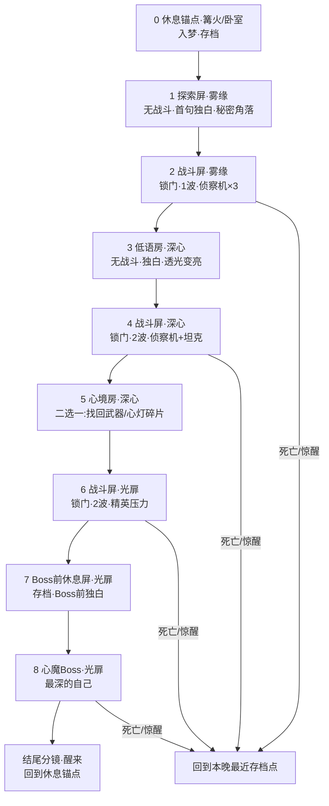

# v0.4 转向：HLD 式「屏幕之旅」· 8 天结构方案

> **定位**：这不是推翻 v0.4，而是**把 v0.4 早已设计、却没实现的另一半（探索 / 呼吸 / 关卡结构）真正补上**。以 *Hyper Light Drifter*（下称 HLD）的**结构与节奏**为北极星，把「从头清怪到尾、急促、无喘息、无暂停」的当前形态，改造成「**探索—打一场—喘口气—再往里走**」的一段旅程。
>
> **关联**：[15天冲刺计划-v0.4](./15天冲刺计划-v0.4打磨与个性化.md)（§5.2.3 呼吸节奏、§8bis 梦房链房型——本文是它们的落地版）
>
> **总时长**：剩余 **8 天**。
>
> **头号原则（本方案不设降级退路）**：**只做「范围收敛」，不做「质量降级」。** 功能可以整块不做，但**决定"要不要玩"的两件事——手感 + 美术/画风——是不可降质的必做项**。宁可少做一屏，不可让任何一屏是半成品。

---

## 进度看板（滚动更新）

> **前置**：十五天冲刺主线（P0–P4）已收口；叙事外壳「标题→生辰→OP→梦房链→ED→结语」已通。**本方案是下一阶段北极星**，不是推翻已交付内容。

| 天 | 主题 | 状态 | 备注 |
|----|------|------|------|
| **D1** | 画面止血 + 暂停 | ✅ 已收口 | level1 挂 presentation；落地影+rim；Esc 暂停菜单已接线 |
| **D2** | 房型骨架 | ⬜ 待开始 | 现链 6 屏；缺探索/Hub/Boss 前休息 |
| **D3** | 旅程感 | ⬜ 待开始 | 过渡基础有；缺分级卡/幕调/面包屑 |
| **D4** | 抉择与呼吸 | ⬜ 待开始 | 低语/心境已可玩，节奏待按 8 屏重排 |
| **D5** | 高潮 | ⬜ 待开始 | Boss 有；缺 Boss 前休息 + 死亡回存档 |
| **D6** | 美术整合 | ⬜ 待开始 | — |
| **D7** | 光影点睛 | ⬜ 待开始 | — |
| **D8** | 收口 | ⬜ 待开始 | — |

**验收（§11）**：H3 / H6 ✅；其余 H1–H2、H4–H5、H7–H10 ⬜（随日程勾选）。

---

## 1. 一句话诊断：我们和 HLD 差在哪

| 维度 | HLD | 我们现在 | 结论 |
|------|-----|----------|------|
| **视角** | 2D 俯视角 | 2D 俯视角（相机阻尼+前瞻已做） | ✅ **不用改**，架构对了 |
| **节奏** | 探索 ↔ 战斗 ↔ 休息**交替** | **从头到尾清怪**，无喘息 | ❌ **核心病根** |
| **结构** | 关外 Hub + 关内一屏一构图 + 屏间过渡 | 3 间雷同战斗房线性串 | ❌ 缺"关外 / 探索 / 旅程感" |
| **系统** | 有暂停、有地图 | **无暂停键** | ❌ 基础缺失 |
| **手感** | 冲刺连段 + 近战 + 枪 | 冲刺✅ + 脉冲枪✅ + 打击感✅（已不差） | 🟡 底子在，但只用在纯战斗里 |
| **美术** | 强剪影 + 有限色板 + 一屏一构图 + 角色与场景共光 | **手绘背景其实不差**，但原型方块悬浮、角色贴不上背景、无构图焦点 | 🟡 **是"整合"问题，不是"画得差"** |

> **关键判断**：手感底子（冲刺 `dash_*`、屏震、闪白、击杀序列帧、两种敌人）在 `constants.hpp` 里已经有了；手绘背景（如 `act1_cold_green_v1.png`、金光森林图）也画得不错。**真正差的是"节奏 / 结构 / 系统 / 画面整合"这四层——恰好是 HLD 的强项，也恰好是能在 8 天内补的。**

### 1.1 当前画面为什么"糟"（基于截图的具体归因）

去掉压暗后的截图暴露了三个**具体且可修**的问题（都不是"画得差"）：

1. **原型碰撞方块悬浮**：`level1.tscn` 里 `Wall`/`DeathPit`/`DamageZone`/`PhysicsBox` 四块直接用了 Kenney 占位贴图（`prototype_textures/dark|red|green|purple`）。它们浮在漂亮的手绘背景上，一秒破功。
   - 现状的遮丑方式（`combat_room_presentation.gd::_hide_prototype_visuals`）**和"压暗氛围"耦合在同一个脚本里**——所以一旦去压暗，丑方块就全冒出来。**这是"压暗"存在的真正原因：它在遮丑，不是在做美术。**
2. **角色和背景"贴不上"**：角色相对场景太小、没有**落地投影**、没有和场景**共用同一套光**（背景是暖金逆光，角色却是平光），像贴纸浮在画上。
3. **构图没有焦点和引导线**：HLD 每一屏都是"画"——有前景剪影框住视线、有明确的路径引导（如第 2 张的石阶+拱门本可作天然引导，却被方块打断）。

> **推论**：把丑方块换成真道具 / 剪影，把角色接地入光，把构图理顺——**"压暗"这个遮丑补丁就可以彻底删掉**，画面自然变亮变好看（趋近 HLD）。

---

## 2. 设计原则（本方案的宪法）

1. **战斗是标点，探索是句子。** 战斗屏是节奏重音，不是全部；大部分屏是探索 / 过渡 / 休息。
2. **一屏一构图。** 学 HLD——不是无缝滚动大世界，而是**一张张精心构图的定格画面**串起来。这对 8 天极关键：只要做好几张"画"，不用做庞大地图。
3. **呼吸节奏。** 吸气（战斗）后必须有呼气（探索/休息/低语），情绪有起伏才不累。
4. **手感与美术不可降级。** 它俩决定"要不要玩"，是必做项；要砍就砍**别的功能范围**。
5. **能删补丁就删。** "压暗+小光圈"是遮丑补丁，最终目标是**删掉它**，靠真美术站住画面。

---

## 3. HLD 结构拆解（我们要借的骨架）

| 层 | HLD 怎么做 | 我们的落地 |
|----|-----------|-----------|
| **关外 / Hub** | 中央营地：无战斗、存档、休息、通往各区 | **篝火 / 卧室锚点**（用现成 `bedroom_anchor`）：入梦起点 + 醒来终点 + 暂停可回此 |
| **关内 · 探索屏** | 一屏一构图，走位、藏支路、壁画叙事、捡碎片 | **低语房**：无战斗，氛围 + 内心独白 + 一个秘密角落 |
| **关内 · 战斗屏** | 进屏锁门、清完解锁的竞技场 | 现有战斗房（复用），但**降低出现频率**，每场更有分量 |
| **关内 · 抉择屏** | 拿模块 / 升级点 | **心境房**：二选一"找回一件武器 / 心灯碎片"（§5.2.6 用语） |
| **过渡** | 一屏切一屏，快速淡入 + 地名 | 升级现有 `room_transition.gd`（已有淡入+地名卡） |
| **系统** | 暂停、地图 | 新增**暂停菜单** + **梦房链进度小图（面包屑式）** |

> HLD 不是开放世界，是**"精心画好的屏幕"串成的旅程**。我们只做**一条线性旅程**即可，不做自由探索大地图（见 §9 砍范围）。

---

## 4. 房型节奏表（呼吸节奏落到房间）

| 房型 | 呼吸 | 内容 | 一晚出现 | 相机 | 是否可暂停/存档 |
|------|------|------|----------|------|------------------|
| **休息锚点**（Hub） | 深呼气 | 篝火/卧室；无敌人；入梦/醒来；可回顾 | 1（首尾同一处） | 拉远、静止 | ✅ 存档点 |
| **探索屏 / 低语房** | 呼气 | 无战斗；走一段路；内心独白淡入；一个可选秘密角落 | 2 | 略拉远、留白 | ✅ 可暂停 |
| **战斗屏** | 吸气 | 进屏锁门；1–2 波敌人；清完解锁 | 3 | 拉近 `combat_zoom` | 战中可暂停 |
| **心境房**（抉择） | 呼气/决策 | 无战斗；二选一"找回武器/心灯碎片" | 1 | 中景 | ✅ |
| **Boss 前休息屏** | 深吸气 | 短休息；氛围铺垫；Boss 前独白 | 1 | 拉远 | ✅ 存档点 |
| **Boss 屏** | 顶点 | 心魔 Boss = "最深的自己" | 1 | 动态 | 战中可暂停 |

**节奏可视化（一晚）**：
```
呼 —— 呼 —— 吸 —— 呼 —— 吸 —— 呼/决策 —— 吸 —— 深吸 —— 顶点
锚点   探索   战斗A  低语   战斗B   心境房      战斗C   Boss前   BOSS
      （雾缘冷绿）      （深心透光）              （光扉暖金）
```
> 视觉三幕（承接现有 `room_display_names` 雾缘→深心→光扉）：**冷绿 → 透光 → 暖金**，每推进一幕整体亮一档，把"找回光"画出来。

---

## 5. 一条可落地的关卡链（8 屏，本方案的主交付）



**每屏一句话规格**：

| # | 屏 | 幕/色调 | 玩家在做什么 | 关键交付 |
|---|----|---------|--------------|----------|
| 0 | 休息锚点 | 篝火暖 | 入梦、学操作、存档 | Hub 场景 + 存档点 |
| 1 | 探索屏 | 雾缘·冷绿 | 走一段、听第一句独白、找秘密角 | 无战斗屏骨架 + 独白系统 |
| 2 | 战斗屏 A | 雾缘·冷绿 | 锁门清 1 波 | 锁门/波次（复用现有） |
| 3 | 低语房 | 深心·透光 | 喘息、独白、场景变亮 | 呼气屏 + 视觉变亮 |
| 4 | 战斗屏 B | 深心·透光 | 锁门清 2 波（混编） | 分波（承接 B5） |
| 5 | 心境房 | 深心·透光 | 二选一拿东西 | 抉择 UI + "找回"语气 |
| 6 | 战斗屏 C | 光扉·暖金 | 高压清怪 | 精英/高压波 |
| 7 | Boss 前休息 | 光扉·暖金 | 存档、听 Boss 前独白 | 存档点 + 铺垫 |
| 8 | 心魔 Boss | 光扉·暖金 | 打 Boss | Boss（承接 P2-4） |

> **实现方式**：关卡链**数据驱动**（`room_chain.json`：每屏 `{scene, type, name, tagline, palette}`），由 GDScript 编排装载顺序；C++ `Main::load_room` 扩展为"按路径 + 房型"加载（现在是硬编码 `room_count=3`）。非战斗屏用轻量场景（可复用 `Level` 但 0 敌人 + 交互点），保证质量不降。

---

## 6. 屏间过渡（升级现有 `room_transition.gd`）

现状：清房 → `room_advance_requested` → 黑屏淡入 + 地名卡 + 情绪短句 → 淡出 → `advance_to_room`。**基础已具备**，做三点升级：

1. **过渡不再只由"清房"触发**：探索屏 / 低语房走到出口（`Area2D` 门）也触发过渡（非战斗屏没有"清怪"事件）。
2. **地名卡按房型分级**：战斗屏用重卡（大字+短句），探索/低语房用轻卡（仅淡色小字或纯淡入，不打断沉浸）。
3. **过渡方向感**：淡入色随幕调（雾缘偏冷绿、光扉偏暖金），而非固定黑；让"越走越暖"在过渡里也能感觉到。

> 技术落点：`room_transition.gd` 增加 `transition_kind`（combat/quiet）与 `fade_color` 参数；`ROOM_TAGLINES` 从内联字典迁到 `room_chain.json`。

---

## 7. 暂停 / 地图系统（新增）

### 7.1 暂停菜单（必做，基础缺失）

- 按 `Esc` / `Start` → `get_tree().paused = true`，弹出 `PauseMenu`（`CanvasLayer`, `process_mode = ALWAYS`，参考 `room_transition.gd` 的 always 用法）。
- 选项：**继续 / 重新开始本晚 / 回标题 / 音量**。
- 视觉：半透明暖金描边卡（沿用 `heart_lamp_hud` 的金边深蓝风），不做花哨。
- **暂停时游戏世界完全冻结**（战斗/敌人/子弹都停）。

### 7.2 梦房链进度（面包屑小图，非可探索大地图）

- 屏角一条**极简进度指示**：`○—●—○—○...` 表示这一晚走到第几屏、当前房型图标（战斗/探索/休息/Boss）。
- 暂停菜单里放大显示当前链条进度 + 已找回的东西。
- **不做**可自由移动的探索大地图（超范围，见 §9）。

---

## 8. 美术 / 画风整合（不可降级的必做项）

> 你的手绘背景不差，**问题是整合**。这一节是"如何正确改画风"的具体清单——按顺序做，画面会肉眼可见地趋近 HLD。

### 8.1 立刻要做的四件（D1 就能见效）

1. **干掉原型方块**：`level1~3.tscn` 里的 `Wall`/`DeathPit`/`DamageZone`/`PhysicsBox` 的 **Sprite 贴图**替换为真道具剪影（石柱/断墙/发光符文），或直接隐藏贴图**只留碰撞**。让遮挡与危险区**用真美术表达**，而不是彩色格子。
2. **解耦"隐藏方块"和"压暗"**：把 `combat_room_presentation.gd` 里"隐藏原型"逻辑保留、**"压暗 backdrop"逻辑删除或大幅调亮**（`ATMOSPHERE_MODULATE` 从 0.38 提到接近 1.0）。压暗是遮丑补丁，方块没了就不需要它。
3. **角色接地**：给玩家/敌人加**落地椭圆投影**（简单半透明黑椭圆 Sprite，跟脚底），瞬间"贴住"地面。
4. **角色入光**：给角色叠一层**与场景同向的边缘光**（rim light，用 `CanvasItem` 材质或第二个 Sprite 描边），让角色和暖金逆光背景是"同一个世界的光"。

### 8.2 构图与层次（D6 整合日）

- **前景剪影层**：每屏加 1 层近景剪影（树影/石框/垂藤），压暗边角、框住视线焦点——这是 HLD 画面高级感的关键。
- **引导线**：用石阶、光路、拱门把视线引向出口/焦点（第 2 张截图的石阶+拱门就是天然引导，别让方块打断）。
- **有限色板 + 强对比**：每幕锁 1 主色 + 1 高光色（冷绿/透光青/暖金），避免"什么颜色都有"的脏感。

### 8.3 光影 shader 点睛（D7，最后做）

- 在画面整合到位后，才上 **bloom（辉光）+ 逆光 god rays + 角色 rim light 增强**。
- **顺序很重要**：shader 是"锦上添花"，不是"雪中送炭"。先把 §8.1/§8.2 做好，shader 才有东西可"点睛"；反过来先堆 shader 只会给半成品打光。

---

## 9. 砍范围边界（只砍功能，不砍质量）

### ✅ 本方案 IN（8 天必做，做到位）
- 休息锚点 Hub（首尾同一处）
- 8 屏关卡链（战斗×3 + 探索/低语×2 + 心境×1 + Boss前休息×1 + Boss×1）
- 房型系统 + 屏间过渡升级
- 暂停菜单 + 面包屑进度
- 美术整合四件套（去方块 / 去压暗 / 接地 / 入光）+ 构图前景层
- shader 光影点睛
- 手感：现有冲刺/枪/打击感在战斗屏内保持并微调，**不降级**

### ❌ 本方案 OUT（整块推迟，不是做半成品）
- 自由探索大地图 / 可回溯世界（只做线性旅程）
- 门选择随机分支（首版**线性固定链**；门选择留拉伸）
- 商店 / 永久升级 / 存档跨晚继承
- 多主题（彩虹海等）——只做森林一晚
- 近战新武器系统扩展（现有脉冲枪打磨到位即可；近战整块推迟）
- 第二主动技能

> 被砍项一律**干净移除、不留残迹**，main 保持整洁（呼应 v0.4 §11）。

---

## 10. 8 天日程

| 天 | 主题 | 交付（每天一个能玩增量） |
|----|------|--------------------------|
| **D1** | 画面止血 | 去原型方块 + 去压暗（调亮）+ 角色落地影/入光 + **暂停菜单** → 立刻从"糟"到"能看+能停" |
| **D2** | 房型骨架 | `room_chain.json` 数据驱动 + `Main` 按路径/房型加载 + 非战斗屏骨架（探索/低语可走、可触发过渡） |
| **D3** | 旅程感 | 屏间过渡升级（分级地名卡 + 幕调淡入）+ 探索屏内容（独白淡入 + 秘密角落）+ 面包屑进度 |
| **D4** | 抉择与呼吸 | 心境房（二选一"找回"UI）+ 低语房独白系统 + 战斗屏降频、每场更有分量 |
| **D5** | 高潮 | Boss 前休息屏 + 心魔 Boss（承接 P2-4）+ 死亡回最近存档点 |
| **D6** | 美术整合 | 前景剪影层 + 构图引导 + 有限色板统一 + 四幕色调过渡全链贯通 |
| **D7** | 光影点睛 | bloom + god rays + rim light + Hub 篝火光 + 全链调色收口 |
| **D8** | 收口 | 全链走测（0→8→醒来）+ 暂停/存档/结算打磨 + 打包 exe + 录 90–120s 演示 |

> 每天收工自检（承接 v0.4 §12）：今天的增量**亲自玩过**了吗？构建能跑吗？commit + tag 了吗？今天是在**做游戏**还是又在改文档？

---

## 11. 验收清单

- [ ] **H1 节奏**：一晚 8 屏，战斗屏 ≤ 一半；每场战斗后都有一段非战斗喘息。
- [ ] **H2 旅程感**：屏间过渡有地名/幕调；玩家能感觉"越走越暖、越走越深"。
- [x] **H3 暂停**：任意时刻可暂停、世界冻结、可继续/重开/回标题。
- [ ] **H4 关外**：有一个休息锚点，入梦从此出发、醒来回到此处。
- [ ] **H5 抉择**：至少一处"二选一找回"，用语无"升级/命格"。
- [x] **H6 画面止血**：全链无悬浮原型方块；无"为遮丑而压黑"；角色接地且入光。
- [ ] **H7 画风**：每幕有限色板 + 前景剪影 + 构图焦点；主观达到"愿意玩下去"。
- [ ] **H8 光影**：bloom/god rays/rim 到位，且是给成品点睛而非给半成品打光。
- [ ] **H9 手感**：战斗屏内冲刺/射击/打击感不劣于当前。
- [ ] **H10 稳定+可分发**：连续 3 轮 0→Boss→醒来 0 崩溃；导出 exe + 演示视频。

---

## 12. 技术落点速查（对应现有代码）

| 需求 | 现有基础 | 要动的地方 |
|------|----------|-----------|
| 屏间过渡 | `room_transition.gd`（淡入+地名卡✅） | 加 `transition_kind`/`fade_color`；出口门也可触发 |
| 关卡链 | `Main::load_room` + `room_paths[3]`（硬编码） | 改数据驱动 `room_chain.json` + 按路径加载 |
| 房型 | 只有战斗 `Level` | 新增探索/低语/心境轻量场景类型 |
| 暂停 | 无 | 新增 `PauseMenu`（`CanvasLayer` + `paused`） |
| 去方块 | `combat_room_presentation._hide_prototype_visuals`✅ | 保留隐藏、**删压暗**；`level*.tscn` 换真道具剪影 |
| 手感 | `constants.hpp::combat`（dash/flash/shake/kill 全有✅） | 战斗屏内微调即可，不重写 |
| 视觉三幕 | `room_display_names` 雾缘/深心/光扉✅ | 绑定到 `room_chain.json` 的 `palette` |
| 存档点 | 无 | Hub + Boss 前休息屏记录当前进度（局内即可，不跨晚） |

---

> **记住**：我们不缺美术资产，也不缺手感底子——缺的是**把它们组织成一段有呼吸、有旅程、能暂停的体验**。HLD 教我们的不是"怎么画"，是"**怎么排**"。8 天，先把这一晚排成一段愿意走完的旅程。
