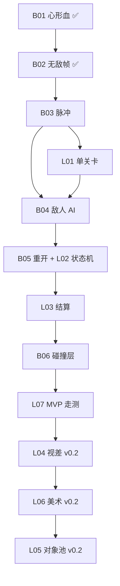

# P0 最小 MVP 闭环开发任务

> **版本**：v0.1 执行路线图（2026-07 调整）  
> **目标**：在已有心形血 + 无敌帧基础上，尽快打通「能打 → 有怪 → 能死 → 能重来 → 有结算」的可玩闭环。  
> **关联**：[MVP定义与验收标准](../MVP定义与验收标准.md) · [P0-战斗与角色](./P0-战斗与角色.md) · [P0-关卡与探索](./P0-关卡与探索.md) · [开发排期与里程碑](../开发排期与里程碑.md)

---

## 1. 与原文档的差异说明

原排期将「单关卡搭建」放在第 5 周。本路线图将 **P0-L01 提前到战斗闭环之前**，原因：

1. 敌人 AI、射击手感需要在有边界的场地里测试；
2. 单人开发应优先串行打通 MVP 主链路，而非严格按周历拆战斗/关卡两条线；
3. 视差、对象池、占位美术（L04–L06）**明确推迟到 v0.1 验收之后**，不阻塞最小闭环。

| 范围 | 任务 | 说明 |
|------|------|------|
| **v0.1 必做** | B03 → L01 → B04 → B05+L02 → L03 → B06 → L07 | 本文件主体 |
| **v0.1 已完成** | B01、B02 | 见实现文档目录 |
| **v0.2 再做** | L04 视差、L05 对象池、L06 占位美术 | MVP 降级方案已覆盖 |

---

## 2. 当前进度

| 任务 | 状态 | 实现文档 |
|------|------|----------|
| P0-B01 心形血量系统 | ✅ 已完成 | [P0-B01-心形血量系统](../P0-B01-心形血量系统/README.md) |
| P0-B02 受击无敌帧 | ✅ 已完成 | [P0-B02-受击无敌帧](../P0-B02-受击无敌帧/README.md) |
| P0-B03 脉冲攻击打磨 | ✅ 已完成 | [P0-B03-脉冲攻击打磨](../P0-B03-脉冲攻击打磨/README.md) |
| P0-L01 单关卡场景搭建 | ✅ 已完成 | [P0-L01-单关卡场景搭建](../P0-L01-单关卡场景搭建/README.md) |
| P0-B04 ~ B06 | ⬜ 待做 | — |
| P0-L02 ~ L03、L07 | ⬜ 待做 | — |
| P0-L04 ~ L06 | ⏸ v0.2 | — |

**代码基线（截至 B02 完成）**：

- `Character` 已有 `take_damage` / `is_invincible` / `died` 信号 / 闪烁反馈
- `Player` 已处理 DamageZone / DeathZone 碰撞扣心
- `HeartHud` 已绑定 `hearts_changed` 信号
- `Projectile` 可发射、有 TTL 与射程，**尚无对敌人的伤害逻辑**
- `Enemy` / `EnemyController` 为骨架，**AI 与接触伤害未实现**
- `Level` 可生成玩家与子弹，**无关卡状态机、无敌人刷怪、无重开**

---

## 3. 推荐执行顺序

```
阶段一（战斗）    B03 脉冲 → L01 单关卡 → B04 敌人 AI
阶段二（流程）    B05 死亡重开 + L02 状态机 → L03 结算文案
阶段三（验收）    B06 碰撞层 → L07 MVP 走测
阶段四（v0.2）    L04 视差 → L06 美术 → L05 对象池
```

### 依赖关系



### MVP 功能映射

| MVP # | 功能 | 由哪些任务交付 |
|-------|------|----------------|
| M1 | 俯视角移动 | 模板已有；L01 提供活动范围 |
| M2 | 脉冲攻击 | **B03** |
| M3 | 心形血量 + 无敌帧 | **B01、B02** ✅ |
| M4 | 敌人 | **B04** |
| M5 | 玩家死亡重开 | **B05、L02** |
| M6 | 单张关卡 | **L01** |
| M7 | 胜负结算 | **L02、L03** |
| M8 | 可构建运行 | 全程保持；**L07** 最终验收 |

---

## 4. 阶段一：战斗闭环

> **目标**：玩家能射击、敌人能追击并造成伤害、敌人可被击杀。  
> **预估**：6–8 天（单人串行）

---

### P0-B03 脉冲攻击打磨

| 项 | 内容 |
|----|------|
| **状态** | ✅ 已完成 |
| **优先级** | P0 — 下一步 |
| **依赖** | 无（B01/B02 已完成） |
| **预估** | 2 天 |
| **覆盖 MVP** | M2 |
| **主要文件** | `src/entity/projectile/projectile.hpp/cpp`，`src/entity/projectile/projectile_spawner.hpp/cpp`，`src/entity/level.cpp`，`project/scenes/projectiles/bullet.tscn` |
| **验收** | 按键射击；子弹命中敌人造成伤害；命中后有可感知反馈（至少 Console 日志或敌人闪烁） |
| **降级** | 无命中特效，仅扣血 + `queue_free` 子弹 |

#### 子任务清单

- [ ] **B03-1** 在 `constants.hpp` 的 `combat` 命名空间增加脉冲伤害常量（如 `projectile_damage_hearts = 1`）
- [ ] **B03-2** 为 `Projectile` 增加 `body_entered` 碰撞处理：检测碰撞体是否为 `Enemy`（或敌人碰撞层）
- [ ] **B03-3** 命中时调用 `Enemy::take_damage()`，命中后销毁子弹（避免穿透多段伤害）
- [ ] **B03-4** 在 `bullet.tscn` 配置碰撞层（Projectiles）与 mask（敌人 + 墙体），确保子弹不与玩家碰撞
- [ ] **B03-5** 在 `Level::on_player_spawn_projectile` 中，将子弹 `body_entered` 接到伤害逻辑（若信号在 Level 侧集中处理）
- [ ] **B03-6** 手动测试：对着静止敌人连续射击，确认扣心、敌人死亡、`died` 信号（若敌人也有心）或自定义死亡逻辑

#### 完成定义（DoD）

1. F5 进关卡，鼠标瞄准 + 射击键可稳定发射子弹
2. 子弹打中敌人后敌人血量减少，心为 0 时敌人消失或禁用
3. 子弹打墙体能正常销毁，不穿墙
4. 编译无警告新增

---

### P0-L01 单关卡场景搭建

| 项 | 内容 |
|----|------|
| **状态** | ✅ 已完成 |
| **优先级** | P0 — 与 B03 收尾重叠或紧接其后 |
| **依赖** | 无 |
| **预估** | 2–3 天 |
| **覆盖 MVP** | M6 |
| **主要文件** | `project/scenes/levels/level1.tscn`，`src/entity/level.hpp/cpp`，`src/core/constants.hpp` |
| **验收** | 玩家不能出界；有明确出生点与至少 1 个敌人刷点 |
| **降级** | `ColorRect` 地面 + `StaticBody2D` 四周围墙 |

#### 子任务清单

- [ ] **L01-1** 在 `level1.tscn` 搭建可活动矩形区域（建议 2000×1500 px 量级，按模板相机缩放调整）
- [ ] **L01-2** 添加四面 `StaticBody2D` 围墙，碰撞层设为 `Walls`；玩家 `collision_mask` 包含墙体
- [ ] **L01-3** 添加 `Marker2D` 节点作为玩家出生点（如 `SpawnPoint`），`Level::_ready` 中读取位置而非硬编码
- [ ] **L01-4** 添加 `Marker2D` 敌人刷点（如 `EnemySpawn1`），预留 `Level` 刷怪接口
- [ ] **L01-5** 保留或迁移现有 `PhysicsBox` / DamageZone 测试区（可选，用于调试扣心）
- [ ] **L01-6** 在 `constants.hpp` 的 `name::level` 中登记新节点名常量
- [ ] **L01-7** 手动测试：WASD 移动全图，无法穿出边界

#### 完成定义（DoD）

1. 每次进入关卡玩家出现在固定出生点
2. 地图边界碰撞正确，无卡缝穿墙
3. 场景中至少有 1 个敌人刷点标记，供 B04 使用

---

### P0-B04 敌人基础 AI

| 项 | 内容 |
|----|------|
| **状态** | ⬜ 待做 |
| **优先级** | P0 |
| **依赖** | P0-B01 ✅，P0-L01 |
| **预估** | 2–3 天 |
| **覆盖 MVP** | M4 |
| **主要文件** | `src/entity/character/enemy.hpp/cpp`，`src/entity/controller/enemy_controller.hpp/cpp`，`src/entity/level.cpp`，`project/scenes/characters/enemy.tscn` |
| **验收** | 敌人发现玩家后追击；接触对玩家扣 1 心；可被脉冲击杀 |
| **降级** | 无巡逻、无视野锥，始终朝玩家直线移动 |

#### 子任务清单

- [ ] **B04-1** `Enemy` 设置默认心数（建议 1–3 心），死亡时 `queue_free` 或发信号通知 `Level`
- [ ] **B04-2** `EnemyController::process_movement_input`：每帧获取玩家全局位置，计算朝向并驱动 `on_character_movement`
- [ ] **B04-3** `EnemyController::process_rotation_input`：面向玩家（与玩家移动逻辑对称）
- [ ] **B04-4** 在 `Enemy` 或 `Player::process_slide_collisions` 中处理「敌人 Body 接触玩家」：对玩家 `take_damage(1)`（利用 B02 无敌帧防连扣）
- [ ] **B04-5** `Level::_ready` 从刷点实例化 `Enemy`，绑定 `EnemyController`
- [ ] **B04-6** 敌人 `collision_layer` = `NPCs`，`mask` 含 `Walls` + `Player`（按 B06 前可先手工配置场景）
- [ ] **B04-7** 手动测试：敌人追击、接触扣心、被子弹击杀；击杀后关卡能感知敌人数量减少

#### 完成定义（DoD）

1. 关卡内至少 1 个敌人从刷点生成并追击玩家
2. 玩家与敌人重叠时扣 1 心，无敌帧内不重复扣
3. 敌人被子弹击杀后从场景移除
4. 同屏 3–5 敌无明显卡顿（v0.1 不要求对象池）

---

## 5. 阶段二：流程闭环

> **目标**：死亡可重开、清敌可胜利、有简短文字反馈。  
> **预估**：4–6 天

---

### P0-B05 + P0-L02 死亡重开与关卡状态机（合并迭代）

| 项 | 内容 |
|----|------|
| **状态** | ⬜ 待做 |
| **优先级** | P0 |
| **依赖** | P0-B01 ✅，P0-B04，P0-L01 |
| **预估** | 3–4 天（两项同批完成） |
| **覆盖 MVP** | M5、M7（胜负判定） |
| **主要文件** | `src/entity/level.hpp/cpp`，`src/entity/controller/player_controller.cpp`，`project/main.tscn` |
| **验收** | 玩家死亡 → 暂停输入 → 可重开；清敌 → 胜利状态；状态互斥（不会同时胜利+失败） |
| **降级** | 重开 = `get_tree()->reload_current_scene()`；胜利 = 击杀固定数量敌人 |

#### 为何合并

原文档中 B05 依赖 L02、L02 依赖 B05，形成环。实施时在同一迭代内按下列顺序落地：

1. 先做最小 L02 状态枚举与切换；
2. 再接 B05 死亡监听与重开；
3. 最后接胜利条件与输入锁定。

#### 子任务清单 — L02 状态机

- [ ] **L02-1** 在 `level.hpp` 定义 `enum class LevelState { Playing, Victory, Defeat }`
- [ ] **L02-2** `Level` 持有 `m_state`、`m_enemy_count`（或跟踪存活敌人列表）
- [ ] **L02-3** `Playing` 状态下 `_process` 正常运行；`Victory` / `Defeat` 下跳过游戏逻辑或仅跑 UI
- [ ] **L02-4** 监听玩家 `died` 信号 → 切 `Defeat`
- [ ] **L02-5** 敌人死亡时递减计数，为 0 → 切 `Victory`
- [ ] **L02-6** 状态变化时发 `level_state_changed` 信号（可选，供 L03 监听）

#### 子任务清单 — B05 重开

- [ ] **B05-1** `Defeat` 时禁用 `PlayerController` 输入（`set_process_input(false)` 或控制器内判断）
- [ ] **B05-2** 提供重开入口：键盘 `R` 或 3 秒自动重载（二选一，建议先 `R`）
- [ ] **B05-3** 重开实现：重载 `level1.tscn` 或调用 `Level::reset()` 重置玩家心、敌人、状态
- [ ] **B05-4** `Victory` 时同样锁定操作，等待 L03 展示结算
- [ ] **B05-5** 手动测试：故意死亡 → 5 秒内可再玩；清敌 → 进入胜利状态

#### 完成定义（DoD）

1. 心为 0 后玩家不能再移动/射击
2. 按 `R`（或约定方式）可在 5 秒内重新开始本关
3. 消灭关卡内全部敌人后进入胜利状态
4. 重开后面板心数、敌人、状态全部复位

---

### P0-L03 结算与叙事占位

| 项 | 内容 |
|----|------|
| **状态** | ⬜ 待做 |
| **优先级** | P0 |
| **依赖** | P0-L02 |
| **预估** | 1–2 天 |
| **覆盖 MVP** | M7（文字反馈） |
| **主要文件** | `src/ui/main_dialog.cpp`，`project/scenes/ui/main_dialog.tscn`，`project/scripts/`（可选 GDScript） |
| **验收** | 过关/失败后显示至少 1 段治愈向占位文案 |
| **降级** | `console::get()->print()` 一次性输出全文 |

#### 子任务清单

- [ ] **L03-1** 准备两段占位文案：`victory_text`、`defeat_text`（各 2–4 句，慢节奏治愈向）
- [ ] **L03-2** `Level` 在 `Victory` / `Defeat` 时调用 `MainDialog` 或 Console 展示对应文案
- [ ] **L03-3** 优先实现逐字或逐行浮现（可用现有 `MainDialog` 扩展）；来不及则降级为整段输出
- [ ] **L03-4** 结算展示期间禁止游戏输入；提供「继续 / 重开」提示
- [ ] **L03-5** 手动测试：两种结局均能看到不同文案

#### 完成定义（DoD）

1. 通关与死亡看到不同文字
2. 文案可读、节奏偏慢（符合项目治愈基调）
3. 不阻塞 B05 重开流程

---

## 6. 阶段三：打磨与验收

> **目标**：碰撞关系清晰、MVP 清单全部勾选。  
> **预估**：2–3 天

---

### P0-B06 伤害与碰撞层整理

| 项 | 内容 |
|----|------|
| **状态** | ⬜ 待做 |
| **优先级** | P1（战斗跑通后再做） |
| **依赖** | P0-B03，P0-B04 |
| **预估** | 1 天 |
| **覆盖 MVP** | M2、M4 稳定性 |
| **主要文件** | `src/core/constants.hpp`，`project/scenes/**/*.tscn` |
| **验收** | 子弹不打玩家；敌人碰玩家扣心；各层职责文档化 |
| **降级** | 仅在场景编辑器手工对齐层，不改代码 |

#### 碰撞矩阵（目标态）

| 主体 | layer | mask 应包含 |
|------|-------|-------------|
| Player | `Player` | `Walls`, `DamageZones`, `DeathZones`, `NPCs` |
| Enemy | `NPCs` | `Walls`, `Player` |
| Projectile | `Projectiles` | `Walls`, `NPCs` |
| 围墙 | `Walls` | — |
| 伤害区 | `DamageZones` | — |
| 即死区 | `DeathZones` | — |

#### 子任务清单

- [ ] **B06-1** 对照上表检查 `player.tscn`、`enemy.tscn`、`bullet.tscn`、`level1.tscn` 碰撞配置
- [ ] **B06-2** 修复子弹命中玩家、敌人穿墙等异常
- [ ] **B06-3** 在 `constants.hpp` 或本任务文档旁注碰撞矩阵（便于后续技能扩展）
- [ ] **B06-4** 回归测试：射击、受击、撞墙、伤害区全流程

#### 完成定义（DoD）

1. 无「自己打自己」「子弹穿墙无限飞」类问题
2. 碰撞层与 `LayerID` 枚举一致

---

### P0-L07 MVP 联调与走测

| 项 | 内容 |
|----|------|
| **状态** | ⬜ 待做 |
| **优先级** | P0 — v0.1 出口 |
| **依赖** | B03–B06，L01–L03 |
| **预估** | 1–2 天 |
| **覆盖 MVP** | M1–M8 全量 |
| **主要文件** | 全项目 |
| **验收** | [MVP 演示检查清单](../MVP定义与验收标准.md#6-演示检查清单) 全部勾选 |

#### 走测步骤

1. **冷启动**：configure-and-build → F5，进关卡 < 30 秒
2. **战斗轮**：移动、瞄准、射击、敌人追击、双方扣血、无敌帧
3. **死亡轮**：故意阵亡 → 看失败文案 → 重开 → 状态复位
4. **胜利轮**：清敌 → 看胜利文案
5. **压力轮**：连续完整游玩 3 轮，记录崩溃与帧率
6. **记录**：在本文档末尾或单独测试记录中勾选清单

#### 演示检查清单

- [ ] 启动到进关卡 < 30 秒
- [ ] 移动、瞄准、射击正常
- [ ] 敌人受伤、死亡有反馈
- [ ] 受击扣心、无敌帧生效
- [ ] 死亡可重开
- [ ] 通关/死亡有文字反馈
- [ ] 连续 3 轮无崩溃

#### 完成定义（DoD）

**Demo v0.1 最小 MVP 达成** — 可交付给自己完整游玩 3–5 分钟闭环。

---

## 7. 阶段四：v0.2 扩展（MVP 之后）

> 以下任务**不纳入 v0.1 最小闭环**，按 [开发排期与里程碑](../开发排期与里程碑.md) 第 9–10 周推进。

| 任务 | 预估 | 说明 |
|------|------|------|
| P0-L04 视差森林背景 | 2–3 天 | 2–3 层 ParallaxBackground |
| P0-L06 占位美术资源整理 | 1–2 天 | 统一 sprite，辨识玩家/敌人/背景 |
| P0-L05 对象池 | 2–3 天 | 同屏 10 敌 + 20 弹；≤5 敌时可跳过 |

---

## 8. 单人开发守则

1. **串行优先**：B03 验收前不开 B04；每周最多 1 个 High 任务
2. **做完就测**：每个任务完成后立即 F5 手动走一遍 DoD
3. **卡住就降级**：严格按各任务「降级」列执行，不追求完美
4. **文档跟进**：每个任务完成后在 `doc/P0-Bxx-*` 或 `doc/P0-Lxx-*` 补实现说明（参照 B01/B02）
5. **每月缓冲**：排期预留 3 天，不挤占 MVP 主链路

---

## 9. 时间预估汇总

| 阶段 | 任务 | 预估 |
|------|------|------|
| — | B01、B02（已完成） | — |
| 一 | B03 + L01 + B04 | 6–8 天 |
| 二 | B05+L02 + L03 | 4–6 天 |
| 三 | B06 + L07 | 2–3 天 |
| **v0.1 合计** | | **约 12–17 天**（含缓冲） |
| 四 | L04 + L06 + L05（v0.2） | 5–8 天 |

---

## 10. 任务总览表

| 序号 | 任务 ID | 名称 | 状态 | 依赖 | 预估 |
|------|---------|------|------|------|------|
| 1 | P0-B01 | 心形血量系统 | ✅ | — | — |
| 2 | P0-B02 | 受击无敌帧 | ✅ | B01 | — |
| 3 | P0-B03 | 脉冲攻击打磨 | ✅ | — | 2 天 |
| 4 | P0-L01 | 单关卡场景搭建 | ✅ | — | 2–3 天 |
| 5 | P0-B04 | 敌人基础 AI | ⬜ | B01, L01 | 2–3 天 |
| 6 | P0-B05 | 死亡与重开 | ⬜ | B01, B04, L01 | 与 L02 合并 |
| 7 | P0-L02 | 关卡流程状态机 | ⬜ | L01, B04 | 与 B05 合并 |
| 8 | P0-L03 | 结算与叙事占位 | ⬜ | L02 | 1–2 天 |
| 9 | P0-B06 | 伤害与碰撞层整理 | ⬜ | B03, B04 | 1 天 |
| 10 | P0-L07 | MVP 联调与走测 | ⬜ | 全部 v0.1 | 1–2 天 |
| — | P0-L04/L05/L06 | v0.2 视觉与性能 | ⏸ | L07 后 | 5–8 天 |

---

## 11. 文档索引

| 文档 | 用途 |
|------|------|
| [P0-战斗与角色](./P0-战斗与角色.md) | 战斗任务原始定义（B01–B06） |
| [P0-关卡与探索](./P0-关卡与探索.md) | 关卡任务原始定义（L01–L07） |
| [MVP定义与验收标准](../MVP定义与验收标准.md) | v0.1 范围与检查清单 |
| [开发排期与里程碑](../开发排期与里程碑.md) | 6 个月总排期 |
| [P0-B01 实现文档](../P0-B01-心形血量系统/README.md) | 已完成参考 |
| [P0-B02 实现文档](../P0-B02-受击无敌帧/README.md) | 已完成参考 |
| [P0-B03 实现文档](../P0-B03-脉冲攻击打磨/README.md) | 已完成参考 |
| [P0-L01 实现文档](../P0-L01-单关卡场景搭建/README.md) | 已完成参考 |
