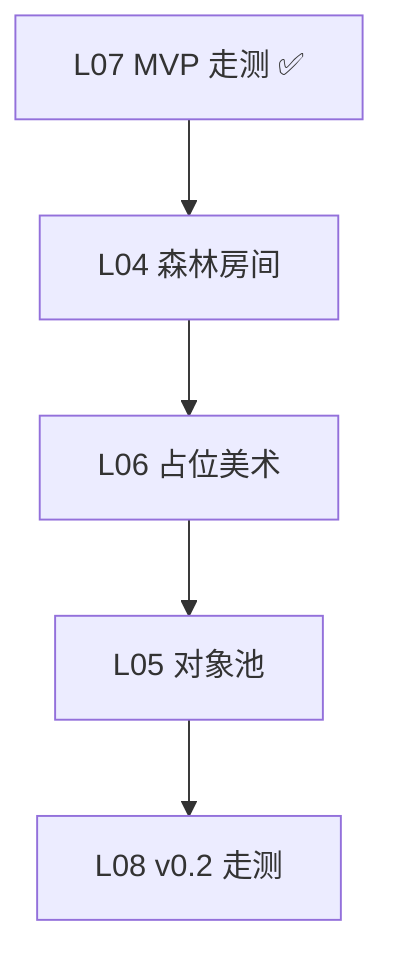

# P0 v0.2 视觉与性能开发任务

> **版本**：v0.2 执行路线图（2026-07）  
> **目标**：在 v0.1 MVP 基础上，完成**森林房间模板**、占位美术统一、敌人/子弹对象池，交付 Demo **v0.2**。  
> **关联**：[v0.2定义与验收标准](../v0.2定义与验收标准.md) · [P0-L04 森林房间模板](../P0-L04-森林房间模板/README.md) · [P0-MVP最小闭环开发任务](./P0-MVP最小闭环开发任务.md) · [P0-关卡与探索](./P0-关卡与探索.md) · [开发排期与里程碑](../开发排期与里程碑.md)

---

## 1. 与 v0.1 的关系

| 范围 | 任务 | 说明 |
|------|------|------|
| **v0.1 已完成** | B01–B06、L01–L03、L07 | 见 [P0-MVP最小闭环开发任务](./P0-MVP最小闭环开发任务.md) |
| **v0.2 本文件** | L04 → L06 → L05 → L08 | 视觉优先，池化殿后 |
| **P1 不接** | 技能、八字、Shader 氛围 | 见 [P1-技能氛围与八字开发任务](./P1-技能氛围与八字开发任务.md) |

推荐顺序：**先能「走进森林房间」，再换 sprite，最后上池化**（L05 依赖稳定场景与美术路径）。关卡呈现参考《元气骑士》**房间制**；节奏保持治愈向慢叙事。

---

## 2. 当前进度

| 任务 | 状态 | 实现文档 |
|------|------|----------|
| P0-L04 森林房间模板 | 🔄 进行中 | [P0-L04-森林房间模板](../P0-L04-森林房间模板/README.md) |
| P0-L06 占位美术资源整理 | ⏳ 待开始 | — |
| P0-L05 对象池（敌人/子弹） | ⏳ 待开始 | — |
| P0-L08 v0.2 联调与走测 | ⏳ 待开始 | — |

**代码基线（截至 v0.1 出口）**：

- `level1.tscn`：**Room Template v0** — 单房 2000×1500 地面 + 雾 overlay + 相机 limit；围墙与 L01 一致
- `Main` 将 `Level` 挂于 `MainSubViewport`（非 CanvasLayer）
- 玩家/敌人：模板或占位 sprite，**风格未统一**
- `ProjectileSpawner` / `Level::clear_projectiles`：`instantiate` + `queue_free`
- `Level::spawn_enemies_from_markers`：每关 `instantiate` 敌人；死亡 `queue_free`
- 碰撞矩阵：见 [P0-B06](../P0-B06-伤害与碰撞层整理/README.md)；**v0.2 不扩展新层**

---

## 3. 推荐执行顺序

```
阶段一（视觉）    L04 森林房间模板
阶段二（美术）    L06 占位 sprite 统一
阶段三（性能）    L05 对象池（子弹 → 敌人）
阶段四（验收）    L08 v0.2 走测
```

### 依赖关系



### v0.2 功能映射

| v0.2 # | 功能 | 由哪些任务交付 |
|--------|------|----------------|
| V1 | 森林房间氛围 | **L04** |
| V2 | 占位美术 | **L06** |
| V3–V4 | 敌人/子弹池 | **L05** |
| V5–V7 | 性能 + 回归 + 构建 | **L05、L08** |

---

## 4. 阶段一：森林房间模板（L04）

> **目标**：奠定《凯尔经的秘密》式葱郁森林基调；**单房静态美术 + 锁镜头**（元气骑士式空间，治愈节奏）。  
> **预估**：2–3 天

---

### P0-L04 森林房间模板（Room Template v0）

| 项 | 内容 |
|----|------|
| **状态** | 🔄 进行中 |
| **优先级** | P0 — v0.2 第一步 |
| **依赖** | P0-L01 ✅，P0-L07 ✅ |
| **预估** | 2–3 天 |
| **覆盖 v0.2** | V1 |
| **主要文件** | `level1.tscn`，`project/assets/parallax/`，`src/core/constants.hpp`，`src/entity/level.cpp` |
| **验收** | 房内地面完整无拼接；相机 limit 贴边；雾层静态半透明 |
| **降级** | L01 纯色 `Ground`，无雾 overlay |
| **实现文档** | [P0-L04-森林房间模板](../P0-L04-森林房间模板/README.md) |

#### 子任务清单

- [x] **L04-1** 房间地面占位图（`parallax_far.png` 拉伸至 2000×1500）
- [x] **L04-2** `GroundSprite` 单张地面 + `Ground` ColorRect fallback
- [x] **L04-3** `FogOverlay` 静态雾层（非 `ParallaxBackground`）
- [x] **L04-4** `Level::apply_room_camera_limits()` 对齐 `playable_width/height`
- [x] **L04-5** `constants.hpp` 登记 `ground_sprite`、`fog_overlay`、`room_assets`
- [x] **L04-6** 实体 z-index 在雾层之上
- [ ] **L04-7** 手动测试：四角贴边、无穿帮、玩法回归

#### 完成定义（DoD）

1. 房内移动时地面/雾不滑脱、无块状拼接
2. 相机在房间边界内取景（元气骑士式当前房）
3. 脉冲、受击、敌人追击玩法不受影响
4. 1080p 下帧率与 v0.1 相当

#### 技术注意

- `Level` 挂在 `MainSubViewport` 下（见 `main.cpp`）
- v0.2 **不用大地图视差**；P1 多房连通 + Shader 雾
- L01 的 2000×1500 **玩法尺寸不变**；`level1.tscn` 即第一间森林房

---

## 5. 阶段二：占位美术（L06）

> **目标**：统一玩家/敌人/环境占位 sprite，并留下 AI 美术导入规范。  
> **预估**：1–2 天

---

### P0-L06 占位美术资源整理

| 项 | 内容 |
|----|------|
| **状态** | ⏳ 待开始 |
| **优先级** | P0 |
| **依赖** | P0-L04 |
| **预估** | 1–2 天 |
| **覆盖 v0.2** | V2 |
| **主要文件** | `project/assets/sprites/`，`project/scenes/characters/*.tscn`，`doc/P0-L06-占位美术规范/README.md`（完成后） |
| **验收** | 截图可区分玩家、敌人、地面、远景 |
| **降级** | 色块 + 色相区分（玩家暖色、敌人冷色、地面绿褐） |

#### 子任务清单

- [ ] **L06-1** 建立目录：`project/assets/sprites/player|enemy|environment/`
- [ ] **L06-2** 替换或统一 `player.tscn`、`enemy.tscn` 的 `Sprite2D` 纹理（尺寸建议 32×32 或 64×64 像素风）
- [ ] **L06-3** 房间地面/雾层贴图与角色 sprite 色调协调（葱郁绿色系）
- [ ] **L06-4** 子弹 `bullet.tscn` 视觉与「光能脉冲」气质一致（亮色小圆/菱形）
- [ ] **L06-5** 编写 `doc/P0-L06-占位美术规范/README.md`：尺寸、Pivot、透明边、Godot import 预设、命名约定
- [ ] **L06-6** （可选）隐藏或移除 `level1.tscn` 中 `DebugZones`（伤害区/即死区/PhysicsBox）；至少默认不可见
- [ ] **L06-7** 回归：M1–M7 玩法走一遍，确认碰撞形状与 sprite 对齐

#### 完成定义（DoD）

1. 新玩家 10 秒内能分清「哪个是自己、哪个是怪」
2. 文档记录 AI 出图导入步骤（供 P1 正式美术）
3. 碰撞层与 B06 矩阵无变更

---

## 6. 阶段三：对象池（L05）

> **目标**：子弹与敌人走池化激活/回收，支撑 P1 多弹与更多敌人。  
> **预估**：2–3 天

---

### P0-L05 对象池（敌人/子弹）

| 项 | 内容 |
|----|------|
| **状态** | ⏳ 待开始 |
| **优先级** | P0 |
| **依赖** | P0-B03 ✅，P0-B04 ✅，P0-L06 |
| **预估** | 2–3 天 |
| **覆盖 v0.2** | V3、V4、V5 |
| **主要文件** | 新建 `src/util/object_pool.hpp`，`src/entity/projectile/projectile_spawner.*`，`src/entity/level.*` |
| **验收** | 10 敌 + 20 弹压力场景 60 FPS；`reset_level` 后池状态正确 |
| **降级** | 仅子弹池；敌人仍 instantiate |

#### 子任务清单 — 基础设施

- [ ] **L05-1** 实现通用 `ObjectPool<T>` 或 Godot 节点池：预创建、 `acquire` / `release`、最大容量配置
- [ ] **L05-2** 池对象 `release` 时：`set_process(false)`、移出场景树或禁用碰撞、重置内部状态

#### 子任务清单 — 子弹池

- [ ] **L05-3** `ProjectileSpawner` 改为从池获取 `Projectile`；移除仅 `instantiate` 路径
- [ ] **L05-4** `Projectile::on_body_entered` 与 TTL 到期改为 `release` 而非 `queue_free`（保留 `m_hit` 等复位）
- [ ] **L05-5** `Level::clear_projectiles` 改为回收池中活跃弹
- [ ] **L05-6** 反弹逻辑（B03 ricochet）在回收前重置 `m_has_bounced`、collision_mask

#### 子任务清单 — 敌人池

- [ ] **L05-7** `Level` 持有 `Enemy` 池；`spawn_enemies_from_markers` 从池激活
- [ ] **L05-8** 敌人死亡：`died` / 击杀逻辑改为 `release`；**`m_enemy_count` 与胜利判定仍正确**
- [ ] **L05-9** `reset_level`：回收所有活跃敌人、复位计数、重新从刷点激活
- [ ] **L05-10** 敌人 `reset_hearts`、控制器、碰撞在 `acquire` 时初始化

#### 子任务清单 — 压力测试

- [ ] **L05-11** 在 `level1.tscn` 或调试开关增加压力刷点（10 敌）；连续射击维持 ~20 活跃弹
- [ ] **L05-12** 记录 1080p 帧率；Profiler 确认无明显 alloc 尖峰

#### 完成定义（DoD）

1. 正常 1–3 敌关卡玩法与 v0.1 一致
2. 压力场景达到 V5 指标或已记录降级数据
3. 死亡重开 R：`Playing` 态敌人/弹数量与初始一致
4. 编译无新增警告

#### 技术注意

- 池化与 `LevelState::Victory/Defeat` 互斥：终局时停止 spawn，回收在 `reset_level` 统一处理
- 勿在 `release` 时断开 `Level` 已连接的 `died` 信号；可在 `acquire` 时 idempotent 连接或使用中央路由

---

## 7. 阶段四：验收（L08）

> **目标**：v0.2 清单全部勾选，v0.1 无回归。  
> **预估**：1 天

---

### P0-L08 v0.2 联调与走测

| 项 | 内容 |
|----|------|
| **状态** | ⏳ 待开始 |
| **优先级** | P0 — v0.2 出口 |
| **依赖** | L04、L05、L06 |
| **预估** | 1 天 |
| **覆盖 v0.2** | V1–V7 |
| **主要文件** | 全项目 |
| **验收** | [v0.2 演示检查清单](../v0.2定义与验收标准.md#6-演示检查清单) 全部勾选 |

#### 走测步骤

1. **冷启动**：configure-and-build → F5
2. **视觉轮**：房内四角移动；相机贴边；辨认玩家/敌人/地面/雾
3. **战斗回归**：MVP 演示检查清单（M1–M8）
4. **压力轮**：10 敌 + 20 弹，观察帧率与池回收
5. **重开轮**：死亡/胜利后 R，确认池与房间状态无残留
6. **记录**：在 `doc/P0-L08-v0.2联调与走测/README.md` 勾选清单

#### 完成定义（DoD）

**Demo v0.2 达成** — 可进入 P1 技能开发。

---

## 8. 单人开发守则

1. **串行优先**：L04 DoD 通过后再开 L06；L05 最后做
2. **做完就测**：每个任务完成后 F5 + 截图留档
3. **卡住就降级**：严格按各任务「降级」列执行
4. **文档跟进**：每任务完成后在 `doc/P0-Lxx-*` 补实现说明（参照 B01/L01）
5. **不改碰撞矩阵**：v0.2 无新技能层；P1 再扩展 B06

---

## 9. 时间预估汇总

| 阶段 | 任务 | 预估 |
|------|------|------|
| 一 | L04 森林房间 | 2–3 天 |
| 二 | L06 美术 | 1–2 天 |
| 三 | L05 对象池 | 2–3 天 |
| 四 | L08 走测 | 1 天 |
| **v0.2 合计** | | **约 6–9 天**（含缓冲） |

---

## 10. 任务总览表

| 序号 | 任务 ID | 名称 | 状态 | 依赖 | 预估 |
|------|---------|------|------|------|------|
| 1 | P0-L04 | 森林房间模板 | 🔄 | L07 | 2–3 天 |
| 2 | P0-L06 | 占位美术整理 | ⏳ | L04 | 1–2 天 |
| 3 | P0-L05 | 对象池 | ⏳ | L06, B03, B04 | 2–3 天 |
| 4 | P0-L08 | v0.2 联调走测 | ⏳ | L04–L06 | 1 天 |

---

## 11. 文档索引

| 文档 | 用途 |
|------|------|
| [v0.2定义与验收标准](../v0.2定义与验收标准.md) | v0.2 范围与检查清单 |
| [P0-MVP最小闭环开发任务](./P0-MVP最小闭环开发任务.md) | v0.1 已完成参考 |
| [P0-关卡与探索](./P0-关卡与探索.md) | L04–L06 原始定义 |
| [P0-B06 碰撞矩阵](../P0-B06-伤害与碰撞层整理/README.md) | v0.2 不扩展 |
| [P0-L04 森林房间模板](../P0-L04-森林房间模板/README.md) | L04 实现说明 |
| [P0-L07 走测记录](../P0-L07-MVP联调与走测/README.md) | v0.1 基线 |
| [P1-技能氛围与八字开发任务](./P1-技能氛围与八字开发任务.md) | v0.2 完成后下一阶段 |
