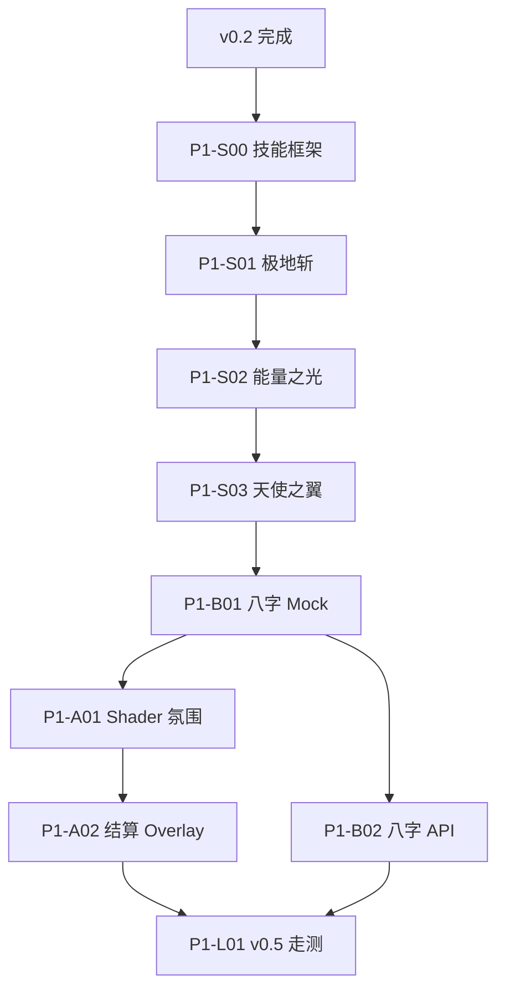

# P1 技能、氛围与八字开发任务

> **版本**：P1 执行路线图（2026-07，讨论定稿）  
> **目标**：交付 Demo **v0.5** — 3 技能（含脉冲整合）、「气」资源、八字 Mock/API、森林 Shader 氛围、结算演出骨架。  
> **关联**：[开发排期与里程碑](../开发排期与里程碑.md) · [v0.2定义与验收标准](../v0.2定义与验收标准.md) · [P0-v0.2-视觉与性能开发任务](./P0-v0.2-视觉与性能开发任务.md) · [技术架构说明](../技术架构说明.md) · [独立游戏项目计划书](../独立游戏项目计划书.md)

---

## 1. 前置条件

| 项 | 要求 |
|----|------|
| **v0.2** | L04–L08 完成（视差、美术、对象池） |
| **碰撞基线** | [P0-B06 矩阵](../P0-B06-伤害与碰撞层整理/README.md) |
| **八字 API** | 负责人调研；P1 先用 **Mock + buff_rules.json** |

---

## 2. 已确认设计规格（讨论定稿）

### 2.1 技能与输入

| 技能 | 键位（默认） | 说明 |
|------|--------------|------|
| **脉冲** | 现有 `shoot`（鼠标/手柄） | 纳入统一技能框架 |
| **极地斩** | `Q` | 近战横扫；强顿挫与光影 |
| **能量之光** | `E` | 地面治疗/加速光环 |
| **天使之翼** | `R`（与重开区分：仅 `Playing` 且气满可用） | 消耗 3 气；前摇；全局时停 + 高爆发 |

> **重开**：终局 `Victory`/`Defeat` 下 **R** 仍为重开；`Playing` 下气满时 **R** 发动天使之翼 — 实现时需在 `Level`/`PlayerController` 区分上下文。

### 2.2 「气」资源

| 规则 | 说明 |
|------|------|
| **上限** | 3 |
| **来源** | ① 击杀敌人掉落 ② 地图收集物 ③ **每次使用任意技能 +1 气** |
| **消耗** | 天使之翼发动时 **消耗 3 气** |
| **满气** | 气 = 3 时可发动天使之翼（有前摇） |

### 2.3 能量之光

| 规则 | 说明 |
|------|------|
| **治疗** | 每次生效 **+1 颗心**（离散，不做 fractional） |
| **满血** | 仍消耗 **CD**；仍 **+1 气**；不加心 |
| **友军** | 不伤害友军 |
| **墙壁** | 光环不穿透墙壁（跟随玩家，mask 仅 Player） |

### 2.4 天使之翼 / 时停

| 规则 | 说明 |
|------|------|
| **时间** | `Engine.time_scale` **全局**缩放（游戏 + UI + Console 叙事均变慢） |
| **delta** | 所有 `_process` 计时（TTL、无敌帧、CD、前摇、hitbox 寿命）统一用缩放后 `delta` |
| **结束** | 恢复 `time_scale = 1.0` |

### 2.5 属性叠加

```
实际移速 = 基础移速 × 八字系数 × 能量之光加速系数 × (天使之翼系数，若有)
```

- 八字：进关卡时从 `profile` + `buff_rules.json` 应用
- 能量之光：限时 Buff，到期移除

### 2.6 碰撞层扩展（P1）

| 主体 | layer（新建） | mask | 说明 |
|------|---------------|------|------|
| 极地斩 hitbox | `PlayerMelee` | NPCs | 只伤敌人 |
| 能量之光 | `PlayerAuras` | Player | 只治疗/加速自己 |
| 敌方弹幕（预留） | `EnemyProjectiles` | Player + Walls | P2 可用 |

在 `LayerID`、`project.godot`、`constants.hpp` 碰撞矩阵中登记；详见任务 **P1-B07**。

---

## 3. 推荐执行顺序

```
阶段一（框架）    P1-S00 技能架构 + 气 + HUD
阶段二（战斗）    P1-S01 极地斩 → P1-S02 能量之光 → P1-S03 天使之翼
阶段三（数值）    P1-B01 八字 Mock → P1-B02 八字 API（调研就绪后）
阶段四（氛围）    P1-A01 Shader 雾效 → P1-A02 结算 Overlay 骨架
阶段五（验收）    P1-L01 v0.5 整合走测
```

### 依赖关系



### 与排期周历对应

| 周 | 任务包 | 本文件任务 ID |
|----|--------|----------------|
| 11–12 | 极地斩 + 能量之光 | S00、S01、S02 |
| 13–14 | 天使之翼 | S03 |
| 15–16 | 八字 Mock → API | B01、B02 |
| 17–20 | Shader + v0.5 整合 | A01、A02、L01 |

---

## 4. 阶段一：技能框架（P1-S00）

> **预估**：3–4 天

### P1-S00 技能架构 + 「气」+ HUD

| 项 | 内容 |
|----|------|
| **依赖** | v0.2 完成 |
| **主要文件** | `src/entity/character/player.*`，`src/entity/controller/player_controller.*`，`src/ui/`（气 HUD），`src/core/constants.hpp`，`project/project.godot` input map |
| **验收** | 脉冲走统一 CD/气积攒；HUD 显示气 0–3 |

#### 子任务清单

- [ ] **S00-1** 定义 `SkillId` 枚举：`Pulse`, `PolarSlash`, `EnergyLight`, `AngelWings`
- [ ] **S00-2** `Player` 持有技能 CD 表、气计数 `m_qi`（0–3）
- [ ] **S00-3** `PlayerController::process_action_input` 扩展 `skill_polar`/`skill_energy`/`skill_angel`（或 Q/E/R）
- [ ] **S00-4** 技能使用统一入口：`use_skill(SkillId)` → 检查 CD → 执行 → 进入 CD → **气 +1**（上限 3）
- [ ] **S00-5** 新建 `QiHud` 或扩展 `HeartHud`：显示气图标 0–3
- [ ] **S00-6** 击杀掉落：敌人 `died` 时可选掉落 `QiPickup`（Area2D）或直接 +1 气
- [ ] **S00-7** 地图 `QiPickup` 收集物占位（`level1.tscn` 1–2 个）
- [ ] **S00-8** `Level` 终局/重开时复位气、CD、time_scale

#### DoD

1. 脉冲射击仍正常，且算作一次技能使用（+1 气、走 CD）
2. HUD 正确显示气；满 3 不再增加
3. 与 `LevelState` 互锁：非 `Playing` 不可放技能

---

## 5. 阶段二：三个 P1 技能

### P1-S01 极地斩（2–3 天）

| 项 | 内容 |
|----|------|
| **依赖** | P1-S00，P1-B07（碰撞层可先并行） |
| **主要文件** | 新建 `polar_slash` 相关或 `Player` 内近战逻辑，`level1` 无需改 |

#### 子任务清单

- [ ] **S01-1** 注册 `PlayerMelee` 碰撞层
- [ ] **S01-2** 极地斩：短前摆 + 扇形/弧形 `Area2D` hitbox，存在时间用 `_process(delta)` 累计
- [ ] **S01-3** `area_entered` / `body_entered` 仅对 `Enemy` 扣心（伤害常量 `combat::polar_slash_damage_hearts`）
- [ ] **S01-4** 命中反馈：敌人闪烁 + Console 日志（与 B03 一致）
- [ ] **S01-5** GPUParticles2D 或 Sprite 占位斩击光效
- [ ] **S01-6** CD 配置（建议 1.5–2.5s，可 constants 调）

#### DoD

1. Q 释放横扫，仅伤敌人，不伤自己
2. 与脉冲、移动、受击无敌帧不冲突
3. 使用一次 +1 气、进入 CD

---

### P1-S02 能量之光（2–3 天）

| 项 | 内容 |
|----|------|
| **依赖** | P1-S00 |
| **主要文件** | `Player` 子节点光环 `Area2D`，`constants.hpp` |

#### 子任务清单

- [ ] **S02-1** 注册 `PlayerAuras` 层；mask 仅 `Player`
- [ ] **S02-2** E 键展开跟随玩家的环形 `Area2D`（持续 3–5s 或瞬时一次治疗，实现时二选一；**推荐瞬时 +1 心 + 短时加速 Buff**）
- [ ] **S02-3** 治疗：`take_damage` 反向或 `heal(1)`；满血不加心但 CD/气规则仍执行
- [ ] **S02-4** 加速：`movement_speed` 乘以 `energy_light_haste_multiplier`，定时恢复
- [ ] **S02-5** 光环节点 `monitorable = false`；不穿透墙（跟随玩家，不对墙后目标生效）
- [ ] **S02-6** 粒子/Shader 占位光环视觉

#### DoD

1. 未满血时 +1 心；满血时仅 CD + 气
2. 加速与八字 debuff 叠加公式符合 §2.5
3. 不伤害敌人/友军

---

### P1-S03 天使之翼（3–4 天）

| 项 | 内容 |
|----|------|
| **依赖** | P1-S01、P1-S02（建议至少 S00 完成） |
| **主要文件** | `Player`，`Level`，`project.godot` |

#### 子任务清单

- [ ] **S03-1** 发动条件：气 == 3；`Playing` 态；非终局
- [ ] **S03-2** **前摇** 0.4–0.6s（吃 time_scale）；前摇结束再进入时停
- [ ] **S03-3** 消耗 3 气；`Engine.time_scale = 0.25`（常量可调）
- [ ] **S03-4** 时停期间：脉冲伤害倍率提升（`angel_wings_damage_multiplier`）
- [ ] **S03-5** 持续 3–5s 后恢复 `time_scale = 1.0`；清除爆发 Buff
- [ ] **S03-6** 与 R 重开区分：`Defeat`/`Victory` 下 R 优先重开；仅 `Playing` + 气满时 R 触发翅膀
- [ ] **S03-7** 视觉：翅膀粒子/Shader 占位；UI 叙事在时停中变慢（全局 scale，符合规格）
- [ ] **S03-8** 回归：TTL、无敌帧、技能 CD 在时停中均用 scaled delta

#### DoD

1. 气满 → 前摇 → 时停 → 爆发 → 恢复；气归零
2. 时停中 Console 逐字与战斗同速变慢
3. 重开/死亡时强制 `time_scale = 1.0`

---

### P1-B07 碰撞层扩展（1 天，可与 S01 并行）

- [ ] **B07-1** `LayerID` 增加 `PlayerMelee`、`PlayerAuras`、`EnemyProjectiles`（预留）
- [ ] **B07-2** `project.godot` 注册层名
- [ ] **B07-3** 更新 `constants.hpp` `collision` 矩阵注释与常量
- [ ] **B07-4** 更新 [P0-B06 README](../P0-B06-伤害与碰撞层整理/README.md) 或新建 P1-B07 实现文档
- [ ] **B07-5** 回归：脉冲、接触伤害、墙体不受影响

---

## 6. 阶段三：赛博八字（P1-B01 / B02）

### P1-B01 八字 Mock（3–4 天）

| 项 | 内容 |
|----|------|
| **依赖** | P1-S00（需 Player 属性管道） |
| **数据流** | 生日输入(GDScript) → `user://profile.json` → C++ 读 Mock JSON → `buff_rules.json` 映射 |

#### 子任务清单

- [ ] **B01-1** GDScript：`BirthdayInput` 界面（首次启动或菜单入口）
- [ ] **B01-2** 写入 `user://profile.json`：`birthday`, `chart_mock_id`
- [ ] **B01-3** `res://data/buff_rules.json` + `res://data/mock_charts/*.json`
- [ ] **B01-4** C++ `BirthChartService`：读 profile → 选 Mock 命格 → 解析映射
- [ ] **B01-5** `Player::apply_birth_chart_modifiers()`：移速、视野、防御、暴击等
- [ ] **B01-6** 至少 2 种 Mock 命格（出身寒微、孤军奋战）可玩差异
- [ ] **B01-7** 无 profile 时使用默认 Mock

#### DoD

1. 输入生日后重进关卡，属性变化可感知（如移速降低）
2. 离线可用，无 HTTP 依赖

---

### P1-B02 八字 API（2–4 天，依赖 API 调研）

- [ ] **B02-1** vcpkg 引入 HTTP 库（cpp-httplib 等），CMake 更新
- [ ] **B02-2** 异步请求 + 主线程 `call_deferred` 应用结果
- [ ] **B02-3** 超时 / 失败 → 回退 Mock
- [ ] **B02-4** 缓存 API 结果到 `profile.json`

#### 降级

API 未就绪时 **v0.5 仅验收 Mock 路径**；B02 不阻塞 L01 走测。

---

## 7. 阶段四：氛围与结算（P1-A01 / A02）

### P1-A01 森林 Shader 氛围（3–4 天）

> **排期说明**：在技能可玩后推进；与 v0.2 视差叠加，不替换 L04。

- [ ] **A01-1** Level 或 SubViewport 挂载轻量雾效 Shader（片元：噪声 + 距离雾）
- [ ] **A01-2** 丁达尔光：简单 Godot 光柱 Sprite + 透明度动画（降级可静态）
- [ ] **A01-3** 技能粒子与雾效色调统一（葱郁绿）
- [ ] **A01-4** 1080p 60 FPS 回归；不达标则降级为静态雾贴图

---

### P1-A02 结算 Overlay 骨架（2–3 天）

> 架构见 [P0-L03 §9](../P0-L03-结算与叙事占位/源码与函数说明.md#9-后续扩展动画-cg--文字--音乐)

- [ ] **A02-1** `main_dialog.tscn` 根层添加 `SettlementOverlay`（CanvasLayer layer=20）
- [ ] **A02-2** 子节点：压暗 `ColorRect`、`NarrativeLabel`、`AudioStreamPlayer`、`AnimationPlayer`
- [ ] **A02-3** `Victory` → `play_victory_sequence()`：压暗 + 逐字（从 Console 迁逻辑）+ BGM 淡入
- [ ] **A02-4** `Defeat` 可维持 Console 纯文字（或同 Overlay 简化版）
- [ ] **A02-5** 静帧 CG 占位纹理；P2 换序列帧
- [ ] **A02-6** `Playing` 信号 → `stop_settlement()` 清理

---

## 8. 阶段五：v0.5 验收（P1-L01）

### P1-L01 v0.5 整合走测（1–2 天）

#### 检查清单

- [ ] 脉冲 + 极地斩 + 能量之光 + 天使之翼 均可使用
- [ ] 气：击杀/拾取/用技能 三来源；天使之翼消耗 3 气
- [ ] 八字 Mock 至少 1 条路径通；API 可选
- [ ] 森林雾效/光感可感知
- [ ] 胜利结算 Overlay 有压暗+文字+BGM 占位
- [ ] v0.1 + v0.2 回归无退化
- [ ] 连续 3 轮无崩溃

完成后在 `doc/P1-L01-v0.5联调与走测/README.md` 记录。

---

## 9. 时间预估汇总

| 阶段 | 任务 | 预估 |
|------|------|------|
| 一 | S00 框架 | 3–4 天 |
| 二 | S01–S03 + B07 | 8–11 天 |
| 三 | B01–B02 | 5–8 天 |
| 四 | A01–A02 | 5–7 天 |
| 五 | L01 走测 | 1–2 天 |
| **P1 合计** | | **约 22–32 天**（含缓冲，对齐月 3–4） |

---

## 10. 任务总览表

| ID | 名称 | 状态 | 依赖 | 预估 |
|----|------|------|------|------|
| P1-S00 | 技能架构 + 气 + HUD | ⏳ | v0.2 | 3–4 天 |
| P1-B07 | 碰撞层扩展 | ⏳ | B06 | 1 天 |
| P1-S01 | 极地斩 | ⏳ | S00, B07 | 2–3 天 |
| P1-S02 | 能量之光 | ⏳ | S00 | 2–3 天 |
| P1-S03 | 天使之翼 | ⏳ | S00 | 3–4 天 |
| P1-B01 | 八字 Mock | ⏳ | S00 | 3–4 天 |
| P1-B02 | 八字 API | ⏳ | B01, API 文档 | 2–4 天 |
| P1-A01 | Shader 氛围 | ⏳ | S01–S03 | 3–4 天 |
| P1-A02 | 结算 Overlay | ⏳ | L03 | 2–3 天 |
| P1-L01 | v0.5 走测 | ⏳ | 全部 | 1–2 天 |

---

## 11. 文档索引

| 文档 | 用途 |
|------|------|
| [v0.2定义与验收标准](../v0.2定义与验收标准.md) | P1 前置 |
| [P0-v0.2-视觉与性能开发任务](./P0-v0.2-视觉与性能开发任务.md) | 当前执行 |
| [P0-L03 结算扩展](../P0-L03-结算与叙事占位/源码与函数说明.md#9-后续扩展动画-cg--文字--音乐) | A02 架构 |
| [技术架构说明](../技术架构说明.md) | C++/GDScript 分工 |
| [独立游戏项目计划书](../独立游戏项目计划书.md) | 技能/命格设计来源 |
